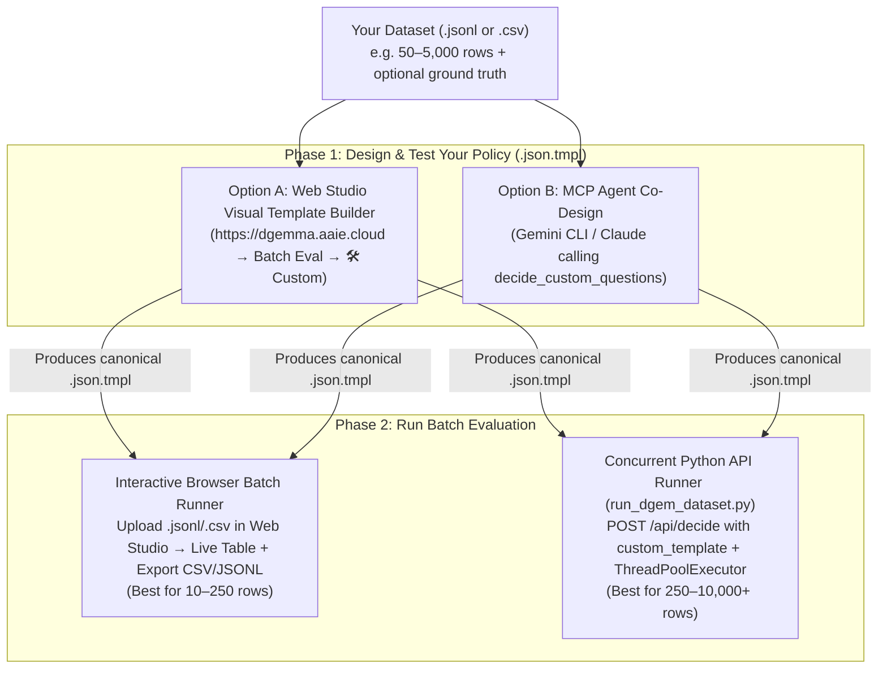

# "I Have a Dataset — How Do I Build a Policy Template & Run an Experiment?"

> **Target Audience**: Applied AI Engineers, Researchers & Domain Experts (`group:aaie-decision-model@google.com`)  
> **Live IAP-Protected Studio & API Gateway**: **`https://dgemma.aaie.cloud`** *(or `https://dgemma-gateway-882920967572.us-central1.run.app`)*

When you have a new `.jsonl` or `.csv` dataset (e.g., customer support tickets, legal contract clauses, RAG passages, agent trajectories, or safety guardrails) and want to evaluate **DiffusionGemma (`dgemma`)** as a **Zero-Shot Decision Model**, you do **not** need to modify the `dgem` Go codebase or redeploy Cloud Run.

You can go from raw dataset to calibrated predictions, Shannon entropy ($H$), and latency percentiles in **10 minutes** using any of three self-service workflows:



---

## Step 1: Map Your Dataset Columns to a `.json.tmpl` Policy Schema

Every `dgem` policy template is a JSON document with two top-level keys:
1. **`"schema"`** *(static across all rows in your dataset)* — Defines global `instructions` and the list of `questions` (decision slots) evaluated simultaneously in a single forward pass (`reads=1`).
2. **`"state"`** *(dynamic per row)* — Injects your dataset's per-row variables using Go template expressions (`{{ .my_column | toJson }}`).

### ⚡ The `vLLM` Prefix-Cache Golden Rule
> **Always keep `"schema"` 100% static and put all row-specific variables inside `"state"`.**  
> Because `structured_server.py` serializes `"schema"` before `"state"` in the prompt, `vLLM`'s automatic prefix cache reuses **70–85% of the KV cache** across every row in your dataset — dropping GPU forward-pass latency from `~450 ms` to **`~60–175 ms` per item**!

### Canonical `.json.tmpl` Template Skeleton

```json
{
  "schema": {
    "instructions": "You are an enterprise policy auditor evaluating a vendor contract clause.",
    "questions": [
      {
        "id": "compliant",
        "type": "boolean",
        "instructions": "Does the clause satisfy standard 60-day termination notice requirements?"
      },
      {
        "id": "risk_category",
        "type": "choice",
        "instructions": "Select the primary legal risk category present in the clause",
        "options": [
          {"name": "indemnity", "description": "Uncapped indemnification or third-party IP liability"},
          {"name": "auto_renewal", "description": "Evergreen automatic renewal without 30-day opt-out"},
          {"name": "data_residency", "description": "Cross-border data transfer or missing GDPR/HIPAA DPA"},
          {"name": "none", "description": "Standard commercial terms with no elevated legal risk"}
        ]
      },
      {
        "id": "severity",
        "type": "score",
        "instructions": "Rate the commercial severity of this clause from 1 (benign) to 5 (deal-breaker)",
        "levels": ["1", "2", "3", "4", "5"]
      }
    ],
    "samples": "auto"
  },
  "state": {
    "clause_text": {{ default "" .clause_text | toJson }},
    "jurisdiction": {{ default "US-DE" .jurisdiction | toJson }}
  }
}
```

### Choosing the Right Slot Type (`questions[].type`)

| Slot Type | JSON Schema | Returned Fields in `answers[id]` | Best Used For |
| :--- | :--- | :--- | :--- |
| **`"boolean"`** | `{"id": "urgent", "type": "boolean", "instructions": "..."}` | `label` (`"yes"` or `"no"`), `confidence`, `noul` ($P(\text{yes})$), `probabilities: {"yes": p, "no": 1-p}` | Binary guardrails, safety checks, presence gates, claim verification. |
| **`"choice"`** | `{"id": "category", "type": "choice", "instructions": "...", "options": [{"name": "...", "description": "..."}]}` | `choice` (option `name`), `label` (`"A"`..`"Z"`), `confidence`, `probabilities: {name: p}` | Multi-class routing, NLI (`entailment`/`neutral`/`contradiction`), intent classification (**max 26 options `[A-Z]` per question**). |
| **`"score"`** | `{"id": "quality", "type": "score", "instructions": "...", "levels": ["1","2","3","4","5"]}` | `level` (winning level), `score` ($\sum k \cdot P(k)$), `confidence`, `probabilities` | Likert rubrics, risk severity, listwise RAG passage reranking (`0..3` expectation $\hat{r}_i = \sum g \cdot p_{i,g}$). |

> **Tip — Single Forward Pass (`reads=1`) vs. Conditional Policy DAGs (`reads=2`)**:  
> By default, omit `depends_on` and `ask_if` so `dgemma` evaluates **all question slots simultaneously in 1 forward pass (`reads=1`)**. Only add `"depends_on": "parent_id", "ask_if": ["yes"]` when a downstream question is nonsensical unless the parent question is `"yes"` (which schedules a 2-pass DAG, `reads=2`).

---

## Step 2: Co-Design Your Template Using MCP (`decide_custom_questions`)

If you use **Gemini CLI**, **Claude Code**, or **Cursor**, you can connect the `dgem` MCP server and let your coding agent design and test the policy schema on sample rows from your dataset before running the full batch.

### 1. Register `dgem` MCP in `~/.gemini/settings.json` (or `.mcp.json`)

```json
{
  "mcpServers": {
    "dgem": {
      "command": "/path/to/dgem/bin/dgem",
      "args": [
        "mcp",
        "-u",
        "https://dgemma.aaie.cloud/v1",
        "--gcp-auth"
      ]
    }
  }
}
```

### 2. Give Your Agent This Prompt

```text
I have a dataset in ./my_dataset.jsonl.
1. Read the first 5 rows of ./my_dataset.jsonl.
2. Call the dgem MCP tool `get_health_and_gpu_status` (and `warmup_gpu` if scaled to zero).
3. Use `decide_custom_questions` to test a multi-slot schema on those 5 rows. Inspect the returned slot probabilities and Shannon entropy (H) on any mismatches.
4. Refine the option descriptions until all 5 sample rows are well-calibrated, then save the canonical policy template to ./my_experiment.json.tmpl.
```

---

## Step 3: Run Your Dataset in the Web Studio (`https://dgemma.aaie.cloud`)

For interactive datasets (**10 to 250 rows**), you can build your template, upload your `.jsonl` or `.csv` file, watch real-time evaluation, and export `.csv` / `.jsonl` receipts directly in the browser:

1. Open **`https://dgemma.aaie.cloud`** and click **Batch Eval** in the left navigation rail.
2. Select the **🛠️ Custom Template & Dataset (`.jsonl` / `.csv`)** card.
3. **Build or Paste Your Template**:
   - Use the **Visual Template Builder** (`+ Add Question Slot`) to define `boolean`, `choice`, or `score` slots and generate the `.json.tmpl` automatically, **or** switch to **Raw `.json.tmpl`** to paste an existing template.
   - Click **⬇ Download `.json.tmpl`** at any time to save your policy file.
4. **Upload Your `.jsonl` or `.csv` Dataset** (or click **Load 10-Row Sample Dataset**):
   - Any JSONL object works! Each line can pass variables at the top level or inside `"variables"`:
     ```json
     {"id": "row-01", "clause_text": "Either party may terminate upon 15 days notice.", "expected_compliant": "no", "expected_risk_category": "auto_renewal"}
     ```
   - To enable live **Accuracy %** and `PASS`/`MISS` grading in the table, include either `"expected_<slot_id>": "..."` columns (e.g., `"expected_compliant": "no"`) or `"expected": {"compliant": "no"}`. If ground truth is omitted, rows are evaluated in **unlabeled inference mode (`DONE`)** showing predicted labels, probabilities $P$, and Shannon entropy $H$.
5. Click **▶ Run Batch (`4×` Workers)** to stream real-time predictions into the results table, then click **⬇ Export `.csv`** or **⬇ Export `.jsonl`** in the scoreboard bar.

---

## Choosing an Inference Backend Target & Recommended Configuration (`vertex_first` vs. `vertex` vs. `cloudrun`)

`dgem` and `dgemma-gateway` (`https://dgemma.aaie.cloud`) support routing any policy template or batch experiment across **Vertex AI Dedicated Endpoints (`/invoke/*`)** and **Serverless Cloud Run GPU (`dgemma`)**. For a deep architectural breakdown, see **[Vertex AI Dedicated Endpoints (`/invoke/*`) vs. Cloud Run GPU](vertex-ai-vs-cloudrun.md)**.

### Backend Target Decision Matrix

| Backend Mode (`backend` / `X-DGem-Backend`) | Target Infrastructure | Cold-Start / Wakeup | Warm GPU Denoise / Wall Time | Cost Profile | When to Choose |
| :--- | :--- | :--- | :--- | :--- | :--- |
| **`vertex_first`** *(Recommended Default — High-Availability Hybrid)* | Primary: **Vertex AI Dedicated Endpoint (`4217256562927861760`, `g2-standard-16` `1× NVIDIA L4`, `64 GB` RAM)**<br/>Auto-Failover: **Serverless Cloud Run GPU (`dgemma`)** | **`0.0 s`** when Vertex replica is active (`auto-failover` if updating or scaled to zero) | **`~490 ms` GPU denoise** (`~536 ms` wall time for `N=4`; `~195 ms` single-pass) | Dedicated L4 baseline (`~$1.12/hr`) while provisioned; `$0.00/hr` Cloud Run standby | **Default for all interactive Web Studio sessions, MCP agents, and production APIs.** Guarantees `0.0 s` wakeup with automatic failover resilience if Vertex is ever updating or undeployed. |
| **`vertex`** *(Strict Production SLA / Zero-Downtime Priority)* | **Vertex AI Dedicated Endpoint (`4217256562927861760`, `/invoke/v1/*`)** (`g2-standard-16`, `1× NVIDIA L4`, `64 GB` RAM) | **`0.0 s`** (`minReplicaCount >= 1`, permanently warm) | **`~490 ms` GPU denoise** (`~536 ms` wall time) | **`~$1.12/hr`** (`1× L4` on `g2-standard-16`) until undeployed via `make vertex-teardown` | **Production pipelines, synchronous CI/CD gates, interactive agents, and shared internal platform services** where zero cold-start latency (`0.0 s`) and `64 GB` host RAM headroom (for multimodal `SigLIP` workloads) take priority over idle GPU reservation cost. |
| **`cloudrun`** *(Strict Scale-to-Zero / Cost-Sensitive & Ad-Hoc Batch)* | **Serverless Cloud Run GPU (`dgemma`)** (`1× NVIDIA RTX Pro 6000` `48GB` or `1× NVIDIA L4` `24GB`, `min-instances=0`) | **`6–8 min`** first-request cold start from `0 → 1` (`0.0 s` while warm) | **`~427 ms` GPU denoise** (`~459 ms` wall time once warm) | **`$0.00/hr` when idle** (`min-instances=0`); billed per-second only during active bursts | **Episodic batch jobs, research experiments, and dev/test sandboxes** where **`$0.00/hr` idle cost** is the primary requirement and a `6–8 minute` first-request cold start is acceptable. |

### Selecting the Backend Across All 4 Surfaces

1. **Web Studio (`https://dgemma.aaie.cloud`)**:
   - Use the topbar **Backend Target** selector to switch between **`Vertex First (Auto)`**, **`Cloud Run GPU (Strict)`**, and **`Vertex AI Strict (/invoke/*)`**.
   - You can also inspect live Vertex AI replica health (`4217256562927861760`) and trigger 1-click **Provision Vertex GPU (`1× L4`)** or **Teardown Replica (`$0/hr`)**.
2. **HTTP Gateway API (`/api/decide`, `/v1/systemone`, `/v1/chat/completions`)**:
   - Pass the HTTP header `X-DGem-Backend: vertex_first | vertex | cloudrun`, the query parameter `?backend=vertex_first`, or the JSON request field `"backend": "vertex_first"`.
   - Every response includes the `X-DGem-Backend-Used: vertex | cloudrun` response header and `"backend_used"` telemetry field confirming which GPU tier served the decision.
3. **MCP Server (`https://dgemma.aaie.cloud/mcp` or `dgem mcp`)**:
   - Pass `"backend": "vertex_first" | "vertex" | "cloudrun"` (and an optional custom `"vertex_url"`) in the tool arguments for **`decide_policy`**, **`decide_custom_questions`**, and **`locate_bounding_boxes`**.
4. **CLI (`dgem`)**:
   - Pass `--vertex-url 4217256562927861760 --gcp-auth` to route directly to the Vertex AI Dedicated Endpoint `/invoke/v1` route (or `-u https://dgemma.aaie.cloud/v1 --gcp-auth` to route via the gateway).

---

## Configuring the Stage 2 Gemini Cascade (`gemini-3.8-flash` Default)

When a single-pass Stage 1 `DiffusionGemma` decision exhibits high epistemic uncertainty (Shannon entropy $H \ge 0.35\text{ nats}$) or misses an expected ground-truth label during batch evaluation, `dgem` can automatically escalate that item to a **Stage 2 Gemini Cascade** (`EXP-05`).

> [!IMPORTANT]
> **Supported Stage 2 Gemini Models**: Always use **`gemini-3.8-flash`** (default), **`gemini-3.5-flash`**, or **`gemini-3.1-flash-lite`** via standard Vertex AI `generateContent` endpoints. Never use legacy Gemini 2.x models.

| Parameter | Allowed Values / Default | Description |
| :--- | :--- | :--- |
| **`cascade_mode`** | `"off"` (default) \| `"entropy"` \| `"on_miss"` | **`"off"`**: Stage 1 `dgemma` only.<br/>**`"entropy"`**: Production escalation gate — early-exits low-entropy decisions at Stage 1 ($H < \tau$, ~72% of traffic in `~536 ms`) and escalates only uncertain items ($H \ge \tau$) to Stage 2 Gemini.<br/>**`"on_miss"`**: Evaluation-time diagnostic cascade — escalates any row where Stage 1 disagrees with the dataset's `expected` label to verify whether Stage 2 resolves the error. |
| **`cascade_threshold`** | `0.35` *(default, in nats)* | Shannon entropy threshold $\tau$ for `"entropy"` mode (`0.35` nats raw, or `0.16` when using cardinality-normalized entropy $\tilde{H} = H / \ln|\mathcal{V}_m|$). |
| **`cascade_model`** | `"gemini-3.8-flash"` *(default)* | Target Vertex AI Gemini model (`"gemini-3.8-flash"`, `"gemini-3.5-flash"`, or `"gemini-3.1-flash-lite"`). |

### Example: Enabling `vertex_first` + Stage 2 `gemini-3.8-flash` Cascade via `/api/decide` and MCP

```bash
# HTTP Gateway API (/api/decide/{template}) with vertex_first & Stage 2 Entropy Cascade:
curl -sS "https://dgemma.aaie.cloud/api/decide/calibration/nli_calibration" \
  -H "Authorization: Bearer $(gcloud auth print-identity-token)" \
  -H "Content-Type: application/json" \
  -H "X-DGem-Backend: vertex_first" \
  -d '{
    "backend": "vertex_first",
    "cascade_mode": "entropy",
    "cascade_threshold": 0.35,
    "cascade_model": "gemini-3.8-flash",
    "variables": {
      "premise": "All four quarterly regional budgets reached between 50% and 75% of the cap.",
      "hypothesis": "Every regional budget met the full annual cap."
    }
  }' | jq '{answers, backend_used, cascade}'
```

```json
{
  "name": "decide_policy",
  "arguments": {
    "template": "calibration/nli_calibration",
    "backend": "vertex_first",
    "cascade_mode": "entropy",
    "cascade_threshold": 0.35,
    "cascade_model": "gemini-3.8-flash",
    "variables": {
      "premise": "All four quarterly regional budgets reached between 50% and 75% of the cap.",
      "hypothesis": "Every regional budget met the full annual cap."
    }
  }
}
```

---

## Step 4: Run Large Datasets (`100–10,000+` Rows) from Python

For larger benchmark runs, notebooks, or CI pipelines, use `POST https://dgemma.aaie.cloud/api/decide` with an inline `custom_template`. Every request automatically emits OpenTelemetry spans and Cloud Logging metrics (`dgem_surface = "python_batch"`, `dgem_template = "<your_experiment_name>"`).

### `run_dgem_dataset.py` (Zero Dependencies Beyond Standard Library)

```python
#!/usr/bin/env python3
"""Evaluate any .jsonl dataset against https://dgemma.aaie.cloud/api/decide."""
import concurrent.futures
import json
import math
import pathlib
import statistics
import subprocess
import time
import urllib.request

GATEWAY_URL = "https://dgemma.aaie.cloud/api/decide"
EXPERIMENT_NAME = "batch/contract_audit_v1"
TEMPLATE_PATH = "my_experiment.json.tmpl"
DATASET_PATH = "my_dataset.jsonl"
OUTPUT_PATH = "results_receipt.jsonl"
WORKERS = 4
CASCADE_ENTROPY_THRESHOLD = 0.35  # EXP-05 Stage-1 exit threshold (nats)


def get_gcp_identity_token() -> str:
    return subprocess.check_output(
        ["gcloud", "auth", "print-identity-token"], text=True
    ).strip()


def shannon_entropy(probs: dict) -> float:
    return -sum(p * math.log(p) for p in probs.values() if isinstance(p, (int, float)) and p > 1e-12)


def extract_answer(slot_ans: dict) -> str:
    if not slot_ans:
        return ""
    val = slot_ans.get("choice") or slot_ans.get("level") or slot_ans.get("label") or ""
    s = str(val).strip()
    return "yes" if s.lower() == "true" else ("no" if s.lower() == "false" else s)


def evaluate_row(idx: int, row: dict, tmpl_str: str, token: str) -> dict:
    t0 = time.perf_counter()
    variables = row.get("variables") or {
        k: v for k, v in row.items() if k not in ("id", "expected") and not k.startswith("expected_")
    }
    payload = json.dumps({"custom_template": tmpl_str, "variables": variables}).encode("utf-8")
    req = urllib.request.Request(
        GATEWAY_URL,
        data=payload,
        headers={
            "Authorization": f"Bearer {token}",
            "Content-Type": "application/json",
            "X-DGem-Surface": "python_batch",
            "X-DGem-Template": EXPERIMENT_NAME,
        },
        method="POST",
    )
    with urllib.request.urlopen(req, timeout=120) as resp:
        data = json.loads(resp.read().decode("utf-8"))

    rtt_ms = round((time.perf_counter() - t0) * 1000)
    timing = data.get("diagnostics", {}).get("timing", {})
    server_ms = round(timing.get("total_ms") or data.get("gpu_forward_ms") or rtt_ms)
    answers = data.get("answers", {})
    expected_map = row.get("expected", {})

    slots_out = {}
    for slot_id, ans in answers.items():
        pred = extract_answer(ans)
        exp = expected_map.get(slot_id, row.get(f"expected_{slot_id}"))
        probs = ans.get("probabilities", {})
        ent = ans.get("entropy") or shannon_entropy(probs)
        slots_out[slot_id] = {
            "predicted": pred,
            "expected": exp,
            "correct": (str(pred).lower() == str(exp).lower()) if exp is not None else None,
            "confidence": ans.get("confidence", 0.0),
            "entropy_nats": round(ent, 4),
            "stage1_exit": ent < CASCADE_ENTROPY_THRESHOLD,
        }

    return {
        "index": idx,
        "id": row.get("id", f"row-{idx}"),
        "server_ms": server_ms,
        "round_trip_ms": rtt_ms,
        "slots": slots_out,
    }


def main():
    token = get_gcp_identity_token()
    tmpl_str = pathlib.Path(TEMPLATE_PATH).read_text()
    rows = [json.loads(line) for line in pathlib.Path(DATASET_PATH).read_text().splitlines() if line.strip()]

    print(f"Running {len(rows)} items against {GATEWAY_URL} ({WORKERS} workers)...")
    results, server_latencies, rtt_latencies = [], [], []
    total_q, correct_q, stage1_total, stage1_correct = 0, 0, 0, 0

    with concurrent.futures.ThreadPoolExecutor(max_workers=WORKERS) as pool:
        futures = [pool.submit(evaluate_row, i + 1, r, tmpl_str, token) for i, r in enumerate(rows)]
        for fut in concurrent.futures.as_completed(futures):
            res = fut.result()
            results.append(res)
            server_latencies.append(res["server_ms"])
            rtt_latencies.append(res["round_trip_ms"])
            for s in res["slots"].values():
                if s["correct"] is not None:
                    total_q += 1
                    correct_q += int(s["correct"])
                    if s["stage1_exit"]:
                        stage1_total += 1
                        stage1_correct += int(s["correct"])
            print(f"  [{len(results)}/{len(rows)}] {res['id']} -> server={res['server_ms']}ms rtt={res['round_trip_ms']}ms")

    results.sort(key=lambda x: x["index"])
    pathlib.Path(OUTPUT_PATH).write_text("\n".join(json.dumps(r) for r in results) + "\n")

    acc = (100.0 * correct_q / total_q) if total_q else 0.0
    s1_acc = (100.0 * stage1_correct / stage1_total) if stage1_total else 0.0
    s1_cov = (100.0 * stage1_total / total_q) if total_q else 0.0
    print("\n=== Batch Summary ===")
    print(f"Items: {len(results)} | Accuracy: {acc:.1f}% ({correct_q}/{total_q})")
    print(f"Stage-1 Low-Entropy Exit (H < {CASCADE_ENTROPY_THRESHOLD}): {s1_cov:.1f}% coverage at {s1_acc:.1f}% accuracy")
    print(f"Server p50: {int(statistics.median(server_latencies))} ms | RTT p50: {int(statistics.median(rtt_latencies))} ms")
    print(f"Saved receipt to: {OUTPUT_PATH}")


if __name__ == "__main__":
    main()
```
