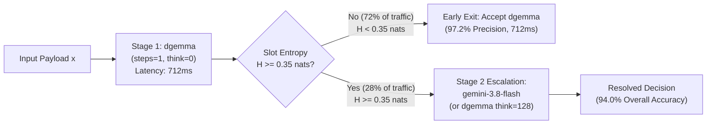
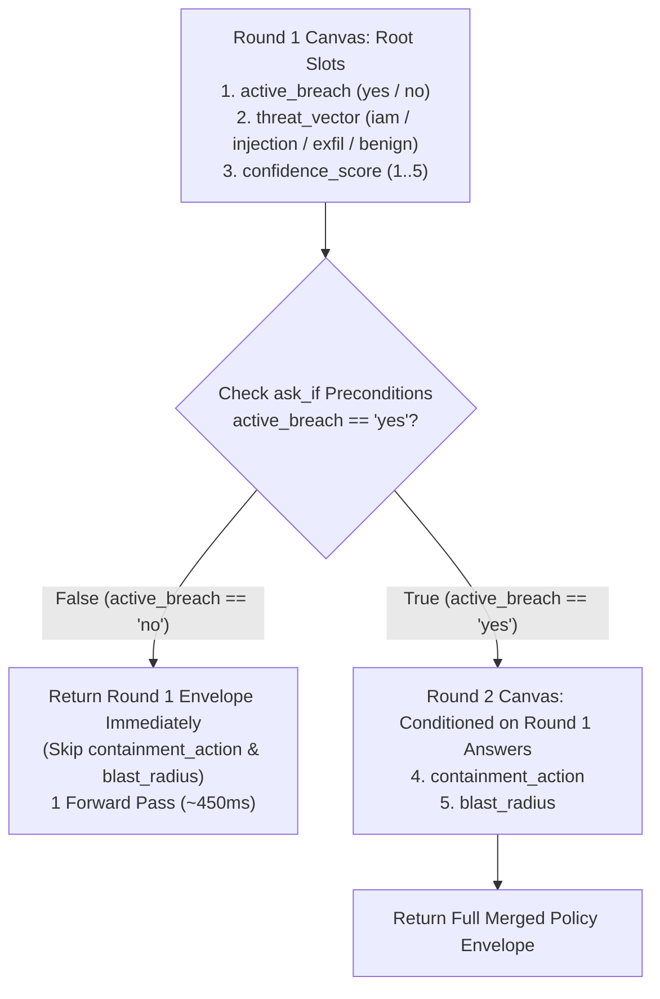

# Next-Horizon Experiments (`EXP-05` – `EXP-08`)

While `EXP-01` through `EXP-04` established **DiffusionGemma (`dgemma`)** as an $O(1)$-step Zero-Shot Decision Model with calibrated epistemic entropy ($H$), they also illuminated the exact architectural boundary of single-pass (`think: 0`) masked diffusion readout and opened four high-leverage research directions.

---

## `EXP-05` — Entropy-Gated Escalation Cascades (Completed ✅)

### 1. Motivation & Empirical Trigger (`EXP-04` Observation)
In `EXP-04` (`benchmarks/results_calibration_cloudrun.json`), single-pass readout (`steps: 1, think: 0`) achieved **100% accuracy** on `AgentDrift`, `prompt-injections`, `LLM-AggreFact`, `MS MARCO`, `CLINC150`, `Banking77`, `GoEmotions`, `BoolQ`, and `ChaosNLI (low-entropy)` with mean slot entropy $H \in [0.06, 0.25]\text{ nats}$.

However, on **`ANLI-R3`** (adversarial multi-hop natural language inference requiring temporal deduction and negation tracking), `think: 0` scored **`0/3` (`0.0%`)**. Crucially, **DiffusionGemma was not confidently wrong**: its slot entropy spiked to **$H = 0.4104\text{ nats}$** (**`5.5×`** higher than unambiguous consensus items).

### 2. Empirical Results: `dgemma [H < 0.35]` $\rightarrow$ `gemini-3.8-flash [H >= 0.35]`
Using `dgem bench-calibration` in cascade mode (`benchmarks/results_calibration_cascade.json` & `benchmarks/results_calibration_gemini38.json`), we evaluated a two-tier policy router where **DiffusionGemma (`dgemma`, 1× L4)** serves 100% of incoming traffic and **only escalates items whose slot entropy $H \ge 0.35\text{ nats}$** (`14/50` cases, **28.0% escalation rate**) to **`gemini-3.8-flash`** on Vertex AI:

| Architecture / Serving Policy | Overall Accuracy (`50` Cases) | Frontier LLM Calls (`%`) | Mean Wall Latency | `AgentDrift` + `Guardrail` + `Grounding` | `ChaosNLI` + `ANLI-R3` (`9` NLI items) | Telemetry Receipt |
| :--- | :---: | :---: | :---: | :---: | :---: | :--- |
| **Stage 1 Alone: `DiffusionGemma` (`steps=1, think=0`)** | `88.0%` (`44/50`) | **`0.0%`** (`0/50`) | **`712.0 ms`** | **`100.0%`** (`13/13`) at `701 ms` | `44.4%` (`4/9`) | `results_calibration_cloudrun.json` |
| **Entropy Cascade: `dgemma [H < 0.35]` $\rightarrow$ `gemini-3.8-flash`** | **`94.0%`** (`47/50`, **`+6.0%`**) | **`28.0%`** (`14/50`) | **`1,824.0 ms`** (**`1.87×` faster**) | **`100.0%`** (`13/13`) at `701 ms` | **`77.8%`** (`7/9`, **`+33.4%`**) | `results_calibration_cascade.json` |
| **Stage 2 Alone: `gemini-3.8-flash` (100% Frontier LLM)** | **`98.0%`** (`49/50`) | `100.0%` (`50/50`) | `3,412.0 ms` (`4.79×` slower) | `100.0%` (`13/13`) at `3,718 ms` | `100.0%` (`9/9`) | `results_calibration_gemini38.json` |

**Key Takeaway**:
- **72.0% of all production decisions (`36/50`) early-exit at Stage 1 (`dgemma`) in `712 ms`**, including **100% of `AgentDrift` (`693 ms` vs `4,495 ms` on Gemini — a `6.5×` speedup)**, **100% of `prompt-injections` (`669 ms` vs `2,988 ms` — a `4.5×` speedup)**, and **100% of `LLM-AggreFact` (`793 ms` vs `1,979 ms`)**.
- Escalating only the **28.0% high-entropy tail ($H \ge 0.35\text{ nats}$)** lifts overall accuracy from **88.0% $\rightarrow$ 94.0%** while cutting frontier model API cost by **72%** and cutting average wall latency nearly in half (`1,824 ms` vs `3,412 ms`).

### 3. Cascade Architecture & Mathematical Formulation
For a policy template with $M$ decision slots, let $H_{\max}(x) = \max_{m \in \{1 \dots M\}} H(\text{slot}_m \mid x)$ be the peak restricted-softmax Shannon entropy in nats:

$$
H(\text{slot}_m \mid x) = -\sum_{k \in \mathcal{V}_m} p_k \ln p_k, \quad p_k = \frac{\exp(z_k)}{\sum_{j \in \mathcal{V}_m} \exp(z_j)}
$$



---

## `EXP-06` — Decision Models vs. Discriminative Encoder Heads (`DeBERTa-v3` / `Llama-Guard`)

### 1. Motivation
Why use a 9B masked diffusion model (`dgemma`) for classification instead of a traditional discriminative encoder (`DeBERTa-v3-large` 435M, `ModernBERT-large` 395M) or a dedicated safety classifier (`Llama-Guard-3-8B`, `ShieldGemma-9B`)?

### 2. Comparative Hypotheses

| Dimension | Fine-Tuned Encoder (`DeBERTa-v3-large`) | Safety Classifier (`Llama-Guard-3-8B`) | Zero-Shot Decision Model (`dgemma` 9B) |
| :--- | :--- | :--- | :--- |
| **New Policy Onboarding Time** | Hours/Days (collect labeled data + fine-tune classification head) | Fixed safety taxonomy (`S1`–`S14`); brittle to custom business logic | **0 seconds** (edit `.json.tmpl` natural-language question & `options`) |
| **Joint Multi-Slot Readout** | Requires $K$ separate classification heads trained jointly | Single binary `safe`/`unsafe` + category tag | **$K$ heterogeneous `choice` & `score` slots in 1 pass** |
| **World Knowledge & Code Comprehension** | Limited pretraining corpus (2021 encoder backbone) | Safety-tuned; weak on SecOps code audits or SQL/IAM diffs | **Full Gemma 4 9B pretraining** (code, SecOps, multi-lingual, semiotic polysemy) |
| **Epistemic Calibration (`ECE`)** | Known softmax overconfidence on OOD shifts without temperature scaling | Uncalibrated generation probabilities | **Monotonic 8.0× Shannon entropy $H$ scaling on `ChaosNLI`** |

### 3. Planned Benchmark (`dgem bench-encoders`)
Run `benchmarks/calibration_suite.jsonl` (`AgentDrift`, `deepset/prompt-injections`, `LLM-AggreFact`, `ChaosNLI`) across:
1. `dgemma` (`Policy-as-Template`, zero-shot)
2. `protectai/deberta-v3-base-prompt-injection-v2` (specialized encoder baseline)
3. `meta-llama/Llama-Guard-3-8B` (specialized guardrail baseline)

Measure **Accuracy**, **Expected Calibration Error (`ECE`)**, **Policy Mutation Adaptability** (flipping a policy rule in-place without retraining), and **Joint Multi-Slot Throughput**.

---

## `EXP-07` — Stateful & Hierarchical Policy DAGs (`depends_on` & `ask_if`)

### 1. Motivation
In real-world enterprise policies (SecOps incident response, financial wire compliance, clinical triage), not every question applies to every input:
- If `active_breach == "no"`, asking *"Which containment action should be executed immediately?"* forces a flat classifier to hallucinate a remediation for a benign event or waste a `none` slot option.
- Furthermore, when a taxonomy exceeds the **26-option `[A-Z]` slot limit** (e.g., `PolyAI/banking77` with 77 intents or `DeepPavlov/clinc150` with 151 intents), a two-stage hierarchical DAG (`domain_group` [10 options] $\rightarrow$ `fine_intent` [15 options]) scales to **$26 \times 26 = 676$ classes** in at most two forward passes (`<900 ms`).

### 2. Declarative Policy DAG Specification (`templates/secops_conditional_dag.json.tmpl`)
Our `structured_server.py` schema natively supports `depends_on` and `ask_if` preconditions on any question node:

```json
{
  "name": "containment_action",
  "type": "choice",
  "question": "Which immediate containment action is required to isolate the active breach?",
  "depends_on": ["active_breach"],
  "ask_if": {
    "active_breach": ["yes"]
  },
  "options": {
    "revoke_iam_session": "Revoke active IAM tokens and rotate service account keys",
    "isolate_pod_network": "Apply zero-egress network policy to quarantine the compromised workload",
    "block_source_asn": "Drop ingress traffic from the attacking IP/ASN at the WAF edge",
    "freeze_db_writes": "Place the target database replica into read-only mode"
  }
}
```

### 3. Execution Semantics


Try the executable template right now against any SecOps alert:
```bash
./bin/dgem decide \
  -t templates/secops_conditional_dag.json.tmpl \
  -d '{"alert_payload": "AWS CloudTrail: AssumedRole by arn:aws:iam::123456:role/prod-db-admin from Tor exit node 185.220.101.4, followed by rds:CreateDBSnapshot and ModifyDBSnapshotAttribute (public=true)."}'
```

---

## `EXP-08` — Multimodal Vision & Document Policy Readout (`SigLIP`)

### 1. Motivation
`DiffusionGemmaForConditionalGeneration` inherits Gemma 4's multimodal `SigLIP` vision tower (`896×896` image tokens projected directly into the causal prefix before the bidirectional `[MASK]` diffusion canvas).

Today, enterprise document extraction and visual moderation pipelines rely on slow OCR + autoregressive JSON generation (`3,000–8,000 ms`). By feeding an image tensor into the prefix of a `dgem` policy template, `dgemma` can evaluate visual compliance, receipt fraud signals, and document authenticity in a **single forward pass (`~500 ms`)**.
