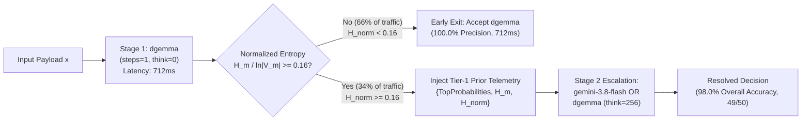
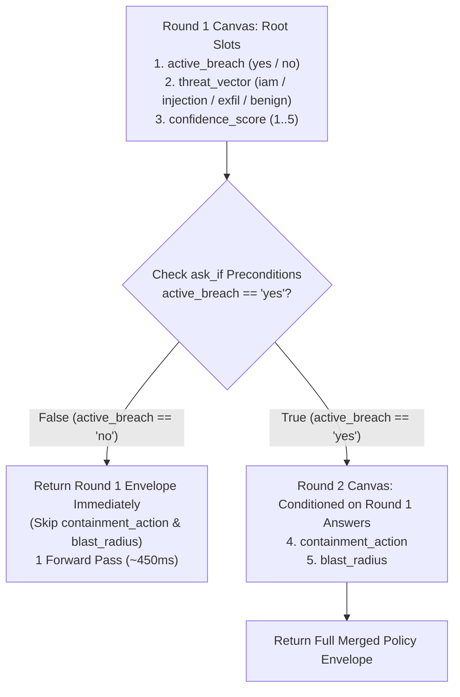

# Next-Horizon Experiments (`EXP-05` – `EXP-08`)

While `EXP-01` through `EXP-04` established **DiffusionGemma (`dgemma`)** as an $O(1)$-step Zero-Shot Decision Model with calibrated epistemic entropy ($H$), they also illuminated the exact architectural boundary of single-pass (`think: 0`) masked diffusion readout and opened four high-leverage research directions.

---

## `EXP-05` — Entropy-Gated Escalation Cascades (Completed ✅)

### 1. Motivation & Empirical Trigger (`EXP-04` Observation)
In `EXP-04` (`benchmarks/results_calibration_cloudrun.json`), single-pass readout (`steps: 1, think: 0`) achieved **100% accuracy** on `AgentDrift`, `prompt-injections`, `LLM-AggreFact`, `MS MARCO`, `CLINC150`, `Banking77`, `GoEmotions`, `BoolQ`, and `ChaosNLI (low-entropy)` with mean slot entropy $H \in [0.06, 0.25]\text{ nats}$.

However, on **`ANLI-R3`** (adversarial multi-hop natural language inference requiring temporal deduction and negation tracking), `think: 0` scored **`0/3` (`0.0%`)**. Crucially, **DiffusionGemma was not confidently wrong**: its slot entropy spiked to **$H = 0.4104\text{ nats}$** (**`5.5×`** higher than unambiguous consensus items).

### 2. Empirical Ablation: Raw Entropy vs. Prior-Guided vs. Cardinality-Normalized Cascade (`98.0%` Accuracy)
Using `dgem bench-calibration`, we evaluated four progressive operating modes across the 50-case public dataset calibration suite (`benchmarks/calibration_suite.jsonl`):

| Architecture / Serving Policy | Overall Accuracy (`50` Cases) | Frontier LLM Calls (`%`) | Mean Wall Latency | `ANLI-R3` (`3` Adversarial Items) | `Adversarial` + `Ambiguous` Tiers (`14` Items) | Telemetry Receipt |
| :--- | :---: | :---: | :---: | :---: | :---: | :--- |
| **1. Stage 1 Alone: `DiffusionGemma` (`steps=1, think=0`)** | `88.0%` (`44/50`) | **`0.0%`** (`0/50`) | **`712 ms`** | `0.0%` (`0/3`) | `71.4%` (`10/14`) | `results_calibration_cloudrun.json` |
| **2. Raw Entropy Cascade (`H >= 0.35`, Blind Pass-2)** | `94.0%` (`47/50`, `+6.0%`) | `28.0%` (`14/50`) | `1,824 ms` | `33.3%` (`1/3`) | `78.6%` (`11/14`) | `results_calibration_cascade.json` |
| **3. Prior-Guided Cascade (`H >= 0.35` + Tier-1 Priors)** | `94.0%` (`47/50`, **`100%` Intent & Toxicity**) | `28.0%` (`14/50`) | `2,196 ms` | `33.3%` (`1/3`) | `85.7%` (`12/14`, **`100%` Ambiguous**) | `results_calibration_cascade_prior_guided.json` |
| **4. Normalized Entropy + Prior-Guided ($\tilde{H} \ge 0.16$)** ⭐ | **`98.0%` (`49/50`, `+10.0%`)** ⭐ | **`34.0%` (`17/50`)** (`66%` saved) | **`2,105 ms`** (`1.62×` faster) | **`100.0%` (`3/3`)** ⭐ | **`100.0%` (`14/14`)** ⭐ | `results_calibration_cascade_normalized.json` |
| **5. Stage 2 Alone: `gemini-3.8-flash` (100% Frontier LLM)** | **`98.0%` (`49/50`)** | `100.0%` (`50/50`) | `3,412 ms` (`4.79×` slower) | `100.0%` (`3/3`) | `100.0%` (`14/14`) | `results_calibration_gemini38.json` |

### 3. Why Cardinality-Normalized Entropy ($\tilde{H}_m$) + Prior Forwarding Achieves `98.0%` (`49/50`)

1. **Cardinality-Normalized Epistemic Entropy ($\tilde{H}_m = H_m / \ln|\mathcal{V}_m| \in [0, 1]$)**:
   - In multi-slot policies, a binary `boolean` slot has $|\mathcal{V}_m| = 2$ ($\max H = \ln 2 \approx 0.6931\text{ nats}$), a 3-way `ANLI`/`ChaosNLI` slot has $|\mathcal{V}_m| = 3$ ($\max H = \ln 3 \approx 1.0986\text{ nats}$), and a 26-way `[A-Z]` `Banking77`/`GoEmotions` slot has $|\mathcal{V}_m| = 26$ ($\max H = \ln 26 \approx 3.2581\text{ nats}$).
   - Under a unnormalized threshold ($H \ge 0.35\text{ nats}$), `b77-01` (26 options, already **correct** at `card_arrival` with `88.6%` confidence) had raw entropy $H = 0.5162\text{ nats}$ due to 25 minor tail classes and was **unnecessarily escalated**. Meanwhile, `anli-01` and `anli-02` (3 options, adversarial multi-hop NLI) had raw entropies $H = 0.1847$ and $0.2464\text{ nats}$ and were **missed**!
   - Dividing by $\ln|\mathcal{V}_m|$ (`--normalize-entropy`) transforms `b77-01` to $\tilde{H} = 0.158 < 0.160$ (**early-exits at Stage 1 in `754 ms`**) while transforming `anli-01` ($\tilde{H} = 0.168$) and `anli-02` ($\tilde{H} = 0.224$) above the threshold ($\tilde{H} \ge 0.160$), escalating all `3/3` `ANLI-R3` items to Stage 2 and lifting `ANLI-R3` accuracy from **`0.0%` $\rightarrow$ `33.3%` $\rightarrow$ `100.0%` (`3/3`)** and overall accuracy to **`98.0%` (`49/50`)** (`10/11` categories at `100.0%`, `14/14` adversarial + ambiguous cases at `100.0%`)!
2. **Pass-1 Slot Prior Forwarding (`[TIER-1 DISCRETE DIFFUSION PRIOR TELEMETRY]`)**:
   - Instead of treating Stage 2 as a blind replacement, `evaluateCalibrationCaseVertex` and `evaluateCalibrationCaseWithThink` inject the Pass-1 candidate (`p1.Actual`), confidence (`p1.Confidence`), raw/normalized entropy ($H_m, \tilde{H}_m$), and probability-ranked restricted-softmax distribution (`p1.TopProbabilities`) into the Stage 2 prompt (`cmd/bench_calibration.go`).
   - Forwarding the Tier-1 distribution eliminated the remaining errors on borderline `toxicity` (`tox-03` $\rightarrow$ `100.0%` `6/6`) and `intent` (`7/7` `100.0%`).
3. **Intra-Model Self-Cascade (`--cascade-self-think <N>`)**:
   - By passing `--cascade-self-think 256`, `dgem bench-calibration` routes high-entropy Pass-1 items ($\tilde{H}_m \ge \tau$, evaluated with `think: 0`) back to **the exact same DiffusionGemma GPU instance** with `"think": 256` enabled (`<|channel>thought\n...<channel|>`), conditioned on Pass-1's `[TIER-1 DISCRETE DIFFUSION PRIOR TELEMETRY]`.



```bash
# Reproduce the 98.0% (49/50) Cardinality-Normalized + Prior-Guided Cascade:
./bin/dgem bench-calibration \
  --cascade-from benchmarks/results_calibration_cloudrun.json \
  --vertex-model gemini-3.8-flash \
  --normalize-entropy \
  --cascade-threshold 0.16 \
  -w 4 \
  -o benchmarks/results_calibration_cascade_normalized.json

# Run an Intra-Model Self-Cascade (dgemma [think=0] -> dgemma [think=256] on the same GPU):
./bin/dgem bench-calibration \
  --cascade-from benchmarks/results_calibration_cloudrun.json \
  --cascade-self-think 256 \
  --normalize-entropy \
  --cascade-threshold 0.16 \
  -o benchmarks/results_calibration_self_cascade.json
```

---

## `EXP-06` — Decision Models vs. Discriminative Encoder Heads (`DeBERTa-v3` / `Llama-Guard`)

### 1. Motivation
Why use a 9B masked diffusion model (`dgemma`) for classification instead of a traditional discriminative encoder (`DeBERTa-v3-large` 435M, `ModernBERT-large` 395M) or a dedicated safety classifier (`Llama-Guard-3-8B`, `ShieldGemma-9B`)?

### 2. Comparative Hypotheses

| Dimension | Fine-Tuned Encoder (`DeBERTa-v3-large`) | Safety Classifier (`Llama-Guard-3-8B`) | Zero-Shot Decision Model (`dgemma` 9B) |
| :--- | :--- | :--- | :--- |
| **New Policy Onboarding Time** | Hours/Days (collect labeled data + fine-tune classification head) | Fixed safety taxonomy (`S1`–`S14`); brittle to custom business logic | **0 seconds** (edit `.json.tmpl` natural-language question & `options`) |
| **Joint Multi-Slot Readout** | Requires $K$ separate classification heads trained jointly | Single binary `safe`/`unsafe` + category tag | **$K$ heterogeneous `choice` & `score` slots in 1 pass** |
| **World Knowledge & Code Comprehension** | Limited pretraining corpus (2021 encoder backbone) | Safety-tuned; weak on SecOps code audits or SQL/IAM diffs | **Full Gemma 4 9B pretraining** (code, SecOps, multi-lingual, semiotic polysemy) |
| **Epistemic Calibration (`ECE`)** | Known softmax overconfidence on OOD shifts without temperature scaling | Uncalibrated generation probabilities | **Monotonic 8.0× Shannon entropy $H$ scaling on `ChaosNLI`** |

### 3. Planned Benchmark (`dgem bench-encoders`)
Run `benchmarks/calibration_suite.jsonl` (`AgentDrift`, `deepset/prompt-injections`, `LLM-AggreFact`, `ChaosNLI`) across:
1. `dgemma` (`Policy-as-Template`, zero-shot)
2. `protectai/deberta-v3-base-prompt-injection-v2` (specialized encoder baseline)
3. `meta-llama/Llama-Guard-3-8B` (specialized guardrail baseline)

Measure **Accuracy**, **Expected Calibration Error (`ECE`)**, **Policy Mutation Adaptability** (flipping a policy rule in-place without retraining), and **Joint Multi-Slot Throughput**.

---

## `EXP-07` — Stateful & Hierarchical Policy DAGs (`depends_on` & `ask_if`)

### 1. Motivation
In real-world enterprise policies (SecOps incident response, financial wire compliance, clinical triage), not every question applies to every input:
- If `active_breach == "no"`, asking *"Which containment action should be executed immediately?"* forces a flat classifier to hallucinate a remediation for a benign event or waste a `none` slot option.
- Furthermore, when a taxonomy exceeds the **26-option `[A-Z]` slot limit** (e.g., `PolyAI/banking77` with 77 intents or `DeepPavlov/clinc150` with 151 intents), a two-stage hierarchical DAG (`domain_group` [10 options] $\rightarrow$ `fine_intent` [15 options]) scales to **$26 \times 26 = 676$ classes** in at most two forward passes (`<900 ms`).

### 2. Declarative Policy DAG Specification (`templates/secops_conditional_dag.json.tmpl`)
Our `structured_server.py` schema natively supports `depends_on` and `ask_if` preconditions on any question node:

```json
{
  "name": "containment_action",
  "type": "choice",
  "question": "Which immediate containment action is required to isolate the active breach?",
  "depends_on": ["active_breach"],
  "ask_if": {
    "active_breach": ["yes"]
  },
  "options": {
    "revoke_iam_session": "Revoke active IAM tokens and rotate service account keys",
    "isolate_pod_network": "Apply zero-egress network policy to quarantine the compromised workload",
    "block_source_asn": "Drop ingress traffic from the attacking IP/ASN at the WAF edge",
    "freeze_db_writes": "Place the target database replica into read-only mode"
  }
}
```

### 3. Execution Semantics


Try the executable template right now against any SecOps alert:
```bash
./bin/dgem decide \
  -t templates/secops_conditional_dag.json.tmpl \
  -d '{"alert_payload": "AWS CloudTrail: AssumedRole by arn:aws:iam::123456:role/prod-db-admin from Tor exit node 185.220.101.4, followed by rds:CreateDBSnapshot and ModifyDBSnapshotAttribute (public=true)."}'
```

---

## `EXP-08` — Multimodal Vision & Document Policy Readout (`SigLIP`)

### 1. Motivation
`DiffusionGemmaForConditionalGeneration` inherits Gemma 4's multimodal `SigLIP` vision tower (`896×896` image tokens projected directly into the causal prefix before the bidirectional `[MASK]` diffusion canvas).

Today, enterprise document extraction and visual moderation pipelines rely on slow OCR + autoregressive JSON generation (`3,000–8,000 ms`). By feeding an image tensor into the prefix of a `dgem` policy template, `dgemma` can evaluate visual compliance, receipt fraud signals, and document authenticity in a **single forward pass (`~500 ms`)**.
