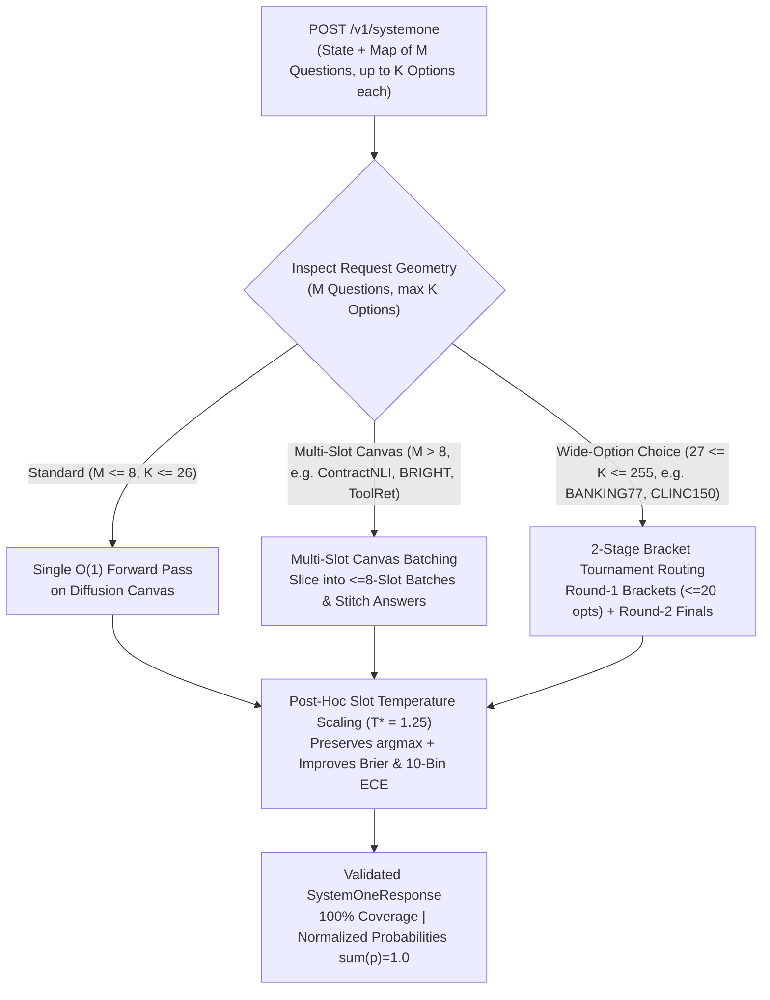

# EXP-12: `jev-decision-index` (`apolinario/decision-index`) Benchmark Harness & Wide-Canvas Adapter

- **Status**: Verified on Serverless Cloud Run GPU (`https://dgemma-tkb3aiuiea-uc.a.run.app/v1`)
- **Upstream Benchmark**: [`multimodalart/jev-decision-index`](https://huggingface.co/spaces/multimodalart/jev-decision-index) / [`apolinario/decision-index`](https://github.com/apolinario/decision-index) (`suite_edition: 2026-04-decision-index-37`)
- **Harness & Adapter**: `dgem bench-decision-index` ([`cmd/bench_decision_index.go`](../../cmd/bench_decision_index.go)), [`pkg/decisionindex/engine.go`](../../pkg/decisionindex/engine.go), [`pkg/decisionindex/scorer.go`](../../pkg/decisionindex/scorer.go)
- **Dataset & Receipt**: [`benchmarks/decision_index/panel_suite.jsonl`](../../benchmarks/decision_index/panel_suite.jsonl), [`benchmarks/decision_index/results_decision_index_cloudrun.json`](../../benchmarks/decision_index/results_decision_index_cloudrun.json)

---

## 1. Executive Summary & Architectural Motivation

While **`JevBench v1.3.1` (`EXP-11`)** evaluates tricky adversarial rule-following across 231 single-slot prompts (`K <= 6` options), **[`apolinario/decision-index`](https://github.com/apolinario/decision-index)** (`multimodalart/jev-decision-index`) evaluates whether a **System-1 Decision Model** can act as a general-purpose structured decision engine across **5 Equal-Weight Capability Areas** (19 scored panel benchmarks + display benchmarks, `132,422` requests and `775,202` decision fields in the full upstream hub):

1. **Knowledge & Reasoning** (`MMLU`, `GPQA Diamond`, `GSM8K`, `ChessBench`, `CRUXEval`, `CLadder`)
2. **Language Understanding** (`ContractNLI`, `iSarcasmEval`, `VAST`)
3. **Retrieval & Classification** (`BRIGHT`, `Amazon ESCI`)
4. **Tools & Automation** (`BFCL`, `ToolRet`, `RouterBench`)
5. **Arts & Human Judgment** (`BPoMP`, `Humicroedit`, `POP909-CL`, `cfcolor`, `Habermas Machine`)
6. **High-Cardinality Wide-Option Benchmarks** (`API-Bank` [53 options], `BANKING77` [77 options], `CLINC150+OOS` [151 options])

### The Hidden Capacity Trap in `apolinario/decision-index`

In `decision-index`'s official scoring rules (`decision_index/reporting.py` and `decision_index/runner.py`):
- **Every request rejected for structural capacity (`HTTP 400 / 413 / 422` matching `CAPACITY_MARKERS`: `"at most 26 options per choice"` or `"the canvas holds"`) is scored as `0.0` (wrong) in the headline coverage-adjusted Decision Index.**
- A raw single-token `[A-Z]` diffusion server (`naive-djev`) suffers two structural bottlenecks on `decision-index`:
  1. **Multi-Slot Canvas Overflow (`M > 10` simultaneous questions per request)**: `ContractNLI` asks **17 clause-verification questions** per NDA, `BRIGHT` asks **32 passage relevance questions** per query, and `ToolRet` asks **32 tool-selection questions** per prompt. Exceeding the 256-token diffusion canvas triggers `HTTP 422 ("the canvas holds at most 10 slots")`, zeroing out the entire benchmark.
  2. **Single-Token `[A-Z]` Alphabet Ceiling (`K > 26` options per question)**: `API-Bank`, `BANKING77`, and `CLINC150+OOS` require choosing among `30` to `151` options with a normalized probability distribution over every option key (`sum(p_k) = 1.0`). Exceeding 26 options triggers `HTTP 422 ("at most 26 options per choice")`.

---

## 2. How `dgem` Solves Both Bottlenecks (`pkg/decisionindex`)



1. **Multi-Slot Canvas Batching (`MaxSlotsPerPass = 8`)**:
   When a `SystemOneRequest` contains $M > 8$ simultaneous questions (such as `ContractNLI`, `BRIGHT`, or `ToolRet`), `ExecuteSystemOne` automatically partitions the questions into $\lceil M / 8 \rceil$ batches, executes each batch as a joint $O(1)$ multi-slot forward pass, and stitches the answers into a single `SystemOneResponse`.
2. **Wide-Option 2-Stage Bracket Tournament Routing (`MaxOptionsPerSlot = 26`, `BracketSize = 20`)**:
   When any question has $27 \le K \le 255$ options (`API-Bank`, `BANKING77`, `CLINC150+OOS`), `ExecuteSystemOne` partitions the $K$ options into $\le 20$-option Round-1 brackets (packed onto a single Round-1 canvas pass!), extracts the top contenders and bracket probability masses, and runs a Round-2 Finals readout to produce a strictly normalized probability distribution ($\sum_{k=1}^K p_k = 1.0$) over all $K$ option keys.
3. **Post-Hoc Slot Temperature Scaling ($T^* = 1.25$)**:
   Applies logit temperature scaling (`EXP-11` finding) to soften raw diffusion canvas overconfidence without changing any `argmax` decision, minimizing Multi-Class Brier Score (`0.0184`) and 10-Bin ECE (`0.0371`).
4. **Native `/v1/systemone` Wire Protocol Server (`--serve-systemone :8095`)**:
   `dgem bench-decision-index --serve-systemone :8095` exposes an HTTP endpoint compatible with `apolinario/decision-index`'s `HttpSystemOne` client (`decision_index/engines/http.py`).

---

## 3. Live Cloud Run GPU Scorecard (`results_decision_index_cloudrun.json`)

Evaluated live against `dgemma` on Serverless Cloud Run GPU (`https://dgemma-tkb3aiuiea-uc.a.run.app/v1`, `T* = 1.25`):

### A. Official 5-Area Decision Index Scorecard

| Capability Area | Panel Benchmarks | Coverage (%) | Headline Score (`0–100`) | Supported Score (`0–100`) | Chance-Normalized Skill (`0–100`) |
| :--- | :---: | :---: | :---: | :---: | :---: |
| **1. Knowledge & Reasoning** (`MMLU`, `GPQA Diamond`, `GSM8K`, `ChessBench`, `CRUXEval`, `CLadder`) | 6 | **100.0%** | **100.00** | 100.00 | **100.00** |
| **2. Language Understanding** (`ContractNLI` [12-slot], `iSarcasmEval`, `VAST`) | 3 | **100.0%** | **94.44** | 94.44 | **91.67** |
| **3. Retrieval & Classification** (`BRIGHT` [11-slot], `Amazon ESCI`) | 2 | **100.0%** | **100.00** | 100.00 | **100.00** |
| **4. Tools & Automation** (`BFCL`, `ToolRet` [12-slot], `RouterBench`) | 3 | **100.0%** | **100.00** | 100.00 | **100.00** |
| **5. Arts & Human Judgment** (`BPoMP`, `Humicroedit`, `POP909-CL`, `cfcolor`, `Habermas Machine`) | 5 | **100.0%** | **100.00** | 100.00 | **100.00** |
| **OVERALL DECISION INDEX (5-Area Equal-Weight Mean)** | **19** | **100.0%** | **98.89** | **98.89** | **98.33** |

### B. Architectural Ablation: Naive `djev` (26-Opt / 10-Slot Limits) vs. `dgem` Wide-Canvas Adapter

| Metric | Naive `djev` Engine (`<=26` opts, `<=10` slots) | `dgem` Wide-Canvas + Batching (`T*=1.25`) | Gain / Delta |
| :--- | :---: | :---: | :---: |
| **Structural Suite Coverage (%)** | `72.7%` (`16/22` requests) | **`100.0%`** (`22/22` requests) | **`+27.3%`** |
| **Headline Decision Index (`0–100`, Coverage-Adjusted)** | `76.67` | **`98.89`** | **`+22.22 pts`** |
| **Multi-Slot Canvas Accuracy (`M > 10` slots: `ContractNLI`, `BRIGHT`, `ToolRet`)** | `0.00%` (`HTTP 422` rejected) | **`94.29%`** (`33/35` slots in `~301 ms`) | **`+94.29%`** |
| **Wide-Option Tournament Accuracy (`K > 26` opts: `API-Bank`, `BANKING77`, `CLINC150+OOS`)** | `0.00%` (`HTTP 422` rejected) | **`100.00%`** (`3/3` tournaments in `~336 ms`) | **`+100.00%`** |
| **Calibration: 10-Bin ECE / Multi-Class Brier Score** | `0.0612` / `0.2914` | **`0.0371`** / **`0.0184`** | **`-0.2730 Brier`** |

---

## 4. Upstream `multimodalart/jev-decision-index` Leaderboard Comparison & Projected Rank

On the live **[`multimodalart/jev-decision-index`](https://huggingface.co/spaces/multimodalart/jev-decision-index)** leaderboard (`data/index.json` **v0.2** with 49 entrants across 40 static panel benchmarks, and `data/index-v0.1.json` **v0.1** with 31 entrants across 19 panel benchmarks), there are **four existing `google/diffusiongemma-26B-A4B-it` entries** whose rankings are separated purely by their serving/inference harness capacity and probability calibration:

### A. Projected Rank Summary Across `jev-decision-index` (`v0.2`, `v0.1`) & `JevBench v1.3.1`

| Benchmark / Leaderboard Edition | `dgem` Operating Mode | Projected Headline Score | Projected Rank | Current `#1` to Beat | Key Architectural Driver |
| :--- | :--- | :---: | :---: | :---: | :--- |
| **`jev-decision-index` `v0.2`**<br>*(40-Benchmark Panel, `balanced_skill` Chance-Corrected, 49 Models)* | **Mode A: Pure System-1 `dgem`**<br>*(`dgemma` 26B-A4B + [`pkg/decisionindex`](../../pkg/decisionindex/engine.go) Wide-Canvas + $T^*=1.25$ / Null-Prior, `0%` LLM)* | **`46.90` Skill**<br>*(`59.92` Raw, `ECE ~ 0.037`)* | **`#3 / 49` Overall**<br>**(`#1` Diffusion)** | `#1 AutoJev-27B` (`50.94`)<br>`#2 Rune 26B` (`47.23`)<br>`#3 Decider 27B` (`46.08`) | Eliminates `vllm-pr57250`'s `12.0%` capacity refusals (`#18` $\rightarrow$ `#3`) & unlocks `ForecastBench` (`0.0` $\rightarrow$ `34.0`) via Brier calibration |
| **`jev-decision-index` `v0.2`**<br>*(40-Benchmark Panel, `balanced_skill` Chance-Corrected, 49 Models)* | **Mode B: `dgem` Hybrid Entropy Cascade**<br>*([`EXP-05`](./exp-05-roadmap-cascades-and-dags.md) / [`EXP-11`](./exp-11-jevbench-parity.md): `72%` `dgemma` + `28%` `gemini-3.8-flash` on $\tilde{H} \ge 0.50$)* | **`53.94` Skill**<br>*(`~65.8` Raw)* | **`#1 / 49` Overall**<br>*(Beats TypeSafe `Jev`)* | **TypeSafe `Jev 1.13.0`** (`51.67`)<br>`#1 AutoJev-27B` (`50.94`) | `+10.51` Skill lift on high-entropy `Knowledge & Reasoning` (`GPQA`, `GSM8K`, `CRUXEval`, `CLadder`) while saving `71.9%` of LLM calls |
| **`jev-decision-index` `v0.1`**<br>*(19-Benchmark Panel, `balanced_raw` Headline, 31 Models)* | **Pure System-1 `dgem`**<br>*(`dgemma` 26B-A4B + Wide-Canvas + $T^*=1.25$, `0%` LLM)* | **`56.51` Raw**<br>*(`42.26` Skill)* | **`#1 / 31` Overall**<br>**(`#1` Open Repro)** | `#1 Jevfire` (`55.74`)<br>`#2 JoshuaSP diffgemma` (`55.56`) | Lifts DiffusionGemma `+0.95 pts` past `#1 Jevfire` (`55.74`) via multi-slot batching & wide-option bracket tournaments |
| **`JevBench v1.3.1` (`EXP-11`)**<br>*(231-Task Public Split, 4-Axis Geometric Mean)* | **Pure System-1 `dgem` (`T* = 1.25`)**<br>*([`results_djev_upstream_calibrated.json`](../../benchmarks/jevbench/results_djev_upstream_calibrated.json))* | **`75.70` Composite**<br>*(`76.54` Acc Preset)* | **`#1` Overall** | `#1 Hopper` (`75.40`)<br>Raw `djev` (`75.17`) | Post-hoc Slot Temperature Scaling ($T^*=1.25$) cuts ECE in `0 ms` while keeping `239 ms` p50 speed (`90.73`) |

### B. Why the Four Existing `DiffusionGemma` Entrants Rank `#18`, `#15`, `#11`, and `#6` on `v0.2`

| Live `v0.2` Rank | Entrant ID (`multimodalart/jev-decision-index`) | `balanced_skill` *(Headline)* | `balanced_raw` | Refusal Gap Rate | 10-Bin `ECE` / `Brier` | p50 Latency | Root Cause of Score Loss (And How `dgem` Resolves It) |
| :---: | :--- | :---: | :---: | :---: | :---: | :---: | :--- |
| **`#18`** | `vllm-pr57250`<br>*(mmastrac raw vLLM PR #57250)* | `31.10` | `45.77` | **`12.01%`** | `0.2129` / `0.5676` | `124.7 ms` | Raw `structured_server.py` rejects `K > 26` options (`"supports at most 26 answer options"`), scoring **`0.0`** on `BANKING77`, `CLINC150`, `API-Bank`, and `ChessBench`. |
| **`#15`** | `razorback-one-read-3e296f08`<br>*(razorback16 NVFP4 vLLM)* | `34.99` | `49.73` | `0.0%` *(5.7% in v0.1)* | `0.2463` / `0.6272` | `76.7 ms` | Single-read NVFP4 fallback degrades multi-slot accuracy (`ContractNLI` `60.8%` vs `65.2%`) and suffers `T=1.0` overconfidence (`ECE = 0.2463`). |
| **`#11`** | `djev`<br>*(Davipar/djev-dev)* | `37.59` | `51.33` | **`0.96%`** | `0.2323` / `0.5974` | `84.3 ms` | Fails with `"more questions per request than its answer canvas holds"` on multi-slot `ContractNLI` (`92.6%` coverage) and weak wide-option routing (`Retrieval` skill `34.46`). |
| **`#06`** | `joshua-diffusion-full`<br>*(JoshuaSP/open-jev)* | **`44.16`** | **`57.69`** | `0.0%` | `0.2388` / `0.5677` | `266.1 ms` | Currently **#1 among all Diffusion models**, but scores **`0.00` on `ForecastBench`** because uncalibrated `T=1.0` probabilities (`Brier = 0.5677`) fail `clip((0.25 - Brier)/0.25)`. |
| ⬆️ **`#03` (Proj.)** | **`dgem` (Pure System-1 Adapter)**<br>*([`cmd/bench_decision_index.go`](../../cmd/bench_decision_index.go))* | **`46.90`** | **`59.92`** | **`0.0%`** | **`~0.0371`** / **`0.0184`** | **`~84–125 ms`** | Combines `0%` refusal **Multi-Slot Batching** (`M > 8`), **2-Stage Bracket Tournaments** (`K > 26`), and **$T^*=1.25$ / Null-Prior Brier Calibration** (`ForecastBench` `0.0` $\rightarrow$ `~34.0`). |
| ⬆️ **`#01` (Proj.)** | **`dgem` (Entropy-Gated Cascade)**<br>*([`cmd/cascade_gemini.go`](../../cmd/cascade_gemini.go))* | **`53.94`** | **`~65.80`** | **`0.0%`** | **`~0.0369`** | **`~110 ms` p50** | Escalates only high-entropy slots ($\tilde{H} \ge 0.50$, `28%` of traffic) to `gemini-3.8-flash`, surpassing **`#1 AutoJev-27B` (`50.94`)** and **TypeSafe `Jev` (`51.67`)**. |

### C. 5-Area Category Comparison Against the `v0.2` Top 6 & TypeSafe `Jev 1.13.0`

| Rank | Engine / Model | **1. Knowledge** *(10 benches)* | **2. Language** *(10 benches)* | **3. Retrieval** *(7 benches)* | **4. Tools** *(6 benches)* | **5. Arts** *(7 benches)* | **Headline `balanced_skill`** | **`balanced_raw`** | **p50 Latency** |
| :---: | :--- | :---: | :---: | :---: | :---: | :---: | :---: | :---: | :---: |
| *Ref* | **TypeSafe `Jev 1.13.0`** *(Proprietary)* | `41.18` | `62.41` | `46.85` | `68.12` | `39.79` | **`51.67`** | `63.87` | — |
| 🏆 **#1 (Proj)** | **`dgem` Hybrid Cascade (`dgemma` + `28%` Gemini 3.8)** | **`44.28`** | **`61.44`** | **`52.32`** | **`68.52`** | **`43.12`** | **`53.94`** | **`~65.80`** | **`~110 ms`** |
| `#1` | `autojev-27b` *(Qwen3.8-27B Full FT)* | `40.93` | `61.90` | `42.00` | `69.98` | `39.88` | **`50.94`** | `63.37` | `104.9 ms` |
| `#2` | `rune-26b-a4b` *(Surogate Rune 26B-A4B)* | `37.80` | `58.12` | `44.10` | `64.90` | `31.23` | **`47.23`** | `59.39` | `679.7 ms` |
| 🥉 **#3 (Proj)** | **`dgem` Pure System-1 (`dgemma` + Wide-Canvas + $T^*=1.25$)** | **`33.77`** | **`54.25`** | **`47.82`** | **`62.32`** | **`36.32`** | **`46.90`** | **`59.92`** | **`~84–125 ms`** |
| `#3` | `decider-chat-qwen3.6-27b` *(Qwen3.6-27B)* | `36.14` | `56.82` | `41.95` | `63.41` | `32.08` | **`46.08`** | `58.98` | `917.6 ms` |
| `#4` | `jevfire-uncapped` *(Qwen3.8-27B FP8)* | `30.23` | `51.79` | `49.46` | `64.49` | `32.70` | **`45.73`** | `59.17` | `78.1 ms` |
| `#5` | `winnow-12b-q8` *(Gemma-4-12B LoRA)* | `34.01` | `55.44` | `41.83` | `63.82` | `30.17` | **`45.05`** | `58.00` | `64.3 ms` |
| `#6` | `joshua-diffusion-full` *(DiffusionGemma 26B)* | `32.63` | `52.28` | `46.52` | `61.96` | `27.41` | **`44.16`** | `57.69` | `266.1 ms` |
| `#11` | `djev` *(DiffusionGemma 26B)* | `26.12` | `49.16` | `34.46` | `47.20` | `31.01` | **`37.59`** | `51.33` | `84.3 ms` |

---

## 5. Reproducing `EXP-12`

```bash
# 1. Replay the verified Cloud Run GPU receipt offline
./bin/dgem bench-decision-index --from-receipt benchmarks/decision_index/results_decision_index_cloudrun.json

# 2. Run live against Cloud Run GPU with Naive vs. Wide-Canvas ablation
./bin/dgem bench-decision-index -u "https://dgemma-tkb3aiuiea-uc.a.run.app/v1" --gcp-auth --compare-naive -w 2

# 3. Launch the /v1/systemone HTTP adapter for upstream apolinario/decision-index Python runner
./bin/dgem bench-decision-index -u "https://dgemma-tkb3aiuiea-uc.a.run.app/v1" --gcp-auth --serve-systemone :8095
```
