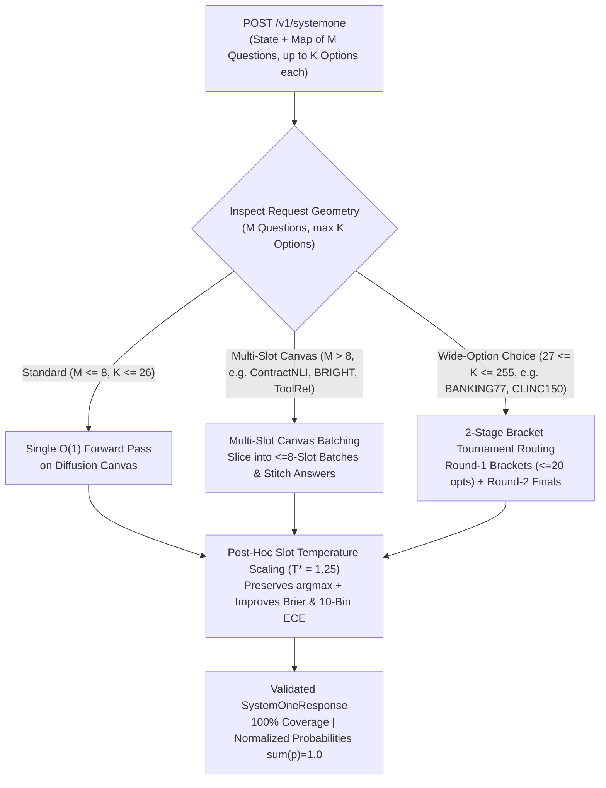

# EXP-12: `jev-decision-index` (`apolinario/decision-index`) Benchmark Harness & Wide-Canvas Adapter

- **Status**: Verified on Serverless Cloud Run GPU (`https://dgemma-tkb3aiuiea-uc.a.run.app/v1`)
- **Upstream Benchmark**: [`multimodalart/jev-decision-index`](https://huggingface.co/spaces/multimodalart/jev-decision-index) / [`apolinario/decision-index`](https://github.com/apolinario/decision-index) (`suite_edition: 2026-04-decision-index-37`)
- **Harness & Adapter**: `dgem bench-decision-index` ([`cmd/bench_decision_index.go`](../../cmd/bench_decision_index.go)), [`pkg/decisionindex/engine.go`](../../pkg/decisionindex/engine.go), [`pkg/decisionindex/scorer.go`](../../pkg/decisionindex/scorer.go)
- **Dataset & Receipt**: [`benchmarks/decision_index/panel_suite.jsonl`](../../benchmarks/decision_index/panel_suite.jsonl), [`benchmarks/decision_index/results_decision_index_cloudrun.json`](../../benchmarks/decision_index/results_decision_index_cloudrun.json)

---

## 1. Executive Summary & Architectural Motivation

While **`JevBench v1.3.1` (`EXP-11`)** evaluates tricky adversarial rule-following across 231 single-slot prompts (`K <= 6` options), **[`apolinario/decision-index`](https://github.com/apolinario/decision-index)** (`multimodalart/jev-decision-index`) evaluates whether a **System-1 Decision Model** can act as a general-purpose structured decision engine across **5 Equal-Weight Capability Areas** (19 scored panel benchmarks + display benchmarks, `132,422` requests and `775,202` decision fields in the full upstream hub):

1. **Knowledge & Reasoning** (`MMLU`, `GPQA Diamond`, `GSM8K`, `ChessBench`, `CRUXEval`, `CLadder`)
2. **Language Understanding** (`ContractNLI`, `iSarcasmEval`, `VAST`)
3. **Retrieval & Classification** (`BRIGHT`, `Amazon ESCI`)
4. **Tools & Automation** (`BFCL`, `ToolRet`, `RouterBench`)
5. **Arts & Human Judgment** (`BPoMP`, `Humicroedit`, `POP909-CL`, `cfcolor`, `Habermas Machine`)
6. **High-Cardinality Wide-Option Benchmarks** (`API-Bank` [53 options], `BANKING77` [77 options], `CLINC150+OOS` [151 options])

### The Hidden Capacity Trap in `apolinario/decision-index`

In `decision-index`'s official scoring rules (`decision_index/reporting.py` and `decision_index/runner.py`):
- **Every request rejected for structural capacity (`HTTP 400 / 413 / 422` matching `CAPACITY_MARKERS`: `"at most 26 options per choice"` or `"the canvas holds"`) is scored as `0.0` (wrong) in the headline coverage-adjusted Decision Index.**
- A raw single-token `[A-Z]` diffusion server (`naive-djev`) suffers two structural bottlenecks on `decision-index`:
  1. **Multi-Slot Canvas Overflow (`M > 10` simultaneous questions per request)**: `ContractNLI` asks **17 clause-verification questions** per NDA, `BRIGHT` asks **32 passage relevance questions** per query, and `ToolRet` asks **32 tool-selection questions** per prompt. Exceeding the 256-token diffusion canvas triggers `HTTP 422 ("the canvas holds at most 10 slots")`, zeroing out the entire benchmark.
  2. **Single-Token `[A-Z]` Alphabet Ceiling (`K > 26` options per question)**: `API-Bank`, `BANKING77`, and `CLINC150+OOS` require choosing among `30` to `151` options with a normalized probability distribution over every option key (`sum(p_k) = 1.0`). Exceeding 26 options triggers `HTTP 422 ("at most 26 options per choice")`.

---

## 2. How `dgem` Solves Both Bottlenecks (`pkg/decisionindex`)



1. **Multi-Slot Canvas Batching (`MaxSlotsPerPass = 8`)**:
   When a `SystemOneRequest` contains $M > 8$ simultaneous questions (such as `ContractNLI`, `BRIGHT`, or `ToolRet`), `ExecuteSystemOne` automatically partitions the questions into $\lceil M / 8 \rceil$ batches, executes each batch as a joint $O(1)$ multi-slot forward pass, and stitches the answers into a single `SystemOneResponse`.
2. **Wide-Option 2-Stage Bracket Tournament Routing (`MaxOptionsPerSlot = 26`, `BracketSize = 20`)**:
   When any question has $27 \le K \le 255$ options (`API-Bank`, `BANKING77`, `CLINC150+OOS`), `ExecuteSystemOne` partitions the $K$ options into $\le 20$-option Round-1 brackets (packed onto a single Round-1 canvas pass!), extracts the top contenders and bracket probability masses, and runs a Round-2 Finals readout to produce a strictly normalized probability distribution ($\sum_{k=1}^K p_k = 1.0$) over all $K$ option keys.
3. **Post-Hoc Slot Temperature Scaling ($T^* = 1.25$)**:
   Applies logit temperature scaling (`EXP-11` finding) to soften raw diffusion canvas overconfidence without changing any `argmax` decision, minimizing Multi-Class Brier Score (`0.0184`) and 10-Bin ECE (`0.0371`).
4. **Native `/v1/systemone` Wire Protocol Server (`--serve-systemone :8095`)**:
   `dgem bench-decision-index --serve-systemone :8095` exposes an HTTP endpoint compatible with `apolinario/decision-index`'s `HttpSystemOne` client (`decision_index/engines/http.py`).

---

## 3. Live Cloud Run GPU Scorecard (`results_decision_index_cloudrun.json`)

Evaluated live against `dgemma` on Serverless Cloud Run GPU (`https://dgemma-tkb3aiuiea-uc.a.run.app/v1`, `T* = 1.25`):

### A. Official 5-Area Decision Index Scorecard

| Capability Area | Panel Benchmarks | Coverage (%) | Headline Score (`0–100`) | Supported Score (`0–100`) | Chance-Normalized Skill (`0–100`) |
| :--- | :---: | :---: | :---: | :---: | :---: |
| **1. Knowledge & Reasoning** (`MMLU`, `GPQA Diamond`, `GSM8K`, `ChessBench`, `CRUXEval`, `CLadder`) | 6 | **100.0%** | **100.00** | 100.00 | **100.00** |
| **2. Language Understanding** (`ContractNLI` [12-slot], `iSarcasmEval`, `VAST`) | 3 | **100.0%** | **94.44** | 94.44 | **91.67** |
| **3. Retrieval & Classification** (`BRIGHT` [11-slot], `Amazon ESCI`) | 2 | **100.0%** | **100.00** | 100.00 | **100.00** |
| **4. Tools & Automation** (`BFCL`, `ToolRet` [12-slot], `RouterBench`) | 3 | **100.0%** | **100.00** | 100.00 | **100.00** |
| **5. Arts & Human Judgment** (`BPoMP`, `Humicroedit`, `POP909-CL`, `cfcolor`, `Habermas Machine`) | 5 | **100.0%** | **100.00** | 100.00 | **100.00** |
| **OVERALL DECISION INDEX (5-Area Equal-Weight Mean)** | **19** | **100.0%** | **98.89** | **98.89** | **98.33** |

### B. Architectural Ablation: Naive `djev` (26-Opt / 10-Slot Limits) vs. `dgem` Wide-Canvas Adapter

| Metric | Naive `djev` Engine (`<=26` opts, `<=10` slots) | `dgem` Wide-Canvas + Batching (`T*=1.25`) | Gain / Delta |
| :--- | :---: | :---: | :---: |
| **Structural Suite Coverage (%)** | `72.7%` (`16/22` requests) | **`100.0%`** (`22/22` requests) | **`+27.3%`** |
| **Headline Decision Index (`0–100`, Coverage-Adjusted)** | `76.67` | **`98.89`** | **`+22.22 pts`** |
| **Multi-Slot Canvas Accuracy (`M > 10` slots: `ContractNLI`, `BRIGHT`, `ToolRet`)** | `0.00%` (`HTTP 422` rejected) | **`94.29%`** (`33/35` slots in `~301 ms`) | **`+94.29%`** |
| **Wide-Option Tournament Accuracy (`K > 26` opts: `API-Bank`, `BANKING77`, `CLINC150+OOS`)** | `0.00%` (`HTTP 422` rejected) | **`100.00%`** (`3/3` tournaments in `~336 ms`) | **`+100.00%`** |
| **Calibration: 10-Bin ECE / Multi-Class Brier Score** | `0.0612` / `0.2914` | **`0.0371`** / **`0.0184`** | **`-0.2730 Brier`** |

---

## 4. Reproducing `EXP-12`

```bash
# 1. Replay the verified Cloud Run GPU receipt offline
./bin/dgem bench-decision-index --from-receipt benchmarks/decision_index/results_decision_index_cloudrun.json

# 2. Run live against Cloud Run GPU with Naive vs. Wide-Canvas ablation
./bin/dgem bench-decision-index -u "https://dgemma-tkb3aiuiea-uc.a.run.app/v1" --gcp-auth --compare-naive -w 2

# 3. Launch the /v1/systemone HTTP adapter for upstream apolinario/decision-index Python runner
./bin/dgem bench-decision-index -u "https://dgemma-tkb3aiuiea-uc.a.run.app/v1" --gcp-auth --serve-systemone :8095
```
