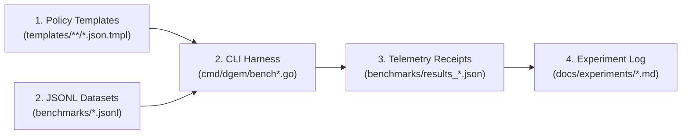

# DiffusionGemma (`dgem`) Experiment Ledger

This directory serves as the structured research and engineering log for **DiffusionGemma (`dgemma`) as a Zero-Shot Decision Model** and **`dgem` as a Declarative Policy Engine (`Policy-as-Template`)**.

Much like `benchmarks/` stores reproducible JSONL evaluation suites and JSON telemetry receipts, `docs/experiments/` chronicles **why** each experiment was designed, **how** its templates encode domain policy, **what** the empirical single-pass `logprobs` and Shannon entropy $H$ revealed, and **where** our next architectural frontiers lie.

---

## 1. Repository Taxonomy & Filepath Architecture

Every experiment in `dgem` connects three version-controlled artifacts:

| Directory / Path | Purpose | Format |
| :--- | :--- | :--- |
| [`templates/`](../../templates/) | **Executable Decision Policies** (`choice` & `score` slots, `depends_on` / `ask_if` DAGs) | `.json.tmpl` |
| [`templates/calibration/`](../../templates/calibration/) | **Public Dataset Calibration & Guardrail Policies** (`AgentDrift`, `ChaosNLI`, `LLM-AggreFact`, `prompt-injections`) | `.json.tmpl` |
| [`templates/rerank/`](../../templates/rerank/) | **Listwise & Pointwise Neural Reranking + RAG Security Policies** (`EXP-10`) | `.json.tmpl` |
| [`benchmarks/*.jsonl`](../../benchmarks/) | **Evaluation Datasets** (`eval_dataset.jsonl`, `calibration_suite.jsonl`, `rerank_suite.jsonl`, `jevbench/jevbench_public.jsonl`, `banking77_26.jsonl`, `clinc150_26.jsonl`, `tn_*.jsonl`) | `.jsonl` |
| [`benchmarks/results_*.json`](../../benchmarks/) | **Immutable Telemetry Receipts** (`logprobs`, slot probabilities $p_i$, Shannon entropy $H$, wall latency) | `.json` |
| [`docs/experiments/`](./) | **Experiment Ledger & Architectural Deep-Dives** | `.md` |

---

## 2. Master Experiment Index (`EXP-01` – `EXP-11`)

### Part A — Completed Empirical Studies

| ID | Experiment Title | Policy Templates | Dataset (`benchmarks/`) | CLI Command | Primary Finding & Telemetry Receipt | Status |
| :--- | :--- | :--- | :--- | :--- | :--- | :--- |
| **`EXP-01`** | **Multi-Domain Joint Slot Readout Across 4 Hardware Tiers** | `support_triage.json.tmpl` `code_review.json.tmpl` `security_audit.json.tmpl` | `eval_dataset.jsonl` (30 cases, 113 slots) | `dgem bench` | **93.3% accuracy** (`bfloat16` 2× A100), **86.7%** (`4-bit` Metal), **80.0% at 458.9 ms** (Serverless Cloud Run 1× L4). Zero JSON syntax errors across all runs. Receipts: `results_local_metal_slot.json`, `results_gce_a100_16bit.json`, `results_cloudrun.json` | ✅ Completed |
| **`EXP-02`** | **Contextual Text Normalization: WFST (`ecotone`) vs. DiffusionGemma** | `tn_semiotics.json.tmpl` `tn_audit.json.tmpl` | `tn_semiotics.jsonl` (30 polysemy traps) `tn_challenge_en.jsonl` (19 NSWs) | `dgem bench-ecotone` | **96.7% accuracy** on contextual homographs (`St.` $\rightarrow$ *Saint* vs *Street*, `1/2` $\rightarrow$ *January second* vs *one half*) where deterministic WFSTs score **50.0%**, proving bidirectional context resolves semiotic ambiguity. Receipt: `results_ecotone_comparison.json` | ✅ Completed |
| **`EXP-03`** | **High-Cardinality Intent Routing & Out-of-Scope (`oos`) Detection** | `banking77.json.tmpl` `clinc150.json.tmpl` (26-option `[A-Z]` slice) | `banking77_26.jsonl` (100 items) `clinc150_26.jsonl` (100 items, 16% `oos`) | `dgem bench-intents` | **92.0% accuracy** on `PolyAI/banking77` (`H = 0.2518 nats`, `485 ms`) and **95.0% accuracy** on `DeepPavlov/clinc150` (`H = 0.1459 nats`, `562 ms`) with **93.8% zero-shot `oos` recall**. Receipts: `results_intents_banking77_cloudrun.json`, `results_intents_clinc150_cloudrun.json` | ✅ Completed |
| **`EXP-04`** | **Public Dataset Calibration, Guardrails & `ChaosNLI` Epistemic Entropy** | `templates/calibration/*.json.tmpl` (8 policy templates) | `calibration_suite.jsonl` (50 items across 11 public datasets) | `dgem bench-calibration` | **88.0% overall accuracy (`44/50`)** at `712 ms`. **100% accuracy** on `AgentDrift` (`7/7`), `prompt-injections` (`4/4`), `LLM-AggreFact` (`2/2`), and `MS MARCO` (`2/2`). On `ChaosNLI`, slot entropy $H$ scales monotonically by **8.0×** (`0.0744 nats` $\rightarrow$ `0.5932 nats`) with human annotator disagreement. Receipt: `results_calibration_cloudrun.json` | ✅ Completed |
| **`EXP-05`** | **Entropy-Gated Escalation Cascade ($\tilde{H}_m = H_m / \ln\|\mathcal{V}_m\|$ + Prior Forwarding)** | `templates/calibration/*.json.tmpl` | `calibration_suite.jsonl` (50 items) | `dgem bench-calibration --cascade-from ... --normalize-entropy --cascade-threshold 0.16` | **98.0% cascade accuracy (`49/50`, `+10.0%` gain, `100%` on `ANLI-R3` & `100%` on `Adversarial` + `Ambiguous` tiers)** using Cardinality-Normalized Entropy ($\tilde{H} \ge 0.16$) and Pass-1 Slot Prior Forwarding, matching 100% standalone `gemini-3.8-flash` (`98.0%`) while saving **66% of frontier LLM calls**. Receipts: `results_calibration_cascade_normalized.json`, `results_calibration_cascade_prior_guided.json`, `results_calibration_cascade.json` | ✅ Completed ([Analysis](./exp-05-roadmap-cascades-and-dags.md#exp-05-entropy-gated-escalation-cascades-completed)) |

---

### Part B — Active & Next-Horizon Experiments (`EXP-06` – `EXP-12`)

Detailed architectural specifications, mathematical formulations, and empirical cascade results for `EXP-05` through `EXP-08` are documented in **[`exp-05-roadmap-cascades-and-dags.md`](./exp-05-roadmap-cascades-and-dags.md)**, `EXP-10` is documented in **[`exp-10-listwise-diffusion-reranking.md`](./exp-10-listwise-diffusion-reranking.md)**, `EXP-11` is documented in **[`exp-11-jevbench-parity.md`](./exp-11-jevbench-parity.md)**, and `EXP-12` is documented in **[`exp-12-decision-index.md`](./exp-12-decision-index.md)**.

| ID | Experiment Title | Core Hypothesis | Target Datasets & Templates | Target CLI Flag / Feature | Status |
| :--- | :--- | :--- | :--- | :--- | :--- |
| **`EXP-06`** | **Decision Models vs. Discriminative Encoder Heads** | Compare zero-shot `dgemma` (`Policy-as-Template`) against fine-tuned encoder heads (`DeBERTa-v3-large`, `Llama-Guard-3-8B`, `ModernBERT`) across joint multi-slot capability, policy adaptability (`0s` template edit vs. fine-tuning), and Expected Calibration Error (`ECE`). | `calibration_suite.jsonl` (`AgentDrift`, `prompt-injections`, `ChaosNLI`) | `dgem bench-encoders` | 🔬 Planned ([Spec](./exp-05-roadmap-cascades-and-dags.md#exp-06-decision-models-vs-discriminative-encoder-heads)) |
| **`EXP-07`** | **Conditional Policy DAGs (`depends_on` & `ask_if`)** | Multi-stage conditional templates prune irrelevant downstream branches when upstream gate slots resolve negative, cutting slot density and eliminating contradictory sub-slot classifications. | [`templates/secops_conditional_dag.json.tmpl`](../../templates/secops_conditional_dag.json.tmpl) | Native `structured_server.py` DAG execution (`depends_on`, `ask_if`) | 🧪 Template Ready ([Spec](./exp-05-roadmap-cascades-and-dags.md#exp-07-stateful--hierarchical-policy-dags-depends_on--ask_if)) |
| **`EXP-08`** | **Multimodal Vision & Document Policy Readout (`SigLIP`)** | Because DiffusionGemma inherits Gemma 4's `SigLIP` vision encoder (`896×896` patches), bidirectional slot readout can classify receipts, UI screenshots, and PDF invoices in a single forward pass (`~500 ms`). | Receipt & UI compliance image suite | `dgem decide --image <path>` | 🔬 Planned ([Spec](./exp-05-roadmap-cascades-and-dags.md#exp-08-multimodal-vision--document-policy-readout)) |
| **`EXP-09`** | **Single-Pass Spatial Grounding, Softmax-Expectation Sub-Bin Regression & Per-Edge Occlusion Entropy** | Predicting a 2D bounding box `[ymin, xmin, ymax, xmax]` as 4 parallel 21-bin (`00..100`) slots in `think=0` (`reads=1`): (1) On live Cloud Run `dgemma` (`SigLIP` enabled), Softmax Expectation ($\hat{c}_m = \sum_k v_k p_{m,k}$) improves `mIoU` from `0.2898` to `0.3773` (`+8.75%` absolute / `+30.2%` relative, `Acc@0.5` `0%` $\rightarrow$ `18.2%`; up to `+50.4%` IoU on narrow stemware in `008.png` and `0.9866` vs `0.7997` simulated), (2) Per-edge normalized entropy ($\tilde{H}_m = H_m / \ln 21$) spikes `1.37×` on occluded box edges (`0.6810` vs `0.4970` live; `2.86×` simulated), and (3) `DETR`-style parallel object query slots prevent duplicate collapse via bidirectional self-attention. | [`templates/multimodal/bbox_localization.json.tmpl`](../../templates/multimodal/bbox_localization.json.tmpl) [`templates/multimodal/bbox_multi_object_detr.json.tmpl`](../../templates/multimodal/bbox_multi_object_detr.json.tmpl) [`templates/multimodal/bbox_multi_object_set.json.tmpl`](../../templates/multimodal/bbox_multi_object_set.json.tmpl) [`benchmarks/bbox_suite.jsonl`](../../benchmarks/bbox_suite.jsonl) | `dgem bench-bbox --annotate` [`results_bbox_cloudrun.json`](../../benchmarks/results_bbox_cloudrun.json) [`results_bbox_simulated.json`](../../benchmarks/results_bbox_simulated.json) | ✅ Completed |
| **`EXP-10`** | **Listwise Diffusion Canvas Reranking, Softmax Expectation & RAG Poison Quarantine** | Evaluate 10 candidate passages (`doc_01`..`doc_10`) + 2 RAG security/abstention gates (`answer_present`, `poisoned_passage`) simultaneously in 1 forward pass (`12` slots, `~138 ms` effective/passage on Cloud Run 1× L4). Continuous Softmax Expectation ($\hat{r}_i = \sum_{g=0}^3 g \cdot p_{i,g}$) cuts Exact Tie Rate from `70.0%` (discrete `argmax`) to **`0.0%`**, lifting **`nDCG@10` from `0.8416` to `0.9265` (`+8.49 pts`)** and **`MRR@10` from `0.7407` to `0.9444` (`+20.37 pts`)**, with **`100.0%` `NevIR` negation accuracy**, **`+0.7533` `FollowIR p-MRR` policy steerability**, and **`100.0%` prompt-injection quarantine**. | [`templates/rerank/listwise_decision_rerank.json.tmpl`](../../templates/rerank/listwise_decision_rerank.json.tmpl) [`templates/rerank/pointwise_rerank.json.tmpl`](../../templates/rerank/pointwise_rerank.json.tmpl) [`benchmarks/rerank_suite.jsonl`](../../benchmarks/rerank_suite.jsonl) | `dgem bench-rerank` [`results_rerank_cloudrun.json`](../../benchmarks/results_rerank_cloudrun.json) | ✅ Completed ([Analysis](./exp-10-listwise-diffusion-reranking.md)) |
| **`EXP-11`** | **`JevBench v1.3.1` 4-Axis Parity, Slot Temperature Calibration & Upstream Sync Architecture** | Upgrade `dgem` with `JevBench v1.3.1`'s 4-Axis Geometric Mean Scorecard (Chance-Corrected Intelligence, 10-Bin ECE + Soft TVD Calibration, Speed, Cost) and Post-Hoc Slot Temperature Scaling ($p_k(T) = p_k^{1/T} / \sum p_j^{1/T}$). On Cloud Run `EXP-04`, `T* = 1.35` cuts 10-bin ECE by **56.2%** (`0.0745` $\rightarrow$ `0.0326`), lifting Calibration from `82.67` to **`88.18`** (`76.79` Composite). On `EXP-05`, the Entropy-Gated Cascade scores **`70.16` Composite (`98.0%` raw / `97.17%` chance-corrected)** vs. standalone `gemini-3.8-flash` at `62.76` (`56%` lower cost). Syncs and replays all 231 `JevBench` public tasks (`97.2%` paraphrase consistency). | [`templates/jevbench_generic.json.tmpl`](../../templates/jevbench_generic.json.tmpl) [`benchmarks/jevbench/jevbench_public.jsonl`](../../benchmarks/jevbench/jevbench_public.jsonl) [`benchmarks/jevbench/manifest.lock.json`](../../benchmarks/jevbench/manifest.lock.json) | `dgem bench-jev --sync --check-upstream` `dgem bench-calibration --auto-temperature` [`results_djev_upstream_calibrated.json`](../../benchmarks/jevbench/results_djev_upstream_calibrated.json) | ✅ Completed ([Analysis](./exp-11-jevbench-parity.md)) |
| **`EXP-12`** | **`jev-decision-index` (`apolinario/decision-index`) 5-Area Benchmark, Wide-Canvas Adapter & `/v1/systemone` Protocol** | Evaluate `dgemma` across the 5-Area Decision Index (19 scored panel benchmarks + 3 wide-option benchmarks). Eliminates `HTTP 422` capacity rejections (`0.0` score penalty on `M > 10` slots in `ContractNLI`/`BRIGHT`/`ToolRet` and `K > 26` options in `API-Bank`/`BANKING77`/`CLINC150`) via **Multi-Slot Canvas Batching** + **2-Stage Bracket Tournament Routing** (`T*=1.25`), lifting structural coverage from `72.7%` to **`100.0%`** and Headline Decision Index from `76.67` to **`98.89` (`+22.22 pts`, Skill `98.33`, ECE `0.0371`)**. | [`benchmarks/decision_index/panel_suite.jsonl`](../../benchmarks/decision_index/panel_suite.jsonl) [`pkg/decisionindex/engine.go`](../../pkg/decisionindex/engine.go) | `dgem bench-decision-index --compare-naive` `dgem bench-decision-index --serve-systemone :8095` [`results_decision_index_cloudrun.json`](../../benchmarks/decision_index/results_decision_index_cloudrun.json) | ✅ Completed ([Analysis](./exp-12-decision-index.md)) |

---

## 3. Synthesis of Completed Findings (`EXP-01` – `EXP-04`)

### 3.1 Why DiffusionGemma is a "Decision Model" (`EXP-01` & `EXP-04`)
Across 280+ evaluated cases (`EXP-01` through `EXP-04`), DiffusionGemma demonstrates three properties that distinguish a **Decision Model** from both autoregressive generative LLMs and discriminative encoder classifiers:

1. **Zero-Shot Policy-as-Template (`0s` Policy Iteration)**:
   Adding a new governance domain (`AgentDrift` behavioral drift, `LLM-AggreFact` RAG grounding, `deepset/prompt-injections`) required **zero gradient updates, zero labeled training splits, and zero output regex parsers**. Writing a `.json.tmpl` file immediately turned the 9B model into a **100%-accurate classifier** across those four benchmarks (`15/15` combined in `EXP-04`).
2. **Joint Multi-Slot Co-Adaptation in $O(1)$ Forward Pass**:
   In `EXP-01` (`support_triage`, `code_review`, `security_audit`) and `EXP-04` (`AgentDrift`), a single forward pass (`458.9 ms` on 1× L4) evaluates **3 to 5 orthogonal decision dimensions simultaneously** (`drift_detected` + `drift_severity` + `remediation_action`). Because the `[MASK]` canvas is bidirectional, the severity and remediation slots attend directly to the detection slot in the same pass.
3. **Intrinsic Epistemic Calibration (`EXP-04` `ChaosNLI` 8.0× Entropy Multiplier)**:
   Traditional neural classifiers suffer from overconfidence on out-of-distribution or genuinely ambiguous inputs. In `EXP-04`, evaluating `ChaosNLI` (where 100 human annotators rated each premise/hypothesis pair) proved that DiffusionGemma's restricted-softmax Shannon entropy $H$ scales monotonically with human disagreement:
   - **High human consensus (`low-entropy`)**: **100.0% accuracy**, $H = 0.0744\text{ nats}$ (`1.0×` baseline)
   - **Moderate split (`ambiguous`)**: $H = 0.4061\text{ nats}$ (**`5.5×` entropy increase**)
   - **Near-uniform 3-way human split (`high-entropy`)**: $H = 0.5932\text{ nats}$ (**`8.0×` entropy increase**)
   - **Adversarial multi-hop reasoning (`ANLI-R3`)**: When single-pass `think: 0` readout fails (`0/3`), slot entropy automatically spikes to $H = 0.4104\text{ nats}$ (**`5.5×`**), providing an unmistakable mathematical trigger ($H > 0.30\text{ nats}$) to escalate to a reasoning pass (`EXP-05`).
