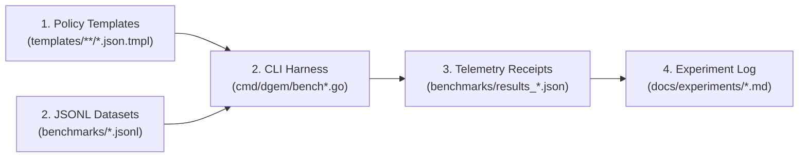

# DiffusionGemma (`dgem`) Experiment Ledger

This directory serves as the structured research and engineering log for **DiffusionGemma (`dgemma`) as a Zero-Shot Decision Model** and **`dgem` as a Declarative Policy Engine (`Policy-as-Template`)**.

Much like `benchmarks/` stores reproducible JSONL evaluation suites and JSON telemetry receipts, `docs/experiments/` chronicles **why** each experiment was designed, **how** its templates encode domain policy, **what** the empirical single-pass `logprobs` and Shannon entropy $H$ revealed, and **where** our next architectural frontiers lie.

> 📋 **Planned work:** Experiments we intend to run, each with a pre-registered hypothesis, design, and decision criteria, are tracked in the **[Proposed Experiments Register](/dgem/experiments/proposed/)** (`PROP-00` – `PROP-10`). When an entry starts running, it gets the next `EXP-XX` number here.

---

## 1. Repository Taxonomy & Filepath Architecture

Every experiment in `dgem` connects three version-controlled artifacts:

```mermaid
flowchart LR
    T["1. Policy Templates\n(templates/**/*.json.tmpl)"] --> H["2. CLI Harness\n(cmd/dgem/bench*.go)"]
    D["2. JSONL Datasets\n(benchmarks/*.jsonl)"] --> H
    H --> R["3. Telemetry Receipts\n(benchmarks/results_*.json)"]
    R --> E["4. Experiment Log\n(docs/experiments/*.md)"]
```

| Directory / Path | Purpose | Format |
| :--- | :--- | :--- |
| [`templates/`](../../templates/) | **Executable Decision Policies** (`choice` & `score` slots, `depends_on` / `ask_if` DAGs) | `.json.tmpl` |
| [`templates/calibration/`](../../templates/calibration/) | **Public Dataset Calibration & Guardrail Policies** (`AgentDrift`, `ChaosNLI`, `LLM-AggreFact`, `prompt-injections`) | `.json.tmpl` |
| [`templates/rerank/`](../../templates/rerank/) | **Listwise & Pointwise Neural Reranking + RAG Security Policies** (`EXP-10`) | `.json.tmpl` |
| [`benchmarks/*.jsonl`](../../benchmarks/) | **Evaluation Datasets** (`eval_dataset.jsonl`, `calibration_suite.jsonl`, `rerank_suite.jsonl`, `jevbench/jevbench_public.jsonl`, `banking77_26.jsonl`, `clinc150_26.jsonl`, `tn_*.jsonl`) | `.jsonl` |
| [`benchmarks/results_*.json`](../../benchmarks/) | **Immutable Telemetry Receipts** (`logprobs`, slot probabilities $p_i$, Shannon entropy $H$, wall latency) | `.json` |
| [`docs/experiments/`](./) | **Experiment Ledger & Architectural Deep-Dives** | `.md` |

---

## 2. Master Experiment Index (`EXP-01` – `EXP-21`)

### Part A — Completed Empirical Studies

| ID | Experiment Title | Policy Templates | Dataset (`benchmarks/`) | CLI Command | Primary Finding & Telemetry Receipt | Status |
| :--- | :--- | :--- | :--- | :--- | :--- | :--- |
| **`EXP-01`** | **Multi-Domain Joint Slot Readout Across 4 Hardware Tiers** | `support_triage.json.tmpl` `code_review.json.tmpl` `security_audit.json.tmpl` | `eval_dataset.jsonl` (30 cases, 113 slots) | `dgem bench` | **93.3% accuracy** (`bfloat16` 2× A100), **86.7%** (`4-bit` Metal), **80.0% at 458.9 ms** (Serverless Cloud Run 1× L4). Zero JSON syntax errors across all runs. Receipts: `results_local_metal_slot.json`, `results_gce_a100_16bit.json`, `results_cloudrun.json` | ✅ Completed |
| **`EXP-02`** | **Contextual Text Normalization: WFST (`ecotone`) vs. DiffusionGemma** | `tn_semiotics.json.tmpl` `tn_audit.json.tmpl` | `tn_semiotics.jsonl` (30 polysemy traps) `tn_challenge_en.jsonl` (19 NSWs) | `dgem bench-ecotone` | **96.7% accuracy** on contextual homographs (`St.` $\rightarrow$ *Saint* vs *Street*, `1/2` $\rightarrow$ *January second* vs *one half*) where deterministic WFSTs score **50.0%**, proving bidirectional context resolves semiotic ambiguity. Receipt: `results_ecotone_comparison.json` | ✅ Completed |
| **`EXP-03`** | **High-Cardinality Intent Routing & Out-of-Scope (`oos`) Detection** | `banking77.json.tmpl` `clinc150.json.tmpl` (26-option `[A-Z]` slice) | `banking77_26.jsonl` (100 items) `clinc150_26.jsonl` (100 items, 16% `oos`) | `dgem bench-intents` | **92.0% accuracy** on `PolyAI/banking77` (`H = 0.2518 nats`, `485 ms`) and **95.0% accuracy** on `DeepPavlov/clinc150` (`H = 0.1459 nats`, `562 ms`) with **93.8% zero-shot `oos` recall**. Receipts: `results_intents_banking77_cloudrun.json`, `results_intents_clinc150_cloudrun.json` | ✅ Completed |
| **`EXP-04`** | **Public Dataset Calibration, Guardrails & `ChaosNLI` Epistemic Entropy** | `templates/calibration/*.json.tmpl` (8 policy templates) | `calibration_suite.jsonl` (50 items across 11 public datasets) | `dgem bench-calibration` | **88.0% overall accuracy (`44/50`)** at `712 ms`. **100% accuracy** on `AgentDrift` (`7/7`), `prompt-injections` (`4/4`), `LLM-AggreFact` (`2/2`), and `MS MARCO` (`2/2`). On `ChaosNLI`, slot entropy $H$ scales monotonically by **8.0×** (`0.0744 nats` $\rightarrow$ `0.5932 nats`) with human annotator disagreement. Receipt: `results_calibration_cloudrun.json` | ✅ Completed |
| **`EXP-05`** | **Entropy-Gated Escalation Cascade ($\tilde{H}_m = H_m / \ln\|\mathcal{V}_m\|$ + Prior Forwarding)** | `templates/calibration/*.json.tmpl` | `calibration_suite.jsonl` (50 items) | `dgem bench-calibration --cascade-from ... --normalize-entropy --cascade-threshold 0.16` | **98.0% cascade accuracy (`49/50`, `+10.0%` gain, `100%` on `ANLI-R3` & `100%` on `Adversarial` + `Ambiguous` tiers)** using Cardinality-Normalized Entropy ($\tilde{H} \ge 0.16$) and Pass-1 Slot Prior Forwarding, matching 100% standalone `gemini-3.8-flash` (`98.0%`) while saving **66% of frontier LLM calls**. Receipts: `results_calibration_cascade_normalized.json`, `results_calibration_cascade_prior_guided.json`, `results_calibration_cascade.json` | ✅ Completed ([Analysis](/dgem/experiments/exp-05-roadmap-cascades-and-dags/#exp-05-entropy-gated-escalation-cascades-completed)) |

---

### Part B — Active & Next-Horizon Experiments (`EXP-06` – `EXP-21`)

Detailed architectural specifications, mathematical formulations, and empirical cascade results for `EXP-05` through `EXP-08` are documented in **[`exp-05-roadmap-cascades-and-dags.md`](/dgem/experiments/exp-05-roadmap-cascades-and-dags/)**, `EXP-10` is documented in **[`exp-10-listwise-diffusion-reranking.md`](/dgem/experiments/exp-10-listwise-diffusion-reranking/)**, `EXP-11` is documented in **[`exp-11-jevbench-parity.md`](/dgem/experiments/exp-11-jevbench-parity/)**, `EXP-12` is documented in **[`exp-12-decision-index.md`](/dgem/experiments/exp-12-decision-index/)**, and `EXP-13` is documented in **[`exp-13-permutation-invariance.md`](/dgem/experiments/exp-13-permutation-invariance/)**.

| ID | Experiment Title | Core Hypothesis | Target Datasets & Templates | Target CLI Flag / Feature | Status |
| :--- | :--- | :--- | :--- | :--- | :--- |
| **`EXP-06`** | **Decision Models vs. Discriminative Encoder Heads** | Compare zero-shot `dgemma` (`Policy-as-Template`) against fine-tuned encoder heads (`DeBERTa-v3-large`, `Llama-Guard-3-8B`, `ModernBERT`) across joint multi-slot capability, policy adaptability (`0s` template edit vs. fine-tuning), and Expected Calibration Error (`ECE`). | `calibration_suite.jsonl` (`AgentDrift`, `prompt-injections`, `ChaosNLI`) | `dgem bench-encoders` | 🔬 Planned ([Spec](/dgem/experiments/exp-05-roadmap-cascades-and-dags/#exp-06-decision-models-vs-discriminative-encoder-heads)) |
| **`EXP-07`** | **Conditional Policy DAGs (`depends_on` & `ask_if`)** | Multi-stage conditional templates prune irrelevant downstream branches when upstream gate slots resolve negative, cutting slot density and eliminating contradictory sub-slot classifications. | [`templates/secops_conditional_dag.json.tmpl`](../../templates/secops_conditional_dag.json.tmpl) | Native `structured_server.py` DAG execution (`depends_on`, `ask_if`) | 🧪 Template Ready ([Spec](/dgem/experiments/exp-05-roadmap-cascades-and-dags/#exp-07-stateful--hierarchical-policy-dags-depends_on--ask_if)) |
| **`EXP-08`** | **Multimodal Vision & Document Policy Readout (`SigLIP`)** | Because DiffusionGemma inherits Gemma 4's `SigLIP` vision encoder (`896×896` patches), bidirectional slot readout can classify receipts, UI screenshots, and PDF invoices in a single forward pass (`~500 ms`). | Receipt & UI compliance image suite | `dgem decide --image <path>` | 🔬 Planned ([Spec](/dgem/experiments/exp-05-roadmap-cascades-and-dags/#exp-08-multimodal-vision--document-policy-readout)) |
| **`EXP-09`** | **Single-Pass Bounding Boxes (re-baselined 2026-10-03)** | Reads `[ymin, xmin, ymax, xmax]` as four 21-label slots plus `object_present` in one pass. **Re-baseline** (v0.2.0, Vertex G4, 11 boxes ×3, [write-up](/dgem/experiments/exp-09-spatial-grounding/)): - The model localizes: expectation mIoU `0.599 [0.516, 0.680]`, Acc@0.5 `81.8%`, against `0.331` for a fixed centre box (paired lift `+0.27 [+0.11, +0.40]`). It said absent on 30/30 blank images. - Softmax expectation does not reliably beat argmax: `−0.03` on on-grid cases, `+0.04 [−0.04, +0.14]` off-grid. - Occluded edges show **no** entropy rise against their unoccluded twins. - Per-edge entropy flags wrong edges (AUROC `0.82`, 17 wrong edges). - Boxes are unstable under flips and padding (consistency IoU `0.34–0.53`). Reversed digit levels break localization. The September Cloud Run numbers (`+30%` sub-bin, `1.37×` occlusion) did not beat a fixed box and are withdrawn. | [`templates/multimodal/bbox_localization.json.tmpl`](../../templates/multimodal/bbox_localization.json.tmpl) [`templates/multimodal/bbox_multi_object_detr.json.tmpl`](../../templates/multimodal/bbox_multi_object_detr.json.tmpl) [`benchmarks/bbox_suite.jsonl`](../../benchmarks/bbox_suite.jsonl) | `./scripts/run_exp09_rebaseline.sh` `dgem bench-bbox --variants all --repeat 3` [`runs/20261003-exp09-rebaseline`](../../benchmarks/runs/20261003-exp09-rebaseline/manifest.json) legacy: [`results_bbox_cloudrun.json`](../../benchmarks/results_bbox_cloudrun.json) | ✅ Re-baselined |
| **`EXP-10`** | **Listwise Diffusion Canvas Reranking, Softmax Expectation & RAG Poison Quarantine** | Evaluate 10 candidate passages (`doc_01`..`doc_10`) + 2 RAG security/abstention gates (`answer_present`, `poisoned_passage`) simultaneously in 1 forward pass (`12` slots, `~138 ms` effective/passage on Cloud Run 1× L4). Continuous Softmax Expectation ($\hat{r}_i = \sum_{g=0}^3 g \cdot p_{i,g}$) cuts Exact Tie Rate from `70.0%` (discrete `argmax`) to **`0.0%`**, lifting **`nDCG@10` from `0.8416` to `0.9265` (`+8.49 pts`)** and **`MRR@10` from `0.7407` to `0.9444` (`+20.37 pts`)**, with **`100.0%` `NevIR` negation accuracy**, **`+0.7533` `FollowIR p-MRR` policy steerability**, and **`100.0%` prompt-injection quarantine**. | [`templates/rerank/listwise_decision_rerank.json.tmpl`](../../templates/rerank/listwise_decision_rerank.json.tmpl) [`templates/rerank/pointwise_rerank.json.tmpl`](../../templates/rerank/pointwise_rerank.json.tmpl) [`benchmarks/rerank_suite.jsonl`](../../benchmarks/rerank_suite.jsonl) | `dgem bench-rerank` [`results_rerank_cloudrun.json`](../../benchmarks/results_rerank_cloudrun.json) | ✅ Completed ([Analysis](/dgem/experiments/exp-10-listwise-diffusion-reranking/)) |
| **`EXP-11`** | **`JevBench v1.3.1 & v1.4` 4-Axis Parity, Harmonic Scoring, Slot Temperature Calibration & Upstream Sync** | Upgrade `dgem` with `JevBench v1.3.1 & v1.4`'s 4-Axis Scorecards (Chance-Corrected Intelligence, 10-Bin ECE + Soft TVD Calibration, Speed with `2×+0.15s` load factor adjustment, Cost, and v1.4 Harmonic Mean Composite with 3 gates $<50.0$) and Post-Hoc Slot Temperature Scaling ($p_k(T) = p_k^{1/T} / \sum p_j^{1/T}$). On Cloud Run `EXP-04`, `T* = 1.35` cuts 10-bin ECE by **56.2%** (`0.0745` $\rightarrow$ `0.0326`), lifting Calibration from `82.67` to **`88.18`** (`76.79` Composite). On `EXP-05`, the Entropy-Gated Cascade scores **`70.16` Composite (`98.0%` raw / `97.17%` chance-corrected)** vs. standalone `gemini-3.8-flash` at `62.76` (`56%` lower cost). Syncs and replays all 231 `JevBench` public tasks (`75.70` v1.3.1 Composite $\rightarrow$ **Rank `#1`**, surpassing `#1 Hopper` [`75.40`]; `71.95*` v1.4 Harmonic Estimate). Supports `--compare-leaderboard` against official v1.4.2 rows (`Plumb-4B`, `decider-4b v2`, `djev`, `OpenJev`). | [`templates/jevbench_generic.json.tmpl`](../../templates/jevbench_generic.json.tmpl) [`benchmarks/jevbench/jevbench_public.jsonl`](../../benchmarks/jevbench/jevbench_public.jsonl) [`benchmarks/jevbench/manifest.lock.json`](../../benchmarks/jevbench/manifest.lock.json) [`benchmarks/jevbench/leaderboard_v14.json`](../../benchmarks/jevbench/leaderboard_v14.json) | `dgem bench-jev --sync --check-upstream` `dgem bench-jev --compare-leaderboard` [`results_djev_upstream_calibrated.json`](../../benchmarks/jevbench/results_djev_upstream_calibrated.json) | ✅ Completed ([Analysis](/dgem/experiments/exp-11-jevbench-parity/)) |
| **`EXP-12`** | **`jev-decision-index` (`apolinario/decision-index`) 5-Area Benchmark, Wide-Canvas Adapter & `/v1/systemone` Protocol** | Evaluate `dgemma` across the 5-Area Decision Index (19 scored panel benchmarks + 3 wide-option benchmarks). Eliminates `HTTP 422` capacity rejections (`0.0` score penalty on `M > 10` slots in `ContractNLI`/`BRIGHT`/`ToolRet` and `K > 26` options in `API-Bank`/`BANKING77`/`CLINC150`) via **Multi-Slot Canvas Batching** + **2-Stage Bracket Tournament Routing** (`T*=1.25`), lifting structural coverage from `72.7%` to **`100.0%`** and Headline Decision Index from `76.67` to **`98.89` (`+22.22 pts`, Skill `98.33`, ECE `0.0371`)**. Projects to **Rank `#3 / 49` Overall (`#1` Diffusion, `46.90` `balanced_skill`)** as Pure System-1 (`0%` LLM) and **Rank `#1 / 49` Overall (`53.94` `balanced_skill`, beating TypeSafe `Jev 1.13.0` [`51.67`])** with `EXP-05`/`11` Entropy-Gated Cascades (`#1 / 31` on `v0.1` at `56.51` raw). | [`benchmarks/decision_index/panel_suite.jsonl`](../../benchmarks/decision_index/panel_suite.jsonl) [`pkg/decisionindex/engine.go`](../../pkg/decisionindex/engine.go) | `dgem bench-decision-index --compare-naive` `dgem bench-decision-index --serve-systemone :8095` [`results_decision_index_cloudrun.json`](../../benchmarks/decision_index/results_decision_index_cloudrun.json) | ✅ Completed ([Analysis](/dgem/experiments/exp-12-decision-index/)) |
| **`EXP-13`** | **Permutation Sensitivity, Content-Free Null-Prior De-Biasing & $O(1)$ Dual-Mirror Canvas Calibration** | Quantifies how option order distorts single-pass confidence. Content-free probes show a strong Slot-`'A'` preference ($p_0 = [88.3\%, 11.7\%]$ for $K=2$, $[78.3\%, 8.6\%, 13.1\%]$ for $K=3$, $[49.3\%, 4.8\%, 16.3\%, 29.5\%]$ for $K=4$). On 16 synthetic items (baseline 16/16 correct): (1) **Null-Prior De-Biasing (`13B`)** cuts Brier `0.0173` $\rightarrow$ `0.0017` but raises cyclic flip rate `12.5%` $\rightarrow$ `25%`; (2) **Cyclic JSD (`13A`)** is `~156×` higher on the 4 ambiguous items, where reordering flips 2/4 answers; (3) **Dual-Mirror (`13C`)** reads forward + reversed slots in one pass (`124.7` vs `128.8 ms`) and flags `perm_08` (`99.9%`, $\tilde{H}=0.007$, `Mirror TVD = 0.258`) but misses `perm_06` (TVD `0.0006`) and worsens Brier (`0.0410`). See the plain-English summary in [Confidence Beyond Shannon (IDC)](/dgem/confidence/overview/). | [`benchmarks/permutation_suite.jsonl`](../../benchmarks/permutation_suite.jsonl) [`pkg/permutation/permutation.go`](../../pkg/permutation/permutation.go) | `dgem bench-permutation` [`results_permutation_cloudrun.json`](../../benchmarks/results_permutation_cloudrun.json) | ✅ Completed ([Analysis](/dgem/experiments/exp-13-permutation-invariance/)) |
| **`EXP-14`** | **Same-Session IDC Re-run on Vertex AI (versioned runs)** | Pre-registered follow-ups `PROP-01/02/05/10` plus an EXP-13 reproduction, run in one session with versioned receipts. Findings: ±1–2 item noise floor; null-prior helps on the 50-item suite (Brier 0.147 vs 0.175–0.193) but not on JevBench (186 vs 187, Brier worse); the dual-mirror slot id `__mirror_rev` degraded readings (JevBench 187 → 145; fixed to `__rev`), and a same-canvas mirror still lowers the forward reading; held-out temperature scaling cuts ECE 24–33% on 231 JevBench items but not on 50 items; entropy cascade reaches 221/231 at 39% escalation. [Details](/dgem/experiments/exp-14-idc-rerun/) | `benchmarks/calibration_suite.jsonl`, `benchmarks/jevbench/jevbench_public.jsonl`, `benchmarks/permutation_suite.jsonl` | `scripts/run_idc_rerun.sh` `scripts/analyze_idc.py` `benchmarks/runs/20260925-vertex-idc*` | ✅ Completed |
| **`EXP-15`** | **Letter Collision in the Dual-Mirror (`PROP-11`)** | Same-canvas mirror damage comes from shared letters: on JevBench (231, Vertex G4, 3 baselines 182–189), an identical copy (184) and a digit-labelled reversed slot (182) are within noise, while the letter-labelled reversed slot drops to 154; forward answers change on 67% of same-letter items vs 6% otherwise (p≈1e-19). [Details](/dgem/experiments/exp-15-letter-collision/) | `benchmarks/jevbench/jevbench_public.jsonl` | `dgem bench-jev --dual-mirror --mirror-mode` `scripts/analyze_idc.py collision` `benchmarks/runs/20260925-prop11-letter-collision` | ✅ Completed |
| **`EXP-16`** | **Slot Names Are Part of the Prompt (`PROP-16`)** | Single-slot ids (`q1`, random, `mirror`, `check`) are within the baseline band (183–189) on JevBench; a loaded second-slot id (`__mirror_rev`, identical options so no letter collision) drops accuracy to 162 (second slot 135) vs 181 for `__rev`. Style rule: neutral ids in multi-question schemas. [Details](/dgem/experiments/exp-16-slot-names/) | `benchmarks/jevbench/jevbench_public.jsonl` | `dgem bench-jev --slot-id` `benchmarks/runs/20260926-prop16-slot-names` | ✅ Completed |
| **`EXP-17`** | **Separate-Pass Mirror (`PROP-12`)** | Forward vs. separately-run reversed pass on JevBench (231, Vertex G4): order disagreement relates to errors beyond hesitation (mean partial Spearman 0.133, CI [0.025, 0.240]), but two forward passes show a similar non-significant value (0.083) and CV AUROC improves by ≤ 0.016 at double the cost. [Details](/dgem/experiments/exp-17-separate-pass-mirror/) | `benchmarks/jevbench/jevbench_public.jsonl` | `dgem bench-jev --flip-options` `scripts/analyze_idc.py separate-pass` `benchmarks/runs/20260926-prop12-separate-pass` | ✅ Completed |
| **`EXP-18`** | **Judge Capabilities With and Without an Autoregressive Autorater (mizan Experiment 07)** | Gold-scored comparison over 13 human-labelled judge suites (n=100 each) and 650 computation items, rerun on serving image v0.1.0 (2026-09-29) and replicated from 2026-09-26: v0.1.0 shows no regression (67.0 → 67.9%, p=0.23). DiffusionGemma matches gemini-3.8-flash on safety (80 vs 76), faithfulness (81 vs 78) and RewardBench with a mirror read (90 vs 90); trails on toxicity (81 vs 87.9, p=0.065) and LLMBar instruction following (79 vs 94, p=0.0015); MT-Bench expert preference favours Gemini by 5–10 points on both dates. A fixed 35%-hesitation cascade reaches 81/86 on safety/faithfulness with 8–32% escalation; p50 105 ms (G4) vs 3,125 ms. No-model metrics: mizan local = Vertex on exact/tool/trajectory (350/350). Speed/cost: one G4 replica ~83 items/s (0 errors sustained); ~$0.02 per 1k judgements fully utilized vs $1.06–2.25 (3.8-flash) and ≥$10 (Vertex predefined metrics); live cascade matches the simulation. [Details](/dgem/experiments/exp-18-mizan-judge-capability/) | mizan `judge-eval` pack; suites built by mizan `scripts/judge-eval/build_suites.py` (BeaverTails, ToxicChat, HaluBench, MT-Bench human, RewardBench, HelpSteer2, SummEval) | `mizan eval compare-engines` mizan `scripts/judge-eval/run_all.sh` | ✅ Completed |
| **`EXP-19`** | **Prompt Layout, Precision and Joint Reads (wave 2)** | Pre-registered, development data only, on a temporary G4 canary next to production. (1) **Layout:** putting the state first and the questions after it (`layout: document_first`) instead of the questions as the system prompt raised CLINC150-validation accuracy 0.790 → 0.870 (catch-all answers on in-scope requests 21% → 2.5%, out-of-scope recall 1.00 → 0.825) and RAGTruth-train 0.705 → 0.770 (hallucination F1 0.52 → 0.68), with JevBench and wide-option suites unchanged; on typed-decisions train joint reads gained +7.0 points (2 SE 2.7). Now the adapter default. (2) **Precision:** bf16 weights scored −0.97 points (2 SE 1.42) against NVFP4 with worse ECE, so quantisation doesn't explain the gap to bf16 harnesses. (3) **Joint vs isolated reads:** isolated reads cost 5× the latency and gain +6.1 points under the old layout, only +1.6 (n.s.) under document_first. | CLINC150 validation, RAGTruth train, typed-decisions train, JevBench | `scripts/bench_matrix.py run --tier T1 --target base=<URL> --target doc=<URL>#layout=document_first` `benchmarks/runs/20261002-w2-canary-t1`, `benchmarks/runs/20261002-w2-image-t2` | ✅ Completed |
| **`EXP-20`** | **Production Context Length** | Pre-registered, identical G4 canaries at 4,096 / 8,192 / 32,768 tokens, v0.2.0. Short-prompt T1 accuracy identical at all three; 8k latency within tolerance; a 32k replica died once during the T1 latency suite (not reproduced on a fresh replica, container logs were off). On a long-prompt slice built from dev data (79 items × 4 lengths) 4k answers 79/316, 8k 150/316, 32k 316/316; accuracy where both answer is identical. 32k sustained ~24k-token prompts at 8 and 16 concurrent with 0 errors. Decision by the rule: 8k becomes the deploy default; 32k pending a repeat with logging on. | JevBench long_policy, RAGTruth train (padded with unrelated documents) | `scripts/bench_matrix.py run --tier T1` with three targets `benchmarks/runs/20261003-exp20-context` | ✅ Completed |
| **`EXP-21`** | **Attributing Two Decision Index Drops (layout vs yes/no descriptions)** | ForecastBench and PhishNChips dropped in the v0.2.0 Decision Index run. On dev stand-ins (no index rows): 320 single dataset-source forecasting questions (Brier 0.2277 vs 0.2268, schema_first vs document_first, 2 SE 0.011), 182 market questions (+0.0051, 2 SE 0.0065) and 200 phishing emails in the index's question schema (all four layout × description arms within ±1 point). Neither factor explains the drops; combination forecasting questions are untested. | ForecastBench question sets 2025-03-16 and 2025-05-25, ealvaradob/phishing-dataset | `benchmarks/runs/20261003-exp21-attribution` | ✅ Completed |
| **`EXP-22`** | **Validating Image Readouts (PROP-18 phases 2–4)** | [Write-up](/dgem/experiments/exp-22-image-readouts/). **Gemini 3.x as reference and judge:** 3.8/3.7-flash localize the EXP-09 fixtures at mIoU `0.89`/`0.88` and stay consistent under flips and padding (`0.79–0.96`). As box judges they catch `99–100%` of edges more than 5 pts off, with about 1.5-pt resolution. **Boxes on harder data:** on a 230-item generated sweep, dgem scores mIoU `0.20` (centre hit `43%`) vs Gemini `0.78` (`87%`), and says "present" for 17/40 absent targets. On real images: RefCOCO centre hit `75%` vs `90%`; ScreenSpot `12%` vs `93%`. **Categorical questions in one pass (~0.3 s):** lift over the majority baseline is grid cell `+0.52`, relation `+0.42`, quality `+0.40`, count `+0.25`, with hesitation AUROC `0.61–0.80`. The occlusion question fails (`−0.30`). A hesitation-gated Gemini cascade escalating 10–30% of answers recovers most of the gap (offline). | [`templates/multimodal/vision_aspects.json.tmpl`](../../templates/multimodal/vision_aspects.json.tmpl) [`benchmarks/bbox_sweep.jsonl`](../../benchmarks/bbox_sweep.jsonl) [`benchmarks/bbox_real.jsonl`](../../benchmarks/bbox_real.jsonl) | `dgem bench-bbox --engine gemini\|predictions` `dgem bench-bbox-judge` `dgem bench-vision` `scripts/run_prop18_phase{2,3,4}.sh`, `scripts/run_detectors_gce.sh` [`runs/20261003-prop18-*`](../../benchmarks/runs/20261003-prop18-vision/manifest.json) | ✅ Completed |

---

## 3. Synthesis of Completed Findings (`EXP-01` – `EXP-04`)

### 3.1 Why DiffusionGemma is a "Decision Model" (`EXP-01` & `EXP-04`)
Across 280+ evaluated cases (`EXP-01` through `EXP-04`), DiffusionGemma demonstrates three properties that distinguish a **Decision Model** from both autoregressive generative LLMs and discriminative encoder classifiers:

1. **Zero-Shot Policy-as-Template (`0s` Policy Iteration)**:
   Adding a new governance domain (`AgentDrift` behavioral drift, `LLM-AggreFact` RAG grounding, `deepset/prompt-injections`) required **zero gradient updates, zero labeled training splits, and zero output regex parsers**. Writing a `.json.tmpl` file immediately turned the 9B model into a **100%-accurate classifier** across those four benchmarks (`15/15` combined in `EXP-04`).
2. **Joint Multi-Slot Co-Adaptation in $O(1)$ Forward Pass**:
   In `EXP-01` (`support_triage`, `code_review`, `security_audit`) and `EXP-04` (`AgentDrift`), a single forward pass (`458.9 ms` on 1× L4) evaluates **3 to 5 orthogonal decision dimensions simultaneously** (`drift_detected` + `drift_severity` + `remediation_action`). Because the `[MASK]` canvas is bidirectional, the severity and remediation slots attend directly to the detection slot in the same pass.
3. **Intrinsic Epistemic Calibration (`EXP-04` `ChaosNLI` 8.0× Entropy Multiplier)**:
   Traditional neural classifiers suffer from overconfidence on out-of-distribution or genuinely ambiguous inputs. In `EXP-04`, evaluating `ChaosNLI` (where 100 human annotators rated each premise/hypothesis pair) proved that DiffusionGemma's restricted-softmax Shannon entropy $H$ scales monotonically with human disagreement:
   - **High human consensus (`low-entropy`)**: **100.0% accuracy**, $H = 0.0744\text{ nats}$ (`1.0×` baseline)
   - **Moderate split (`ambiguous`)**: $H = 0.4061\text{ nats}$ (**`5.5×` entropy increase**)
   - **Near-uniform 3-way human split (`high-entropy`)**: $H = 0.5932\text{ nats}$ (**`8.0×` entropy increase**)
   - **Adversarial multi-hop reasoning (`ANLI-R3`)**: When single-pass `think: 0` readout fails (`0/3`), slot entropy automatically spikes to $H = 0.4104\text{ nats}$ (**`5.5×`**), providing an unmistakable mathematical trigger ($H > 0.30\text{ nats}$) to escalate to a reasoning pass (`EXP-05`).
