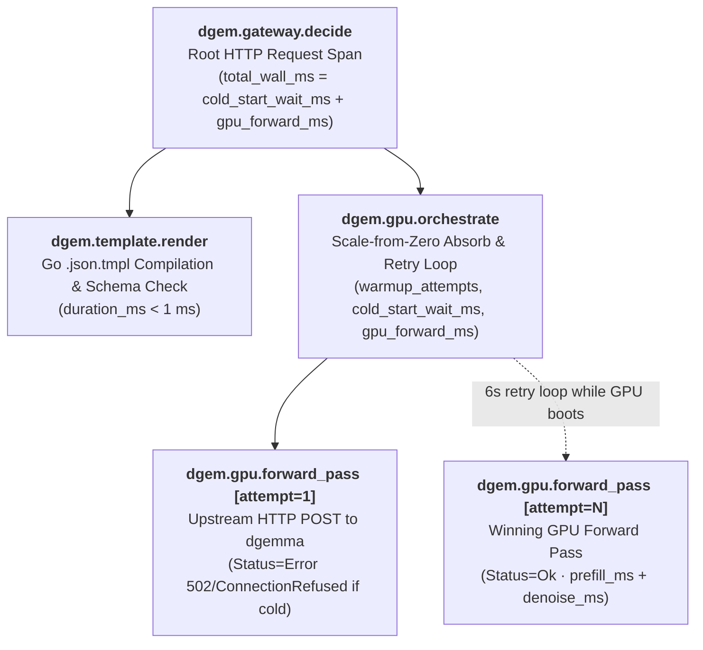

# OpenTelemetry Trace Waterfall & Cloud Observability Guide

Every decision request handled by **`dgemma-gateway`** (`POST /api/decide`, `POST /api/decide/{template}`, MCP `decide_with_template`, and the Decision Studio Web UI) is instrumented with **OpenTelemetry** (`cmd/otel.go` and `cmd/serve.go`) and exported to **Google Cloud Trace**, **Cloud Run Structured Logging**, and the gateway's built-in **Trace Ring Buffer (`GET /api/traces`)**.

This guide explains what `dgem.gateway.decide` and `dgem.gpu.orchestrate` measure, why they exhibit two very different latency regimes (cold start vs. warm forward pass), how to interpret their span attributes, and where to inspect them in Google Cloud Observability.

---

## 1. The OpenTelemetry Span Waterfall

When a decision evaluation executes, `dgemma-gateway` records a 3-level parent-child span hierarchy:



```text
dgem.gateway.decide (total_wall_ms, gpu_forward_ms, cold_start_wait_ms, max_entropy)
 ├── dgem.template.render (template.id, template.path, duration_ms < 1ms)
 └── dgem.gpu.orchestrate (upstream_url, model, warmup_attempts)
      ├── dgem.gpu.forward_pass [attempt=1, status=Error (ConnectionRefusedError)]  <-- Only during cold boot
      └── dgem.gpu.forward_pass [attempt=N, status=Ok] (gpu.forward_ms, prefill_ms, denoise_ms, reads, steps)
```

### Span Reference Table

| Span Name | Source Function | Role & What It Measures | Key Attributes |
| :--- | :--- | :--- | :--- |
| **`dgem.gateway.decide`** | `decideHandler` (`cmd/serve.go`) | **Root HTTP Request Span.** Wraps the complete lifecycle of a decision evaluation from incoming HTTP request to JSON response serialization. | `dgem.total_wall_ms`, `dgem.gpu.forward_ms`, `dgem.gpu.cold_start_wait_ms`, `dgem.gpu.reads`, `dgem.max_entropy`, `dgem.template`, `dgem.surface`, `dgem.user`, `dgem.multimodal` |
| **`dgem.template.render`** | `decideHandler` (`cmd/serve.go`) | **Policy Compilation.** Renders the `.json.tmpl` policy with caller variables and validates the decision slot schema (`< 1 ms`). | `dgem.template.id`, `dgem.template.path` |
| **`dgem.gpu.orchestrate`** | `executeDecideWithWarmup` (`cmd/serve.go`) | **Serverless GPU Wakeup & Retry Orchestrator.** Absorbs Cloud Run scale-from-zero (`0 -> 1` GPU instance) by retrying upstream calls every `6 seconds` until `vLLM` is ready, separating cold-start wait from pure GPU inference time. | `dgem.warmup_attempts`, `dgem.gpu.cold_start_wait_ms`, `dgem.gpu.forward_ms`, `dgem.upstream_url`, `dgem.model`, `dgem.image_count` |
| **`dgem.gpu.forward_pass`** | `executeDecideWithWarmup` (`cmd/serve.go`) | **Single Upstream GPU Attempt.** Represents one HTTP call to `dgemma`. On a warm GPU, only 1 child span (`dgem.attempt=1`) appears. On a cold boot, attempts `1..N-1` record `Status=Error` (`502`/`503`/`ConnectionRefusedError`) and attempt `N` records `Status=Ok`. | `dgem.attempt`, `dgem.gpu.forward_ms`, `dgem.gpu.prefill_ms`, `dgem.gpu.denoise_ms`, `dgem.gpu.reads`, `dgem.gpu.steps`, `dgem.gpu.prompt_tokens` |
| **`dgem.gpu.warmup_lifecycle`** | `TriggerGPUWarmupWithSource` (`cmd/mcp.go`) | **4-Stage GPU Boot Telemetry.** Emitted whenever a background scale-from-zero wakeup completes, decomposing total boot time across the 4 hardware initialization stages and updating the EWMA wake estimator. | `dgem.warmup.total_ms`, `dgem.warmup.stage1_activator_ms`, `dgem.warmup.stage2_tmpfs_ms`, `dgem.warmup.stage3_vllm_siglip_ms`, `dgem.warmup.stage4_triton_jit_ms`, `dgem.warmup.ewma_wake_seconds` |

---

## 2. Why Do `dgem.gateway.decide` and `dgem.gpu.orchestrate` Take So Long?

Because `dgem.template.render` completes in `< 1 ms`, the parent span (`dgem.gateway.decide`) and its orchestration child (`dgem.gpu.orchestrate`) always have nearly identical durations. High durations fall into one of **two distinct regimes**:

### Regime A: Serverless Cold Start (`total_wall_ms` = 90,000 – 180,000+ ms / 1.5–3+ minutes)

To enforce the **Zero-Idle-Cost Mandate**, the upstream `dgemma` Cloud Run GPU service (`NVIDIA RTX Pro 6000` 48GB or `NVIDIA L4` 24GB) scales down to `0` instances (`--min-instances=0`) when idle. When a request arrives while scaled to zero:

1. **Port 8080 (`structured_server.py`) Starts Before Port 8000 (`vLLM`)**:
   The lightweight Python reverse proxy (`structured_server.py`) passes Cloud Run startup probes immediately so the container activates, while `vLLM`'s `EngineCore` takes ~2–3 minutes (or ~6–8 minutes without `tmpfs` staging) to load weights in the background (`ConnectionRefusedError(111)` on port 8000).
2. **The 4 Hardware Boot Stages** (recorded on `dgem.gpu.warmup_lifecycle`):
   * **Stage 1 — Cloud Run GPU Activator (`stage1_activator_ms`, ~5%)**: GPU VM allocation and container scheduling.
   * **Stage 2 — GCS FUSE $\to$ `/dev/shm` `tmpfs` Staging (`stage2_tmpfs_ms`, ~38%)**: Streaming **17.53 GiB** of `bfloat16` safetensors into RAM.
   * **Stage 3 — `vLLM` `EngineCore` & `SigLIP` Init (`stage3_vllm_siglip_ms`, ~50%)**: Loading model weights into GPU VRAM and initializing Gemma 4's `SigLIP` vision encoder.
   * **Stage 4 — First-Inference Triton JIT Compilation (`stage4_triton_jit_ms`, ~8.6s)**: Compiling custom `TRITON_ATTN` kernels on the first forward pass.
3. **Why `dgem.gpu.orchestrate` Spans the Entire Wait**:
   Instead of failing the caller's HTTP request with `502 Bad Gateway`, `dgem.gpu.orchestrate` holds the request open and retries `dgem.gpu.forward_pass` every `6 seconds` until `vLLM` answers.

### Regime B: Warm GPU Inference (`gpu_forward_ms` = 600 – 1,400 ms, or 2,000 – 4,000 ms for DAGs/Vision)

When the GPU is already warm (`dgem.warmup_attempts = 1` and `dgem.gpu.cold_start_wait_ms = 0`), a single decision evaluation takes **~0.6s – 1.4s** (or **2s – 4s** for multimodal or multi-stage policies) for three architectural reasons:

1. **Eager Execution (`--enforce-eager`) & `TRITON_ATTN`**:
   FlashAttention-2 and CUDA Graphs reject DiffusionGemma's mixed **causal-prompt + bidirectional-canvas** attention mask. Running `TRITON_ATTN` in eager mode introduces Python/kernel dispatch overhead across the iterative denoising steps (`dgem.gpu.steps`, typically 8–16 steps per read).
2. **2-Stage Conditional Policy DAGs (`dgem.gpu.reads = 2`)**:
   Whenever a `.json.tmpl` policy uses `depends_on` / `ask_if` (for example, `secops_conditional_dag.json.tmpl`), `structured_server.py` partitions the questions into `level 0` and `level 1` in `schedule(qs)`, executing **2 sequential GPU forward passes (`reads=2`)** and doubling `gpu_forward_ms`. To guarantee a single forward pass (`reads=1`), keep all slots in `level 0` and gate downstream interpretation in the client.
3. **Multimodal `SigLIP` Vision Encoding (`dgem.multimodal = true`)**:
   Passing an image or bounding-box canvas runs the `SigLIP` vision tower and multi-scale visual token projection during `dgem.gpu.prefill_ms` prior to canvas denoising (`dgem.gpu.denoise_ms`).

---

## 3. How to Analyze & Interpret a Trace

Use this 4-step checklist when diagnosing any trace in Cloud Trace or the Web Studio Waterfall:

1. **Isolate Cold-Start Wait from Pure GPU Forward Pass**:
   $$\text{total\_wall\_ms} = \text{dgem.gpu.cold\_start\_wait\_ms} + \text{dgem.gpu.forward\_ms}$$
   * Check `dgem.warmup_attempts` and `dgem.gpu.cold_start_wait_ms`. If `warmup_attempts > 1`, the long bar on `dgem.gpu.orchestrate` is **serverless scale-from-zero boot time**, not model inference latency.
   * Look at the **last** `dgem.gpu.forward_pass` child span (`status = Ok`) for true GPU execution time (`dgem.gpu.forward_ms`).
2. **Compare `prefill_ms` vs. `denoise_ms` on `dgem.gpu.forward_pass`**:
   * High `dgem.gpu.prefill_ms` $\rightarrow$ Large input context (`dgem.gpu.prompt_tokens`) or high-resolution `SigLIP` image encoding.
   * High `dgem.gpu.denoise_ms` $\rightarrow$ Wide decision canvas (many slots) or multiple denoising iterations (`dgem.gpu.steps`).
3. **Inspect `dgem.gpu.reads`**:
   * `reads = 1` confirms single-pass $O(1)$ joint slot readout.
   * `reads >= 2` indicates a multi-stage `depends_on` / `ask_if` DAG split.
4. **Inspect `dgem.max_entropy`**:
   * Reports the highest slot Shannon entropy ($H_{\max}$ in nats) across the decision canvas. Low entropy ($H < 0.35\text{ nats}$) indicates high model certainty; high entropy ($H \ge 0.35\text{ nats}$) indicates epistemic ambiguity suitable for cascade escalation (`EXP-05`).

---

## 4. Where to View Traces in Google Cloud Observability

`initGatewayTracer` (`cmd/otel.go`) exports telemetry to four surfaces simultaneously:

### A. Google Cloud Trace (Visual Waterfall)
* **Console URL**: `https://console.cloud.google.com/traces/list?project=genai-blackbelt-fishfooding`
* Filter by service name **`dgemma-gateway`** or span name **`dgem.gateway.decide`**.
* Every `/api/decide` response returns an HTTP header **`X-Dgem-Trace-Id`** and JSON property **`trace_id`**. Paste this 32-character hex ID into Cloud Trace to inspect the correlated `dgemma-gateway` $\to$ `dgemma` span waterfall.

### B. Google Cloud Logging Explorer (Correlated Structured Logs)
Every completed span emits a structured JSON log entry with `logging.googleapis.com/trace` and `logging.googleapis.com/spanId` fields so logs and traces cross-link automatically in the GCP Console.

* **Query 1 — All Decision Evaluations (with Latency, Reads & Entropy):**
  ```text
  resource.type="cloud_run_revision"
  jsonPayload.span_name="dgem.gateway.decide"
  ```
* **Query 2 — Warm GPU Decisions Only (Exclude Scale-from-Zero Cold Starts):**
  ```text
  resource.type="cloud_run_revision"
  jsonPayload.span_name="dgem.gateway.decide"
  jsonPayload.dgem_cold_start_wait_ms = 0
  ```
* **Query 3 — Cold-Start 4-Stage Hardware Warmup Breakdowns:**
  ```text
  resource.type="cloud_run_revision"
  jsonPayload.span_name="dgem.gpu.warmup_lifecycle"
  ```

### C. Google Cloud Monitoring Operational Dashboard & Log-Based Metrics
Provisioned via `scripts/setup_cloud_monitoring.sh` (`deploy/monitoring/dgem-operational-dashboard.json`):
* **Dashboard**: **DiffusionGemma (`dgem`) — Operational & Decision Intelligence Dashboard**
* **Custom Metrics (`logging.googleapis.com/user/*`)**:
  * `dgem_decisions_total` — Decision request volume broken down by `surface`, `template`, `user`, `multimodal`, and `reads`.
  * `dgem_gpu_forward_ms` — Distribution of pure GPU forward-pass latency (`ms`), cleanly excluding cold-start wait time.
  * `dgem_epistemic_entropy` — Distribution of calibrated Shannon entropy ($H_{\max}$ in nats) by `template` and `surface`.
  * `dgem_warmup_total_ms` — Distribution of scale-from-zero GPU warmup durations by trigger source (`web_studio_wake`, `auto_wake_decide`, `mcp_agent`, `api_warmup`).

### D. Gateway Ring Buffer API (`GET /api/traces`) & Decision Studio UI
* **Decision Studio Web UI**: Directly underneath the slot readout cards, the **OpenTelemetry Request & GPU Model Span Waterfall** panel renders proportional horizontal timeline bars for `dgem.template.render`, `dgem.gpu.orchestrate`, and `dgem.gpu.forward_pass`.
* **REST API (`GET /api/traces`)**:
  ```bash
  # Fetch the 60 most recent spans from the gateway ring buffer
  curl -s -H "Authorization: Bearer $(gcloud auth print-identity-token)" \
    "${GATEWAY_URL}/api/traces" | jq .

  # Fetch the exact span waterfall for a specific trace_id
  curl -s -H "Authorization: Bearer $(gcloud auth print-identity-token)" \
    "${GATEWAY_URL}/api/traces?trace_id=${TRACE_ID}" | jq .
  ```
