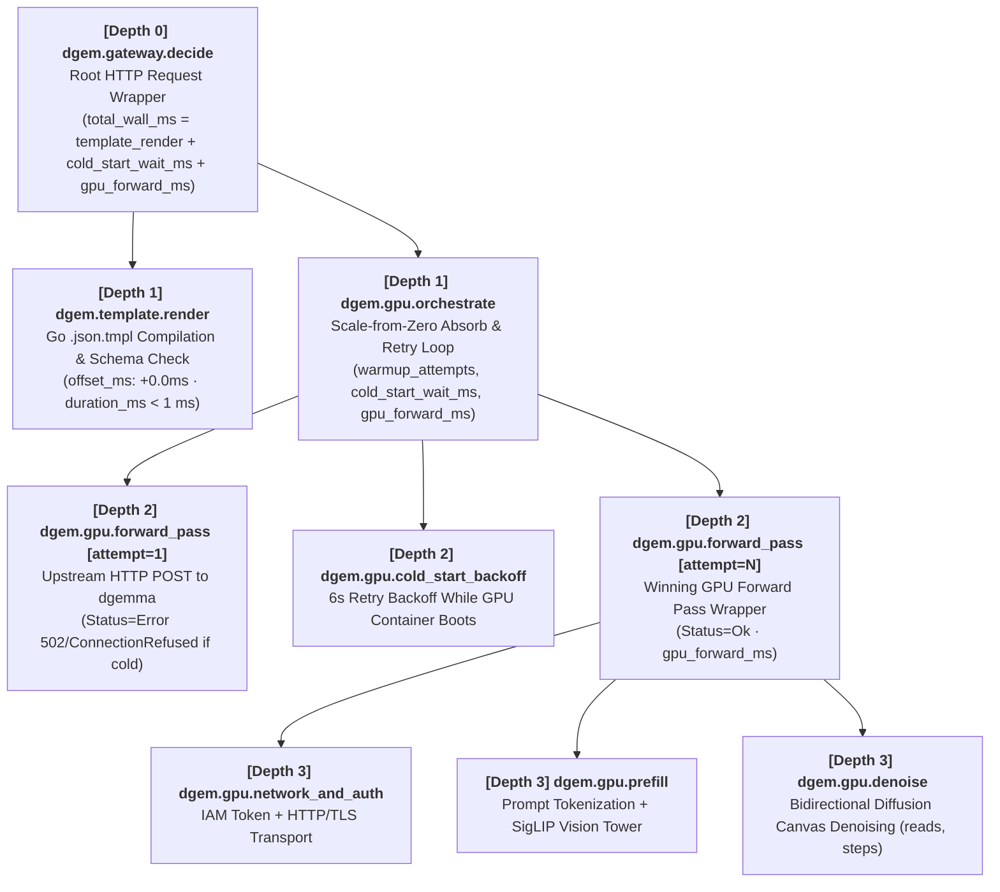

# OpenTelemetry Trace Waterfall & Cloud Observability Guide

Every decision request handled by **`dgemma-gateway`** (`POST /api/decide`, `POST /api/decide/{template}`, MCP `decide_with_template`, and the Decision Studio Web UI) is instrumented with **OpenTelemetry** (`cmd/otel.go` and `cmd/serve.go`) and exported to **Google Cloud Trace**, **Cloud Run Structured Logging**, and the gateway's built-in **Trace Ring Buffer (`GET /api/traces`)**.

This guide explains what `dgem.gateway.decide` and `dgem.gpu.orchestrate` measure, why they exhibit two very different latency regimes (cold start vs. warm forward pass), how child spans segment each GPU pass into `network_and_auth` $\to$ `prefill` $\to$ `denoise`, and where to inspect them in Google Cloud Observability.

---

## 1. The OpenTelemetry Span Waterfall

When a decision evaluation executes, `dgemma-gateway` records a 4-level hierarchical Gantt waterfall ordered top-down (`Depth 0` $\to$ `Depth 3`) with microsecond-accurate `offset_ms`:



```text
dgem.gateway.decide (depth=0, total_wall_ms, gpu_forward_ms, cold_start_wait_ms, max_entropy)
 ├── dgem.template.render (depth=1, template.id, template.path, duration_ms < 1ms)
 └── dgem.gpu.orchestrate (depth=1, upstream_url, backend, warmup_attempts)
      ├── dgem.gpu.forward_pass [attempt=1, status=Error]      <-- Only during cold boot
      ├── dgem.gpu.cold_start_backoff [attempt=1, 6000ms]      <-- Only during cold boot
      └── dgem.gpu.forward_pass [attempt=N, status=Ok] (depth=2, gpu.forward_ms)
           ├── dgem.gpu.network_and_auth (depth=3, gpu.network_ms)
           ├── dgem.gpu.prefill (depth=3, gpu.prefill_ms, prompt_tokens, image_count)
           └── dgem.gpu.denoise (depth=3, gpu.denoise_ms, reads, steps)
```

### Span Reference Table

| Span Name | Depth | Role & What It Measures | Key Attributes |
| :--- | :---: | :--- | :--- |
| **`dgem.gateway.decide`** | `0` | **Root HTTP Request Wrapper.** Wraps the complete lifecycle of a decision evaluation from incoming HTTP request to JSON response serialization. | `dgem.total_wall_ms`, `dgem.gpu.forward_ms`, `dgem.gpu.prefill_ms`, `dgem.gpu.denoise_ms`, `dgem.gpu.cold_start_wait_ms`, `dgem.gpu.reads`, `dgem.max_entropy`, `dgem.template`, `dgem.surface`, `dgem.user` |
| **`dgem.template.render`** | `1` | **Policy Compilation (Leaf).** Renders the `.json.tmpl` policy with caller variables and validates the decision slot schema (`< 1 ms`). | `dgem.template.id`, `dgem.template.path` |
| **`dgem.gpu.orchestrate`** | `1` | **Serverless GPU Wakeup & Retry Wrapper.** Absorbs Cloud Run scale-from-zero (`0 -> 1` GPU instance) by retrying upstream calls every `6 seconds` until `vLLM` is ready. | `dgem.warmup_attempts`, `dgem.gpu.cold_start_wait_ms`, `dgem.gpu.forward_ms`, `dgem.upstream_url`, `dgem.backend`, `dgem.model` |
| **`dgem.gpu.cold_start_backoff`** | `2` | **Scale-from-Zero Retry Wait (Leaf).** Explicit `6s` backoff interval between cold-start probe attempts while `vLLM` streams safetensors into GPU VRAM. | `dgem.attempt`, `dgem.reason` |
| **`dgem.gpu.forward_pass`** | `2` | **Single Upstream GPU Attempt Wrapper.** Represents one HTTP call to `dgemma`. Contains the 3 contiguous execution leaf spans (`network_and_auth`, `prefill`, `denoise`) when `Status=Ok`. | `dgem.attempt`, `dgem.gpu.forward_ms`, `dgem.gpu.network_ms`, `dgem.gpu.prefill_ms`, `dgem.gpu.denoise_ms`, `dgem.gpu.reads`, `dgem.gpu.steps` |
| **`dgem.gpu.network_and_auth`** | `3` | **Transport & Auth Overhead (Leaf).** IAM/Bearer token header injection, TLS handshake, and JSON payload serialization. | `dgem.gpu.network_ms`, `dgem.backend` |
| **`dgem.gpu.prefill`** | `3` | **Prompt & Vision Encoding (Leaf).** Causal prompt token prefill (`dgem.gpu.prompt_tokens`) and `SigLIP` vision tower feature extraction (`dgem.image_count`). | `dgem.gpu.prefill_ms`, `dgem.gpu.prompt_tokens`, `dgem.image_count` |
| **`dgem.gpu.denoise`** | `3` | **Bidirectional Canvas Denoising (Leaf).** Iterative discrete diffusion denoising across all decision slots simultaneously (`dgem.gpu.steps` and `dgem.gpu.reads`). | `dgem.gpu.denoise_ms`, `dgem.gpu.reads`, `dgem.gpu.steps` |
| **`dgem.gpu.warmup_lifecycle`** | `0` | **4-Stage GPU Boot Telemetry.** Emitted whenever a background scale-from-zero wakeup completes, decomposing total boot time across the 4 hardware initialization stages. | `dgem.warmup.total_ms`, `dgem.warmup.stage1_activator_ms`, `dgem.warmup.stage2_tmpfs_ms`, `dgem.warmup.stage3_vllm_siglip_ms`, `dgem.warmup.stage4_triton_jit_ms` |

---

## 2. Why Do `dgem.gateway.decide` and `dgem.gpu.orchestrate` Have Similar Inclusive Widths?

In OpenTelemetry, parent wrapper spans record **inclusive wall-clock duration** (`EndTime - StartTime`). Because `dgem.template.render` takes `< 1 ms` (`~0.03%` of total wall time), the root HTTP span (`dgem.gateway.decide`) and its orchestration child (`dgem.gpu.orchestrate`) naturally span ~99.97% of the same time window.

In the **Decision Studio Gantt Waterfall**, parent wrapper spans (`gateway.decide`, `gpu.orchestrate`, `gpu.forward_pass`) are rendered as **dashed outline container brackets**, while the **active execution leaf spans** (`template.render`, `cold_start_backoff`, `network_and_auth`, `prefill`, `denoise`) are rendered as **solid color-coded Gantt bars positioned at their exact `left: offset%` and `width: duration%` coordinates**.

High total durations fall into one of **two distinct regimes**:

### Regime A: Serverless Cold Start (`total_wall_ms` = 90,000 – 180,000+ ms / 1.5–3+ minutes)

To enforce the **Zero-Idle-Cost Mandate**, the upstream `dgemma` Cloud Run GPU service (`NVIDIA RTX Pro 6000` 48GB or `NVIDIA L4` 24GB) scales down to `0` instances (`--min-instances=0`) when idle. When a request arrives while scaled to zero:

1. **Port 8080 (`structured_server.py`) Starts Before Port 8000 (`vLLM`)**:
   The lightweight Python reverse proxy passes Cloud Run startup probes immediately so the container activates, while `vLLM`'s `EngineCore` takes ~2–3 minutes to load weights in the background (`ConnectionRefusedError(111)` on port 8000).
2. **The 4 Hardware Boot Stages** (recorded on `dgem.gpu.warmup_lifecycle`):
   * **Stage 1 — Cloud Run GPU Activator (`stage1_activator_ms`, ~5%)**: GPU VM allocation and container scheduling.
   * **Stage 2 — GCS FUSE $\to$ `/dev/shm` `tmpfs` Staging (`stage2_tmpfs_ms`, ~38%)**: Streaming **17.53 GiB** of `bfloat16` safetensors into RAM.
   * **Stage 3 — `vLLM` `EngineCore` & `SigLIP` Init (`stage3_vllm_siglip_ms`, ~50%)**: Loading model weights into GPU VRAM and initializing Gemma 4's `SigLIP` vision encoder.
   * **Stage 4 — First-Inference Triton JIT Compilation (`stage4_triton_jit_ms`, ~8.6s)**: Compiling custom `TRITON_ATTN` kernels on the first forward pass.
3. **Visible `dgem.gpu.cold_start_backoff` Spans**:
   Rather than failing the caller's HTTP request with `502 Bad Gateway`, `dgem.gpu.orchestrate` holds the request open and emits `dgem.gpu.cold_start_backoff` spans (`6,000 ms` each) between retries until `vLLM` answers.

### Regime B: Warm GPU Inference (`gpu_forward_ms` = 600 – 1,400 ms, or 2,000 – 4,000 ms for DAGs/Vision)

When the GPU is already warm (`dgem.warmup_attempts = 1` and `dgem.gpu.cold_start_wait_ms = 0`), a single decision evaluation takes **~0.6s – 1.4s** (or **2s – 4s** for multimodal or multi-stage policies) for three architectural reasons:

1. **Eager Execution (`--enforce-eager`) & `TRITON_ATTN`**:
   FlashAttention-2 and CUDA Graphs reject DiffusionGemma's mixed **causal-prompt + bidirectional-canvas** attention mask. Running `TRITON_ATTN` in eager mode introduces Python/kernel dispatch overhead across the iterative denoising steps (`dgem.gpu.steps`, typically 8–16 steps per read).
2. **2-Stage Conditional Policy DAGs (`dgem.gpu.reads = 2`)**:
   Whenever a `.json.tmpl` policy uses `depends_on` / `ask_if` (for example, `secops_conditional_dag.json.tmpl`), `structured_server.py` partitions the questions into `level 0` and `level 1` in `schedule(qs)`, executing **2 sequential GPU forward passes (`reads=2`)** and doubling `dgem.gpu.denoise`.
3. **Multimodal `SigLIP` Vision Encoding (`dgem.multimodal = true`)**:
   Passing an image or bounding-box canvas runs the `SigLIP` vision tower and multi-scale visual token projection during `dgem.gpu.prefill` prior to canvas denoising (`dgem.gpu.denoise`).

---

## 3. Where to View Traces in Google Cloud Observability

`initGatewayTracer` (`cmd/otel.go`) exports telemetry to four surfaces simultaneously:

### A. Google Cloud Trace (Visual Waterfall)
* **Console URL**: `https://console.cloud.google.com/traces/list?project=genai-blackbelt-fishfooding`
* Filter by service name **`dgemma-gateway`** or span name **`dgem.gateway.decide`**.
* Every `/api/decide` response returns an HTTP header **`X-Dgem-Trace-Id`** and JSON property **`trace_id`**. Paste this 32-character hex ID into Cloud Trace to inspect the correlated `dgemma-gateway` $\to$ `dgemma` span waterfall.

### B. Google Cloud Logging Explorer (Correlated Structured Logs)
Every completed span emits a structured JSON log entry with `logging.googleapis.com/trace` and `logging.googleapis.com/spanId` fields so logs and traces cross-link automatically in the GCP Console.

* **Query 1 — All Decision Evaluations (with Prefill, Denoise, Latency, Reads & Entropy):**
  ```text
  resource.type="cloud_run_revision"
  jsonPayload.span_name="dgem.gateway.decide"
  ```
* **Query 2 — Warm GPU Decisions Only (Exclude Scale-from-Zero Cold Starts):**
  ```text
  resource.type="cloud_run_revision"
  jsonPayload.span_name="dgem.gateway.decide"
  jsonPayload.dgem_cold_start_wait_ms = 0
  ```
* **Query 3 — Cold-Start 4-Stage Hardware Warmup Breakdowns:**
  ```text
  resource.type="cloud_run_revision"
  jsonPayload.span_name="dgem.gpu.warmup_lifecycle"
  ```

### C. Google Cloud Monitoring Operational Dashboard & Log-Based Metrics
Provisioned via `scripts/setup_cloud_monitoring.sh` (`deploy/monitoring/dgem-operational-dashboard.json`):
* **Dashboard**: **DiffusionGemma (`dgem`) — Operational & Decision Intelligence Dashboard**
* **Custom Metrics (`logging.googleapis.com/user/*`)**:
  * `dgem_decisions_total` — Decision request volume broken down by `surface`, `template`, `user`, `multimodal`, and `reads`.
  * `dgem_gpu_forward_ms` — Distribution of pure GPU forward-pass latency (`ms`), cleanly excluding cold-start wait time.
  * `dgem_gpu_prefill_ms` — Distribution of GPU prompt + `SigLIP` vision prefill duration (`ms`).
  * `dgem_gpu_denoise_ms` — Distribution of bidirectional diffusion canvas denoising duration (`ms`).
  * `dgem_epistemic_entropy` — Distribution of calibrated Shannon entropy ($H_{\max}$ in nats) by `template` and `surface`.
  * `dgem_warmup_total_ms` — Distribution of scale-from-zero GPU warmup durations by trigger source.

### D. Gateway Ring Buffer API (`GET /api/traces`) & Decision Studio UI
* **Decision Studio Web UI**: Directly underneath the slot readout cards, the **OpenTelemetry Request & GPU Model Span Waterfall (Gantt Timeline)** panel renders hierarchical tree rows with dashed parent wrappers and solid leaf bars positioned at `[+offset_ms, duration_ms]`.
* **REST API (`GET /api/traces`)**:
  ```bash
  # Fetch the exact hierarchical span waterfall for a specific trace_id
  curl -s -H "Authorization: Bearer $(gcloud auth print-identity-token)" \
    "${GATEWAY_URL}/api/traces?trace_id=${TRACE_ID}" | jq .
  ```
