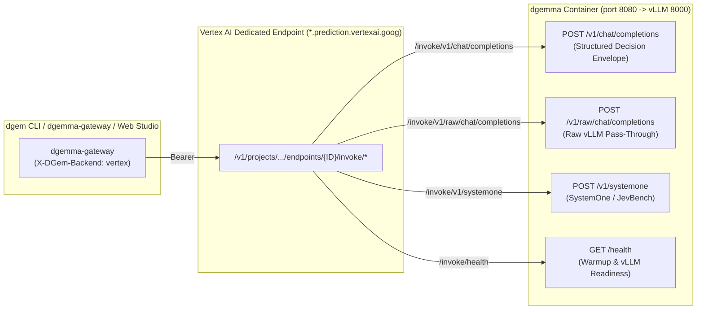

Reference for the two cloud runtimes behind `dgem`: why Vertex uses arbitrary custom routes, how the platforms
differ, and historical head-to-head receipts. For the current recommendation and step-by-step setup, follow
[From Laptop to Production](/dgem/deploy/): [Deploy on Cloud Run](/dgem/deploy/cloud-run/),
[Production on Vertex AI](/dgem/deploy/vertex/) and [Gateway and routing](/dgem/deploy/gateway/).

> Sections 2.1 and 5 are **historical**: they were measured on the retired L4 Vertex endpoint and an earlier
> serving image. Current measurements: [Latency and capacity](/dgem/operate/latency-capacity/).

---

## 1. Why We Use Vertex AI Arbitrary Custom Routes (`invokeRoutePrefix: "/*"`)

Standard Vertex AI Online Prediction (`:predict` and `:rawPredict`) binds a container deployment to a **single fixed HTTP path** (`AIP_PREDICT_ROUTE`). However, the `dgemma` container (`structured_server.py` on port `8080` fronting `vLLM EngineCore` on port `8000`) exposes **four distinct HTTP routes**:

- `POST /v1/chat/completions` — Structured 128-token diffusion decision envelope (`answers` + `diagnostics`).
- `POST /v1/raw/chat/completions` — Direct pass-through to `vLLM`'s raw `/v1/chat/completions`.
- `POST /v1/systemone` — Multipart image + JSON decision route (`JevBench` / `SystemOne`).
- `GET /health` — Live container warmup phase, staged GiB telemetry, and `vllm_ready` flag.

By uploading the model with **[`invokeRoutePrefix: "/*"`](https://docs.cloud.google.com/gemini-enterprise-agent-platform/machine-learning/predictions/use-arbitrary-custom-routes)** and deploying it to a **Vertex AI Dedicated Endpoint** (`dedicatedEndpointEnabled: true`), Vertex AI forwards any non-root path under `/invoke/<path>` **verbatim** as `/<path>` to `structured_server.py`:

---

## 2. Side-by-Side Comparison: Cloud Run GPU vs. Vertex AI Dedicated Endpoints

| Dimension | Serverless Cloud Run GPU (`dgemma`) | Vertex AI Dedicated Endpoint (`dgemma-dedicated-g4`) |
| :--- | :--- | :--- |
| **Scale-to-Zero (`min=0`)** | **Yes (`--min-instances=0`)** — Automatically scales down after 15 min idle (`$0.00/hr` when idle). | **No (`minReplicaCount >= 1`)** — Bills per replica-hour while a model is deployed, until undeployed (`make vertex-teardown`). |
| **Cold-Start / Provisioning** | **2.3–2.7 min** idle → warmed with Direct VPC egress (weights copied into memory in 64–83 s, overlapped with vLLM start-up). | **~10–15 min** to deploy a model; replicas then stay warm (no wake-up). |
| **Supported GPU Shapes** | `1× NVIDIA L4` (`24GB VRAM`, `32Gi RAM`) or `1× NVIDIA RTX Pro 6000 Blackwell` (`48GB VRAM`, `80Gi RAM`). | `g4-standard-48` + 1× RTX PRO 6000 (recommended; native NVFP4), plus L4 (`g2-*`), A100 (`a2-*`) and H100 (`a3-*`) machine types. |
| **Multimodal (vision tower)** | Single-GPU RTX PRO 6000 (80 GiB RAM) runs the model and the vision tower. | `g4-standard-48` + RTX PRO 6000 runs NVFP4 weights and the vision tower on one GPU. |
| **Routing Protocol** | Direct HTTPS to `https://dgemma-*.a.run.app/v1/chat/completions` | Arbitrary Custom Routes (`invokeRoutePrefix: "/*"`) via `https://<id>.<region>-<proj_num>.prediction.vertexai.goog/v1/projects/.../endpoints/<id>/invoke/v1/chat/completions` |
| **Authentication Token** | **OIDC Identity Token** (`gcloud auth print-identity-token`, audience = Cloud Run URL) | **OAuth2 Access Token** (`gcloud auth print-access-token`, scope = `cloud-platform`) |
| **Payload Size Limit** | **`32 MiB`** (HTTP/1.1) / Unlimited streaming (HTTP/2) | **`10–32 MiB`** on Dedicated Endpoints (`*.prediction.vertexai.goog`); bypasses the `1.5 MiB` shared `:predict` limit |
| **Health Probe Behavior** | Polls `GET /health` (`200 OK` immediately so gateway can read live staging telemetry during scale-from-zero). | Startup probe on `GET /health` (long timeout); readiness fields as on Cloud Run. |
| **Enterprise MLOps Features** | Revision traffic splitting, Direct Cloud Run IAP, Cloud Logging & Monitoring. | Model Registry versioning, Private Service Connect (PSC) endpoints, traffic-split canary rollouts (`deployedModels/{id}/invoke/*`), DCGM GPU AutoMetrics. |

---

## 2.1 Empirical 30-Case Benchmark Comparison (`dgem bench`, historical: L4 endpoint)

We evaluated the exact same 30-case multi-domain decision suite ([`benchmarks/eval_dataset.jsonl`](https://github.com/ghchinoy/dgem/blob/main/benchmarks/eval_dataset.jsonl) across `support`, `code_review`, and `security`) on our live **Vertex AI Dedicated Endpoint (`<legacy-l4-endpoint>`, `g2-standard-16` · `1× NVIDIA L4` · `/invoke/v1`)** and **Serverless Cloud Run GPU (`dgemma`)**:

| Backend Target | Hardware Profile | Cold-Start / Wakeup | Single-Pass (`N=1`) Denoise | 4-Sample (`N=4`) Avg GPU Denoise | Avg End-to-End Wall Time (`30 cases`) | Proxy / Network Overhead | Multi-Domain Slot Accuracy | Receipt |
| :--- | :--- | :--- | :--- | :--- | :--- | :--- | :--- | :--- |
| **Vertex AI Dedicated Endpoint (`/invoke/v1`)** | `g2-standard-16` (`1× NVIDIA L4` 24GB VRAM, `64GB` RAM) | **`0.0 s`** (`minReplicaCount=1`, always warm) | **`195 ms`** (`245 ms` wall) | **`490.0 ms`** (`~122.5 ms/read`) | **`536.0 ms`** | **`46.0 ms`** | **`76.7%`** (`23/30`) | `benchmarks/results_vertex_l4_invoke.json` |
| **Serverless Cloud Run GPU (`dgemma`)** | `1× NVIDIA RTX Pro 6000` (`48GB VRAM`, `80Gi` RAM) | **`~121.8 s`** (`0 → 1` scale-from-zero, `$0.00/hr` idle) | **`171 ms`** (`199 ms` wall) | **`427.3 ms`** (`~106.8 ms/read`) | **`459.0 ms`** | **`31.7 ms`** | **`80.0%`** (`24/30`) | `benchmarks/results_cloudrun.json` |
| **GCE VM (Raw vLLM without `structured_server.py`)** | `g2-standard-8` (`1× NVIDIA L4` 24GB VRAM, `32GB` RAM) | **`0.0 s`** (dedicated VM) | — | — | **`1,968.7 ms`** (`3.67×` slower) | — | **`73.3%`** (`22/30`) | `benchmarks/results_gce_l4.json` |
| **Local Apple Silicon Metal (`diffgemma`)** | Apple M-Series (`q4` unified memory) | **`0.0 s`** (local daemon) | **`210 ms`** | **`892.0 ms`** | **`898.5 ms`** | **`6.5 ms`** | **`80.0%`** (`24/30`) | `benchmarks/results_local_metal_slot.json` |

### Key Engineering Takeaways from Live Deployment
1. **Why `g2-standard-16` (`64 GB` RAM) is Required for `1× NVIDIA L4` on Vertex AI**:
   - `g2-standard-8` (`1× NVIDIA L4`) provides only **`32 GB` of host RAM**. Staging the `17.53 GiB` `dgemma` safetensors into `/tmp/dgemma` (`tmpfs` in RAM) while `vLLM`/PyTorch allocates a `17.53 GiB` CPU load buffer requires **`~35.1 GiB` of RAM**, causing a container OOM kill on `g2-standard-8`.
   - **`g2-standard-16`** attaches the **exact same single `1× NVIDIA L4` GPU** (`24 GB` VRAM) with **`64 GB` of host RAM** and `16 vCPUs`, eliminating the `32 GB` RAM bottleneck for negligible incremental CPU cost.
2. **2-Second `/health` Startup for Vertex AI Health Probes**:
   - Vertex AI Dedicated Endpoints fail `deploy-model` if port `:8080/health` does not respond during container initialization. [`deploy/cloudrun/entrypoint.sh`](https://github.com/ghchinoy/dgem/blob/main/deploy/cloudrun/entrypoint.sh) stages only the `<20 MB` tokenizer + `4 MB` safetensors headers synchronously (`<2 seconds`), launches `structured_server.py` on `:8080` immediately so `/health` returns `200 OK`, and streams the `17.53 GiB` tensor bodies in the background across 64 HTTPS Range streams while `_wait_for_upstream()` holds early inference requests until `vLLM` on `:8000` is ready.

---

## 3. Routing and deployment

Backend modes (`vertex_first`, `vertex`, `cloudrun`, `local`) and per-request overrides:
[Gateway and routing](/dgem/deploy/gateway/). Deploying, swapping images and tearing down a dedicated endpoint:
[Production on Vertex AI](/dgem/deploy/vertex/).

---

## 4. 4-Phase Head-to-Head Benchmark Matrix (historical: L4 endpoint, `scripts/compare_vertex_vs_cloudrun.sh`)

All empirical receipts are stored in [`benchmarks/results_head_to_head_vertex_vs_cloudrun.json`](https://github.com/ghchinoy/dgem/blob/main/benchmarks/results_head_to_head_vertex_vs_cloudrun.json), [`benchmarks/results_calibration_vertex_l4.json`](https://github.com/ghchinoy/dgem/blob/main/benchmarks/results_calibration_vertex_l4.json), and [`benchmarks/results_rerank_vertex_l4.json`](https://github.com/ghchinoy/dgem/blob/main/benchmarks/results_rerank_vertex_l4.json).

### Phase 1: Concurrency & Tail-Latency Scaling (`dgem bench` 30-Case Multi-Slot Suite)

| Concurrency (`-w`) | Active vLLM Sequences (`w × 4`) | Accuracy | GPU Denoise `p50` | GPU Denoise `p90` | GPU Denoise `p99` | Client Wall `p50` | Sustained Throughput | Operational Note |
| :--- | :--- | :--- | :--- | :--- | :--- | :--- | :--- | :--- |
| **`w=1` (Sequential)** | `4` sequences | **`80.0%` (`24/30`)** | **`499.4 ms`** | **`517.1 ms`** | **`576.0 ms`** | **`534.0 ms`** | `1.87 dec/sec` | Lowest per-request latency (`188 ms` when `N=1`) |
| **`w=4` (4 Workers)** | `16` sequences (`= MAX_NUM_SEQS`) | **`76.7%` (`23/30`)** | **`717.4 ms`** | **`769.8 ms`** | **`827.6 ms`** | **`786.0 ms`** | **`5.44 dec/sec`** (`30` cases in `5.51s`) | **Sweet-spot concurrency** for 1× NVIDIA L4 (`24 GB` VRAM) |
| **`w=8` (8 Workers)** | `32` sequences | **`76.7%` (`23/30`)** | **`1009.4 ms`** | **`1025.7 ms`** | **`1054.5 ms`** | **`1047.0 ms`** | **`7.49 dec/sec`** (`30` cases in `4.01s`) | **Peak throughput** on a single L4 GPU replica (`100%` HTTP 200) |
| **`w=16` (16 Workers)** | `64` sequences | — | — | — | — | — | — | Exceeds single-L4 `24 GB` KV-cache (`MAX_NUM_SEQS=16`); scale `max-replica-count >= 2` or cap `w <= 8` per L4 |

### Phase 2: 50-Case Public Dataset Calibration & Guardrail Suite (`dgem bench-calibration`, `EXP-04`)

| Metric | **Vertex AI Dedicated Endpoint (`<legacy-l4-endpoint>`)** | **Serverless Cloud Run GPU (`dgemma`)** |
| :--- | :--- | :--- |
| **Overall Suite Accuracy (`50` cases)** | **`88.0%` (`44/50`)** | **`82.0%` (`41/50`)** |
| **Chance-Corrected Accuracy (`JevBench`)** | **`83.05%`** | **`74.57%`** |
| **10-Bin Expected Calibration Error (`ECE`)** | **`0.0470` (`4.70%`)** | **`0.0684` (`6.84%`)** |
| **Multi-Class Brier Score** | **`0.1944`** | **`0.2412`** |
| **Composite `JevBench v1.3.1` Score (GeoMean)** | **`73.37`** (`Intelligence: 84.10`, `Calibration: 84.85`) | **`71.18`** |
| **Median Latency (`p50`)** | **`790.0 ms`** | **`712.0 ms`** |

### Phase 3: 30-Query (300-Passage) 12-Slot Listwise Diffusion Reranking (`dgem bench-rerank`, `EXP-10`)

| Metric | **Vertex AI Dedicated Endpoint (`<legacy-l4-endpoint>`)** | **Serverless Cloud Run GPU (`dgemma`)** |
| :--- | :--- | :--- |
| **Simultaneous Slots per Forward Pass** | `12` slots (`10` passage grades + `poisoned_passage` + `answer_present`) | `12` slots (`10` passage grades + `poisoned_passage` + `answer_present`) |
| **Mean Wall Latency (`12` Slots / ~2,000 tokens)** | **`1,631.9 ms`** (`~136 ms/slot`) | **`1,454.3 ms` – `2,336.4 ms`** |
| **Continuous Expectation `nDCG@10`** | **`0.8502`** | **`0.9265`** |
| **FollowIR Policy-Flip `p-MRR`** | **`+0.8350`** | **`+0.7533`** |
| **Exact Tie Rate** | **`0.0%`** | **`0.0%`** |
| **RAG Prompt-Injection Poison Quarantine** | **`100.0%`** | **`100.0%`** |
