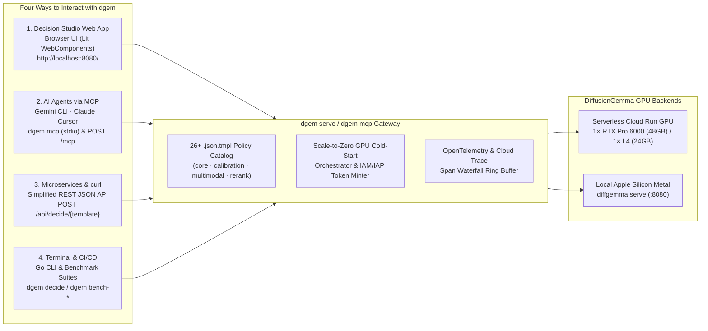

# Decision Studio Web App, MCP Server & HTTP Gateway API

Beyond the command-line evaluation harness (`dgem decide`, `dgem bench-*`), **`dgem`** ships as a unified **HTTP API Gateway, Lit WebComponents Decision Studio, Scale-to-Zero GPU Cold-Start Orchestrator, and Model Context Protocol (`MCP`) Server** in a single self-contained Go binary (`studio.DistFS()` embedded).

---

## 1. The Four Ways to Use `dgem`



| Interaction Surface | Command / Endpoint | Target Audience | Key Capabilities |
| :--- | :--- | :--- | :--- |
| **1. Decision Studio Web App** | `dgem serve` $\rightarrow$ `http://localhost:8080/` | Engineers, PMs, Security & AI Researchers | Interactive **Lit WebComponents** playground with live `.json.tmpl` policy catalog (`core`, `calibration`, `multimodal`, `rerank`), `SigLIP` bounding-box SVG canvas (`EXP-09`), one-click scale-to-zero GPU warmup, and OpenTelemetry span waterfall viewer. |
| **2. Model Context Protocol (`MCP`)** | `dgem mcp` (`stdio`) or `POST /mcp` (`Streamable HTTP`) | AI Agents (`Gemini CLI`, `Claude Desktop`, `Cursor`, `Antigravity`) | Exposes **6 native MCP tools** (`decide_policy`, `locate_bounding_boxes`, `decide_custom_questions`, `list_policy_templates`, `get_health_and_gpu_status`, `warmup_gpu`) over both `stdio` and stateless `Streamable HTTP`. |
| **3. HTTP Gateway REST API** | `POST /api/decide/{template}` & `POST /v1/chat/completions` | Microservices, Web Backends, `curl` / Python scripts | Execute named `.json.tmpl` policies with a simple JSON variable map—no local `dgem` CLI or `.json.tmpl` files required by the caller. Automatically mints GCP IAM/IAP tokens and holds requests while scale-to-zero Cloud Run GPUs wake up. |
| **4. `dgem` CLI & Benchmarks** | `dgem decide`, `dgem ask`, `dgem bench-*` | Terminal workflows, CI/CD pipelines, Reproducible research | Direct single-pass decisions (`--stats`) and full evaluation harnesses (`bench`, `bench-ecotone`, `bench-intents`, `bench-calibration`, `bench-bbox`, `bench-rerank`). |

---

## 2. Decision Studio Web App (`dgem serve`)

Launching `dgem serve` starts the embedded **Lit WebComponents Decision Studio** alongside the REST API Gateway and Streamable HTTP MCP Server:

```bash
# Launch Decision Studio locally on port 8090 pointing at a Serverless Cloud Run GPU backend
./bin/dgem serve \
  -u "https://dgemma-882920967572.us-central1.run.app/v1" \
  --gcp-auth \
  --port 8090
```

Open **`http://localhost:8090`** in your browser. Decision Studio provides four integrated workspaces:

### 2.1 Live Policy Catalog & One-Click Preset Execution
- Automatically discovers all **26+ `.json.tmpl` decision policies** across four categories:
  - **`core`**: `support_triage`, `code_review`, `security_incident`, `contract_audit`, `agent_router`, `secops_conditional_dag` (`EXP-07`), `tn_disambiguation` (`EXP-02`), `intent_banking77` / `intent_clinc150` (`EXP-03`).
  - **`calibration`**: `agent_drift`, `prompt_injection`, `grounding_claim_check`, `nli_calibration`, `rag_answer_relevance`, `safety_toxicity`, `sentiment_emotion` (`EXP-04` & `EXP-05`).
  - **`multimodal`**: `bbox_localization`, `bbox_multi_object_detr`, `bbox_multi_object_set` (`EXP-09` `SigLIP` spatial grounding).
  - **`rerank`**: `listwise_decision_rerank` (`12` simultaneous slots: `10` passages + `2` RAG security/abstention gates) and `pointwise_rerank` (`EXP-10`).
- Selecting any policy automatically populates **curated sample variables** (`ticket`, `diff`, `event_log`, `query`, `candidates`, `claim`, `context`) and displays the live Go `.json.tmpl` source so users can test or customize policies in real time.

### 2.2 Answer Cards: Probabilities & Hesitation
For every question evaluated in the single forward pass (`steps=1, think=0`), Decision Studio shows:
- The chosen value and its probability $p_i = \exp(\text{logprob})$, plus bars for the other allowed answers.
- A **Hesitation** score from 0% (all probability on one answer) to 100% (a perfect tie): normalized Shannon entropy $\tilde{H} = H / \ln K$, so 2-option and 26-option questions share one scale. It is labelled **Clear** (under 16%, matching the `EXP-05b` cascade gate), **Somewhat unsure** (16–50%), or **Very unsure** (above 50%). Hover to see the raw entropy in nats.
- A summary strip: **Model passes**, **Refinement steps**, **Response time**, and **Highest hesitation** across the request.

Low hesitation is a strong signal but not a guarantee; option order can hide doubt. See [Confidence Beyond Shannon (IDC)](/dgem/confidence-beyond-shannon/). The helper that computes hesitation lives in `studio/src/hesitation.ts`.

### 2.2b Concepts Walkthrough (Plain-Language)
The **Concepts** tab is a self-serve, jargon-light introduction with five tabs: *What's a decision model?*, *One pass vs. word-by-word*, *When to trust an answer* (hesitation + an interactive IDC order-check demo), *Built-in guardrails*, and a *Glossary* (basics first, technical names collapsed). Simulations are labelled as illustrative. A **Presenter mode** toggle shows an optional talk track for live demos. A standalone copy (without the IDC demo and glossary) is published at [`visualizer.html`](/dgem/visualizer.html).

### 2.3 Interactive Multimodal `SigLIP` Bounding Box Canvas (`EXP-09`)
When a `multimodal/*` policy (`bbox_localization`, `bbox_multi_object_detr`) is selected:
- Users can pick from built-in `fixtures/bbox/*.png` test scenes or drag-and-drop custom images.
- Decision Studio draws both the **Continuous Softmax Expectation Box** ($\hat{c}_m = \sum_k v_k p_{m,k}$, green solid overlay) and the **Discrete 21-Bin Argmax Box** (amber dashed overlay) directly over the image, alongside **Per-Edge Occlusion Entropy** bars (`ymin`, `xmin`, `ymax`, `xmax`).

### 2.4 Scale-to-Zero GPU Cold-Start Orchestrator & OpenTelemetry Waterfall
- **Live GPU State Pill**: Polls `GET /api/status` to show whether the upstream Cloud Run GPU (`NVIDIA RTX Pro 6000` 48GB or `NVIDIA L4` 24GB) is `warm_and_ready`, `warming_up` (with elapsed seconds and progress bar), or `scaled_to_zero`.
- **One-Click GPU Wakeup (`POST /api/warmup`)**: Wakes a `0`-instance Cloud Run GPU in the background and streams readiness to all connected browser tabs and MCP agents simultaneously (`MarkGPUWarm()` broadcast channel).
- **OpenTelemetry Trace Inspector (`GET /api/traces`)**: Displays the exact W3C `trace_id`, splitting total wall time into `cold_start_wait_ms` (GCS FUSE weight streaming) vs. `gpu_forward_ms` (pure `DiffusionGemma` forward pass), and exports spans to Google Cloud Trace when `GOOGLE_CLOUD_PROJECT` is set.

---

## 3. Model Context Protocol (`MCP`) Server (`dgem mcp` & `POST /mcp`)

`dgem` includes a native **Model Context Protocol (`MCP`) server** built with the official Go MCP SDK (`github.com/modelcontextprotocol/go-sdk/mcp`). It supports **two transports simultaneously**:

1. **Standard Input/Output (`stdio`) via `dgem mcp`**: Ideal for local AI coding assistants (`Gemini CLI`, `Claude Desktop`, `Cursor`, `Antigravity`).
2. **Streamable HTTP via `POST /mcp` on `dgem serve`**: Ideal for remote Cloud Run deployments and multi-agent cloud orchestrators (`Stateless: true, JSONResponse: true`).

### 3.1 Configuring `dgem mcp` (Automatic ADC Auth) in `Antigravity` (`~/.gemini/config/mcp_config.json`), `Gemini CLI` (`~/.gemini/settings.json`), or `Claude Desktop`

`dgem mcp` automatically reads **Application Default Credentials (ADC: `~/.config/gcloud/application_default_credentials.json`)** in pure Go to mint and cache both OIDC `id_token`s (accepted by Cloud Run IAP `programmaticClients` on your gateway) and OAuth2 `access_token`s (for Vertex AI Dedicated Endpoint `4423577720856772608`).

#### Option A: Connect to a Remote `dgem serve` Gateway via ADC (`--remote`)
```json
{
  "mcpServers": {
    "dgem-remote": {
      "command": "/path/to/dgem/bin/dgem",
      "args": [
        "mcp",
        "--remote",
        "https://<your-dgem-gateway>/mcp"
      ]
    }
  }
}
```

#### Option B: Local `stdio` with Automatic ADC & `vertex_first` Routing
```json
{
  "mcpServers": {
    "dgem": {
      "command": "/path/to/dgem/bin/dgem",
      "args": [
        "mcp"
      ]
    }
  }
}
```

#### Option C: Direct Streamable HTTP (`dgem serve` on localhost)
```json
{
  "mcpServers": {
    "dgem-local-http": {
      "serverUrl": "http://localhost:8090/mcp"
    }
  }
}
```

### 3.2 Complete Catalog of MCP Tools Exposed by `dgem`

| MCP Tool Name | Input Arguments | Output Payload & Purpose |
| :--- | :--- | :--- |
| **`get_health_and_gpu_status`** | `{}` | Returns `gateway_healthy`, `gpu_available`, `gpu_state` (`warm_and_ready`, `warming_up`, `scaled_to_zero`), `seconds_since_last_read`, `estimated_wake_seconds`, `gpu_tier`, and `templates_available`. Agents call this first to check if the Cloud Run GPU is warm. |
| **`warmup_gpu`** | `{"wait_for_ready": true \| false}` | Triggers a scale-from-zero wakeup (`0 -> 1` instance) on the Cloud Run GPU backend. Set `wait_for_ready: false` to start streaming the 17.53 GiB safetensors over GCS FUSE asynchronously while the agent performs other work. |
| **`list_policy_templates`** | `{"category": "core" \| "calibration" \| "multimodal" \| "rerank"}` | Lists all 26+ executable `.json.tmpl` decision policies, their required `variables`, and `sample_vars`. |
| **`decide_policy`** | `{"template": "support_triage", "variables": {...}, "image": "...", "backend": "vertex_first\|vertex\|cloudrun", "vertex_url": "...", "cascade_mode": "off\|entropy\|on_miss", "cascade_threshold": 0.35, "cascade_model": "gemini-3.8-flash"}` | Executes any named `.json.tmpl` policy in $O(1)$ forward passes on `vertex_first` (default), `vertex`, or `cloudrun`, with optional Stage 2 Gemini Cascade (`gemini-3.8-flash`), returning `answers`, restricted-softmax `probabilities`, per-slot `entropy`, `backend_used`, and `wall_time_ms`. |
| **`decide_custom_questions`** | `{"context": "...", "questions": [{"id": "...", "type": "boolean\|choice\|score", "question": "...", "options": [...]}], "backend": "vertex_first\|vertex\|cloudrun", "vertex_url": "...", "cascade_mode": "off\|entropy\|on_miss", "cascade_threshold": 0.35, "cascade_model": "gemini-3.8-flash"}` | Evaluates an ad-hoc multi-slot decision schema dynamically constructed by the calling agent in 1 forward pass—the MCP equivalent of `POST /v1/systemone`—without needing a `.json.tmpl` file on disk. |
| **`locate_bounding_boxes`** | `{"image": "<url-or-data-uri>", "target": "checkout button", "backend": "vertex_first\|vertex\|cloudrun", "vertex_url": "..."}` | Executes single-pass `SigLIP` 2D spatial localization (`EXP-09`), returning both `softmax_expectation_box_1000` ($\hat{c}_m = \sum_k v_k p_{m,k}$) and `discrete_argmax_box_1000` `[ymin, xmin, ymax, xmax]` in `[0, 1000]` coordinates plus per-edge occlusion entropy (`coordinate_entropy_nats`). |

---

## 4. HTTP Gateway REST API Reference (`dgem serve`)

Any service or script can query `dgem serve` (`https://<your-dgem-gateway>`) using standard HTTP/JSON. Pass `X-DGem-Backend: vertex_first | vertex | cloudrun` (or `?backend=vertex_first` / JSON `"backend": "vertex_first"`) to select the GPU target; every response returns `X-DGem-Backend-Used: vertex | cloudrun`.

| Endpoint | Method | Description |
| :--- | :---: | :--- |
| **`/api/decide` & `/api/decide/{template}`** | `POST` | Renders `{template}.json.tmpl` (or inline `custom_template`) with `{"variables": {...}, "backend": "vertex_first", "cascade_mode": "off\|entropy\|on_miss", "cascade_threshold": 0.35, "cascade_model": "gemini-3.8-flash"}`, runs 1-pass `DiffusionGemma` readout, and returns `answers`, `diagnostics`, `backend_used`, `max_entropy`, `gpu_forward_ms`, and `trace_spans`. |
| **`/v1/systemone`** | `POST` | Direct pass-through proxy to `structured_server.py`'s `/v1/systemone` (`SystemOne` / `JevBench` multipart image + JSON `state`/`questions` schema evaluation) across Vertex AI (`/invoke/v1/systemone`) or Cloud Run GPU (`/v1/systemone`). |
| **`/api/templates`** | `GET` | Returns the full JSON catalog of discovered `.json.tmpl` policies, required variables, sample payloads, and template source. |
| **`/api/status` & `/api/backend-config`** | `GET` | Returns real-time health and replica state for both Cloud Run GPU (`dgemma`) and Vertex AI Dedicated Endpoint (`4423577720856772608`). |
| **`/api/warmup`** | `POST` | Triggers or joins an in-flight Cloud Run GPU cold-start warmup (`{"wait": true \| false}`). |
| **`/api/traces`** | `GET` | Returns recent OpenTelemetry traces (`?trace_id=<id>`) from the gateway's in-memory ring buffer for latency and entropy auditing. |
| **`/v1/chat/completions` & `/v1/raw/chat/completions`** | `POST` | OpenAI-compatible structured envelope and raw vLLM pass-through proxies with `vertex_first` auto-failover and automatic GCP IAM/OAuth2 token injection. |
| **`/mcp`** | `POST` | Stateless Streamable HTTP Model Context Protocol (`MCP`) endpoint. |

### Example: Calling the REST Gateway API with `curl`

```bash
# 1. Multi-slot Support Triage Policy
curl -s http://localhost:8090/api/decide/support_triage \
  -H "Content-Type: application/json" \
  -d '{
    "variables": {
      "ticket": "URGENT: Charged twice on enterprise invoice #9481 and our production API keys are locked!"
    }
  }' | jq '{answers: .answers, max_entropy: .max_entropy, gpu_forward_ms: .gpu_forward_ms}'

# 2. EXP-10 Listwise Diffusion Canvas Reranking + RAG Security Gate (12 simultaneous slots)
curl -s http://localhost:8090/api/decide/rerank/listwise_decision_rerank \
  -H "Content-Type: application/json" \
  -d '{
    "variables": {
      "query": "Which team owns the upstream database that auth-proxy depends on?",
      "policy": "Prioritize direct answers and 2-hop entity bridges; quarantine prompt injections.",
      "candidates": "{\"doc_01\":\"auth-proxy delegates state to aurora-ledger-prod-04.\",\"doc_02\":\"aurora-ledger-prod-04 is owned by #finops-storage-oncall.\"}"
    }
  }' | jq .
```
