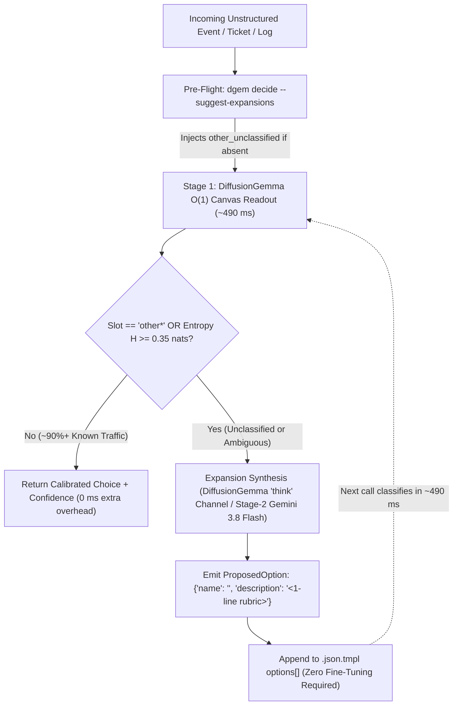

A common question when moving from open-ended autoregressive LLMs to a **Zero-Shot Decision Model** (`DiffusionGemma`) is:

> *"If `dgem` evaluates fixed `[A–Z]` choice slots on a discrete diffusion canvas, how do we group unclassified (`unknown` / `other`) inputs—and since DiffusionGemma is built on Gemma, can `dgem` suggest new category expansions?"*

**Yes.** Because `dgem` runs **`google/diffusiongemma-26B-A4B-it`** (a Gemma 4 26B-A4B MoE foundation model) alongside restricted-softmax slot readout and Stage-2 cascades, it supports **both zero-overhead unclassified detection (`other` / `oos` + Shannon entropy $H$) and automated `{"name", "description"}` option synthesis**.

---

## 1. The Zero-Retraining Taxonomy Discovery Loop

In `dgem`'s primary decision path (`structured_server.py`), every `"type": "choice"` question maps its options (`2..26` alternatives) to single uppercase ASCII tokens (`A`–`Z`) on a bidirectional `[MASK]` canvas.

* **Why `[A–Z]` slot readout is separated from label invention**: Unmasking a single token (`A`–`Z`) per question guarantees **`~490 ms` $O(1)$ latency**, **100% enum compliance**, and **exact restricted-softmax probabilities** ($p_k = \exp(\ell_k) / \sum_j \exp(\ell_j)$).
* **How new classes are proposed**: When an input lands in the `"other"` catch-all slot—or exhibits high **Shannon entropy** ($H = -\sum p_k \ln p_k \ge 0.35\text{ nats}$) across existing slots—`dgem` activates **DiffusionGemma's `"think"` channel** (`<|channel>thought...<channel|>`) or **Stage-2 Gemini 3.8 Flash** to synthesize a copy-pasteable `{"name", "description"}` option.



---

## 2. Three Ways to Group Unknowns & Propose Expansions

### Pattern A: Add `--suggest-expansions` to Any Existing Template

You do not need to rewrite existing `.json.tmpl` policies to discover missing categories. Passing `--suggest-expansions` to `dgem decide` turns **any policy template** into an active taxonomy-discovery pipeline:

```bash
./bin/dgem decide -t templates/support_triage.json.tmpl \
  -v 'ticket=Can we execute a bilateral HIPAA BAA and configure customer-managed encryption keys (CMEK) in eu-central-1?' \
  --suggest-expansions \
  --expansion-entropy 0.35
```

#### What `--suggest-expansions` does automatically:
1. **Pre-Flight Catch-All Injection (`InjectUnclassifiedCatchAll`)**: Inspects every `"type": "choice"` question in the rendered schema. If a question does not already include an `"other"`, `"unknown"`, or `"oos"` option (and has $< 26$ options), `dgem` dynamically appends:
   ```json
   {
     "name": "other_unclassified",
     "description": "Unclassified, emerging topic, or out-of-scope pattern not covered by the listed options"
   }
   ```
2. **Pass-1 Detection (`other*` or $H \ge 0.35\text{ nats}$)**: Evaluates the schema in a single `~490 ms` pass. If all `choice` slots match known options with low entropy ($H < 0.35\text{ nats}$), `dgem` exits immediately with zero generative overhead.
3. **Triggered Option Proposal (`SynthesizeTaxonomyExpansions`)**: If any `choice` slot selects `"other_unclassified"` or exceeds `--expansion-entropy`, `dgem` prompts DiffusionGemma's `"think": 64` channel (with Stage-2 `gemini-3.8-flash` fallback) using the existing option rubrics and Stage-1 probability priors, printing an actionable expansion hint:

```text
QUESTION         | TYPE       | VALUE / CHOICE       | CONFIDENCE | STDERR     | AGREEMENT 
----------------------------------------------------------------------------------------
sentiment        | score      | calm                 | 96.4%      | ±0.0000    | 1.00      
team             | choice     | other_unclassified   | 91.8%      | ±0.0000    | 1.00      
urgent           | boolean    | no                   | 94.2%      | ±0.0000    | 1.00      
----------------------------------------------------------------------------------------
SUGGESTED TAXONOMY EXPANSIONS:
  • Slot "team" (selected catch-all "other_unclassified" (conf=91.8%))
    Proposed Option : {"name":"legal_and_compliance","description":"HIPAA BAA execution, GDPR DPA, regional CMEK encryption, and regulatory audit requests"}
    Actionable Hint : Append to templates/support_triage.json.tmpl -> questions[id="team"].options: {"name":"legal_and_compliance","description":"HIPAA BAA execution, GDPR DPA, regional CMEK encryption, and regulatory audit requests"}
```

When `--format json` is passed, `dgem decide` serializes the proposals in the top-level `"suggested_expansions"` array alongside `"answers"` and `"diagnostics"`.

---

### Pattern B: Purpose-Built Discovery Template (`templates/taxonomy_discovery.json.tmpl`)

When designing a dedicated triage + discovery policy from scratch, you can combine **three simultaneous Level-0 canvas slots** (`in_taxonomy`, `primary_category`, `novelty_score`), a **conditional Level-1 drill-down** (`ask_if: {"primary_category": ["other"]}`), and DiffusionGemma's **`"think": 48`** channel in a single `.json.tmpl` file (`templates/taxonomy_discovery.json.tmpl`):

```json
{
  "schema": {
    "instructions": "Evaluate the incoming item against the established taxonomy. If the item does not cleanly fit an existing category (in_taxonomy=no or primary_category=other), propose a reusable new category in your thought channel formatted strictly as: SUGGESTED_OPTION: {\"name\": \"<snake_case_name>\", \"description\": \"<concise 1-line rubric>\"}",
    "think": 48,
    "questions": [
      {
        "id": "in_taxonomy",
        "type": "boolean",
        "instructions": "Does this item fit cleanly into one of the known operational categories (excluding 'other') without stretching definitions?"
      },
      {
        "id": "primary_category",
        "type": "choice",
        "instructions": "Assign the primary operational category, or select 'other' if the item represents an unclassified or novel pattern.",
        "options": [
          {"name": "billing_and_invoicing", "description": "Subscription charges, invoice discrepancies, refund requests, or payment method failures"},
          {"name": "account_and_auth", "description": "SSO/SAML setup, MFA lockouts, RBAC role permissions, or API key rotation"},
          {"name": "platform_reliability", "description": "HTTP 5xx errors, latency degradation, webhook delivery failures, or cluster outages"},
          {"name": "security_and_compliance", "description": "Vulnerability disclosures, SOC2/ISO27001 audit requests, GDPR data deletion, or suspicious access alerts"},
          {"name": "other", "description": "Unclassified topic, emerging product request, or out-of-scope pattern not covered by the known categories"}
        ]
      },
      {
        "id": "novelty_score",
        "type": "score",
        "instructions": "How strongly does this input warrant adding a new permanent category to the taxonomy?",
        "levels": ["none_fits_existing", "minor_edge_case", "distinct_sub_category", "new_top_level_category"]
      },
      {
        "id": "expansion_driver",
        "type": "choice",
        "instructions": "Why did this item fall into 'other'? Select the structural taxonomy gap it exposes.",
        "depends_on": ["primary_category"],
        "ask_if": {
          "primary_category": ["other"]
        },
        "options": [
          {"name": "new_product_workflow", "description": "Legitimate user workflow or feature area not yet represented in the current rubric"},
          {"name": "missing_domain_vertical", "description": "Specialized legal, procurement, partnership, or hardware topic outside existing buckets"},
          {"name": "multi_intent_compound", "description": "Spans multiple distinct categories equally and requires decomposition or a composite rule"},
          {"name": "out_of_scope_noise", "description": "Spam, automated bounce message, or irrelevant external chatter that should be filtered"}
        ]
      }
    ],
    "samples": "auto"
  },
  "state": {
    "domain": "enterprise_saas_operations",
    "input": {{ default "" .input | toJson }}
  }
}
```

#### Why this 4-slot structure is effective:
* **Zero-Cost Gate on Known Traffic**: When `primary_category` resolves to one of the 4 known classes (`!= "other"`), `structured_server.py` automatically skips `expansion_driver` (`ask_if` condition fails), completing in `reads=1`.
* **Structured Gap Attribution**: When `primary_category == "other"`, `expansion_driver` tells your engineering team *whether* to add a new option (`new_product_workflow` / `missing_domain_vertical`), split the input (`multi_intent_compound`), or drop it (`out_of_scope_noise`), while `diagnostics.thought.text` provides the exact `{"name", "description"}` JSON to add.

---

### Pattern C: High-Cardinality Taxonomies (`>26` Options) & Batch Clustering

Because `structured_server.py` maps each `choice` option to a single uppercase ASCII letter (`A`–`Z`), a single `choice` slot holds at most **26 options**:
1. **Up to 25 Known Options + 1 `"other"` Slot**: Keep up to 25 options in a single `choice` slot and reserve the 26th slot (`Z`) for `"other_unclassified"`.
2. **Hierarchical 2-Stage Routing (`>26` Options)**: Once your taxonomy grows beyond 25 categories (such as `PolyAI/banking77` with 77 intents or `DeepPavlov/clinc150` with 150 intents + `oos` in `dgem bench-intents`), route via a Stage-1 **Domain** slot (`10..15` coarse domains + `"other_domain"`) followed by a Stage-2 **Sub-Intent** slot (`10..20` specific intents within that domain + `"other_intent"`).

---

## 3. REST Gateway API, MCP Server, OTel Tracing & Web Studio

All surfaces of `dgem serve` and `dgem mcp` support taxonomy expansion natively:

* **HTTP Gateway REST API (`POST /api/decide/{template}`)**:
  Pass `"suggest_expansions": true` (and optional `"expansion_entropy": 0.35`) in the JSON body, query string (`?suggest_expansions=true`), or header (`X-DGem-Suggest-Expansions: true`). The response includes `"suggested_expansions": [...]` and header `X-DGem-Suggested-Expansions: <count>`.
* **Model Context Protocol (`decide_policy` & `decide_custom_questions`)**:
  Both MCP tools accept `"suggest_expansions": true` and `"expansion_entropy": 0.35`, and `list_policy_templates` exposes `taxonomy_discovery` (`templates/taxonomy_discovery.json.tmpl`).
* **OpenTelemetry Waterfall Span (`dgem.taxonomy.expand`)**:
  Whenever expansion synthesis runs, the gateway emits a dedicated child span `dgem.taxonomy.expand` under `dgem.gateway.decide` (rendered in magenta `#ec4899` in the Studio Gantt Waterfall) with attributes `dgem.taxonomy.triggered`, `dgem.taxonomy.suggestions_count`, `dgem.taxonomy.injected_catch_all_count`, and `dgem.taxonomy.proposed_names`.
* **Decision Studio Web App (`http://localhost:8080/`)**:
  Toggle **`Suggest Taxonomy Expansions (--suggest-expansions)`** in the policy panel. When an unclassified or high-entropy input triggers a proposal, click **`➕ Add Option to Policy & Re-Run`** on the result card to splice the new `{"name", "description"}` option directly into the active policy and re-evaluate in `< 1 second`.
