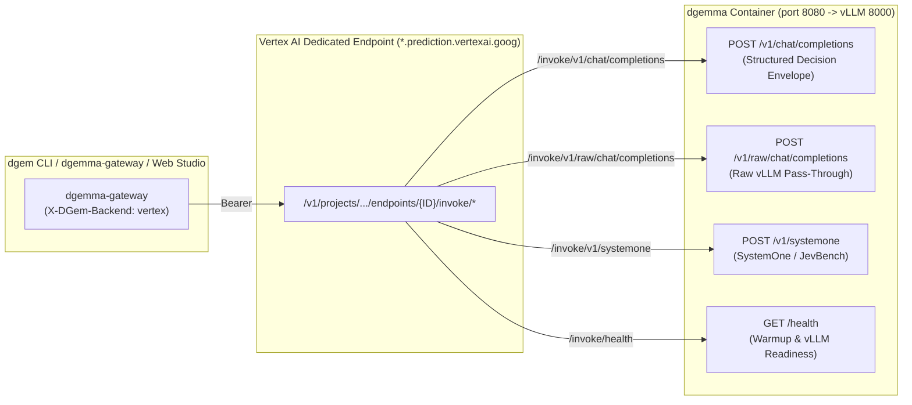

# Vertex AI Dedicated Endpoints (`/invoke/*`) vs. Cloud Run GPU

`dgem` supports **four execution infrastructures** using the exact same `.json.tmpl` decision policies, OpenTelemetry instrumentation, and `dgemma` container (`us-central1-docker.pkg.dev/genai-blackbelt-fishfooding/dgem/dgemma:latest`):

1. **Local Apple Silicon Metal (`diffgemma`)** — Developer laptop prototyping & offline eval.
2. **GCE VM (`g2-standard-8` L4 / `a2-highgpu-2g` A100)** — Raw VM benchmarking & custom kernel profiling.
3. **Serverless Cloud Run GPU (`dgemma`)** — **Default production backend** (`--min-instances=0`, scale-to-zero `$0/hr` idle cost, NVIDIA RTX Pro 6000 48GB or L4 24GB).
4. **Vertex AI Dedicated Endpoints (`dgemma-dedicated` with `invokeRoutePrefix: "/*"`)** — **Enterprise MLOps backend** exposing all `structured_server.py` and `vLLM` routes directly via `/invoke/*`.

---

## 1. Why We Use Vertex AI Arbitrary Custom Routes (`invokeRoutePrefix: "/*"`)

Standard Vertex AI Online Prediction (`:predict` and `:rawPredict`) binds a container deployment to a **single fixed HTTP path** (`AIP_PREDICT_ROUTE`). However, the `dgemma` container (`structured_server.py` on port `8080` fronting `vLLM EngineCore` on port `8000`) exposes **four distinct HTTP routes**:

- `POST /v1/chat/completions` — Structured 128-token diffusion decision envelope (`answers` + `diagnostics`).
- `POST /v1/raw/chat/completions` — Direct pass-through to `vLLM`'s raw `/v1/chat/completions`.
- `POST /v1/systemone` — Multipart image + JSON decision route (`JevBench` / `SystemOne`).
- `GET /health` — Live container warmup phase, staged GiB telemetry, and `vllm_ready` flag.

By uploading the model with **[`invokeRoutePrefix: "/*"`](https://docs.cloud.google.com/gemini-enterprise-agent-platform/machine-learning/predictions/use-arbitrary-custom-routes)** and deploying it to a **Vertex AI Dedicated Endpoint** (`dedicatedEndpointEnabled: true`), Vertex AI forwards any non-root path under `/invoke/<path>` **verbatim** as `/<path>` to `structured_server.py`:



---

## 2. Side-by-Side Comparison: Cloud Run GPU vs. Vertex AI Dedicated Endpoints

| Dimension | Serverless Cloud Run GPU (`dgemma`) | Vertex AI Dedicated Endpoint (`dgemma-dedicated`) |
| :--- | :--- | :--- |
| **Scale-to-Zero (`min=0`)** | **Yes (`--min-instances=0`)** — Automatically scales down after 15 min idle (`$0.00/hr` when idle). | **No (`minReplicaCount >= 1`)** — Bills continuously (`~$0.95/hr` for 1× L4 or `~$2.30/hr` for 2× L4) until undeployed (`make vertex-teardown`). |
| **Cold-Start / Provisioning** | **~89s** from `0 → 1` (64-stream GCS HTTPS Range API into `/tmp/dgemma` overlapped with `vLLM` + `SigLIP` init). | **~12–18 min** initial VM + container provisioning; once `Deployed`, replicas stay permanently warm (`0s` wakeup). |
| **Supported GPU Shapes** | `1× NVIDIA L4` (`24GB VRAM`, `32Gi RAM`) or `1× NVIDIA RTX Pro 6000 Blackwell` (`48GB VRAM`, `80Gi RAM`). | `1..8× NVIDIA L4` (`g2-standard-8` to `g2-standard-96`), `1..8× NVIDIA A100` (`a2-highgpu-*`), `8× NVIDIA H100` (`a3-highgpu-8g`). |
| **Multimodal (`bfloat16` + `SigLIP`)** | Single-GPU `RTX Pro 6000` (`48GB VRAM`, `80Gi RAM`) runs full `bfloat16` + `SigLIP` with zero tensor parallelism. | Requires `g2-standard-24` (`2× NVIDIA L4 = 48GB VRAM`, `--tensor-parallel-size 2`) or `a2-highgpu-1g` (`A100 40GB`). |
| **Routing Protocol** | Direct HTTPS to `https://dgemma-*.a.run.app/v1/chat/completions` | Arbitrary Custom Routes (`invokeRoutePrefix: "/*"`) via `https://<id>.<region>-<proj_num>.prediction.vertexai.goog/v1/projects/.../endpoints/<id>/invoke/v1/chat/completions` |
| **Authentication Token** | **OIDC Identity Token** (`gcloud auth print-identity-token`, audience = Cloud Run URL) | **OAuth2 Access Token** (`gcloud auth print-access-token`, scope = `cloud-platform`) |
| **Payload Size Limit** | **`32 MiB`** (HTTP/1.1) / Unlimited streaming (HTTP/2) | **`10–32 MiB`** on Dedicated Endpoints (`*.prediction.vertexai.goog`); bypasses the `1.5 MiB` shared `:predict` limit |
| **Health Probe Behavior** | Polls `GET /health` (`200 OK` immediately so gateway can read live staging telemetry during scale-from-zero). | Polls `GET /vertex-health` (`503` while `vLLM` loads weights, `200 OK` once `vllm_ready: true`). |
| **Enterprise MLOps Features** | Revision traffic splitting, Direct Cloud Run IAP, Cloud Logging & Monitoring. | Model Registry versioning, Private Service Connect (PSC) endpoints, traffic-split canary rollouts (`deployedModels/{id}/invoke/*`), DCGM GPU AutoMetrics. |

---

## 3. Switching Backends in `dgemma-gateway` & Web Studio

`dgemma-gateway` supports dynamic per-request and runtime backend routing between **Cloud Run GPU** and **Vertex AI Dedicated Endpoints** without restarting the gateway.

### A. In the Web Studio UI (`https://dgemma.aaie.cloud`)
1. Click the **`Cloud Run GPU` / `Vertex AI (/invoke/*)`** selector pill in the top header bar.
2. Enter your Vertex AI **Endpoint ID** (e.g., `1234567890123456789`) or full Dedicated Endpoint `/invoke/v1` URL and click **Save & Apply**.
3. Both interactive single decisions (**Decision Studio**) and concurrent batch evaluations (**Batch Eval**) immediately send `X-DGem-Backend: vertex` and `X-DGem-Vertex-Url`, and tag every Cloud Logging entry and OpenTelemetry span with `dgem_backend="vertex"`.

### B. Via HTTP Headers (`X-DGem-Backend` & `X-DGem-Vertex-Url`)
Pass `X-DGem-Backend: vertex` and `X-DGem-Vertex-Url` (either a numeric Endpoint ID or full Dedicated Endpoint URL) on any `POST /api/decide/{template}` call:

```bash
curl -sS "https://dgemma.aaie.cloud/api/decide/support_triage" \
  -H "Authorization: Bearer $(gcloud auth print-identity-token)" \
  -H "Content-Type: application/json" \
  -H "X-DGem-Backend: vertex" \
  -H "X-DGem-Vertex-Url: 1234567890123456789" \
  -d '{
    "variables": {
      "ticket": "I was charged twice for my Pro subscription and need an immediate refund."
    }
  }' | jq .
```

### C. Via `dgem` CLI Directly Against the Vertex AI Dedicated Endpoint
Because `pkg/client` automatically detects `*.prediction.vertexai.goog` and `/invoke/*` URLs and switches `--gcp-auth` from OIDC ID tokens to OAuth2 `cloud-platform` access tokens, any `dgem` CLI command (`decide`, `bench`, `bench-calibration`, `bench-rerank`, `bench-jev`) can target Vertex AI directly:

```bash
./bin/dgem decide \
  -u "https://<ENDPOINT_ID>.us-central1-882920967572.prediction.vertexai.goog/v1/projects/genai-blackbelt-fishfooding/locations/us-central1/endpoints/<ENDPOINT_ID>/invoke/v1" \
  --gcp-auth \
  -t templates/support_triage.json.tmpl \
  -v ticket="I was charged twice for my Pro subscription."
```

---

## 4. Deploying & Tearing Down a Vertex AI Dedicated Endpoint

```bash
# 1. Upload dgemma with invokeRoutePrefix="/*" and deploy to a Dedicated Endpoint
make vertex-deploy

# 2. Mandatory teardown after testing (Vertex AI Dedicated Endpoints enforce minReplicaCount >= 1)
make vertex-teardown
```
