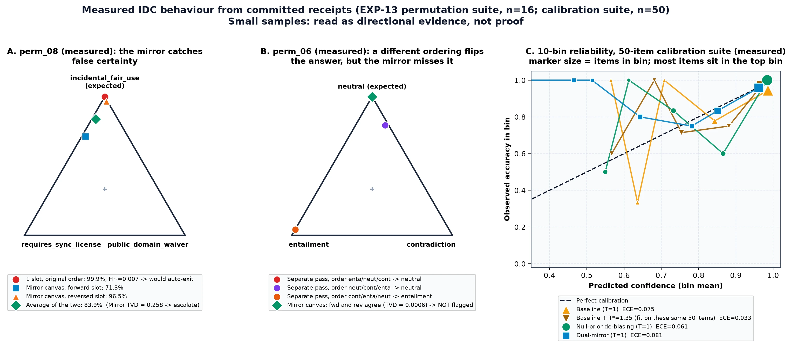
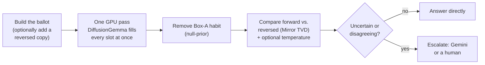
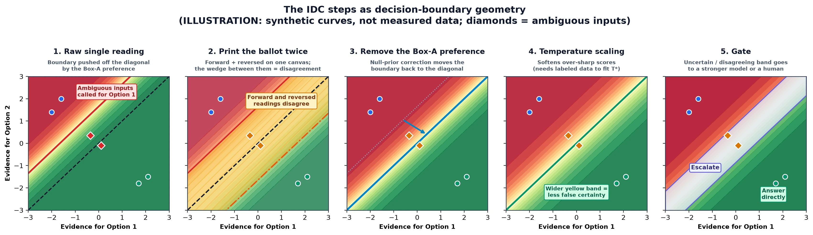
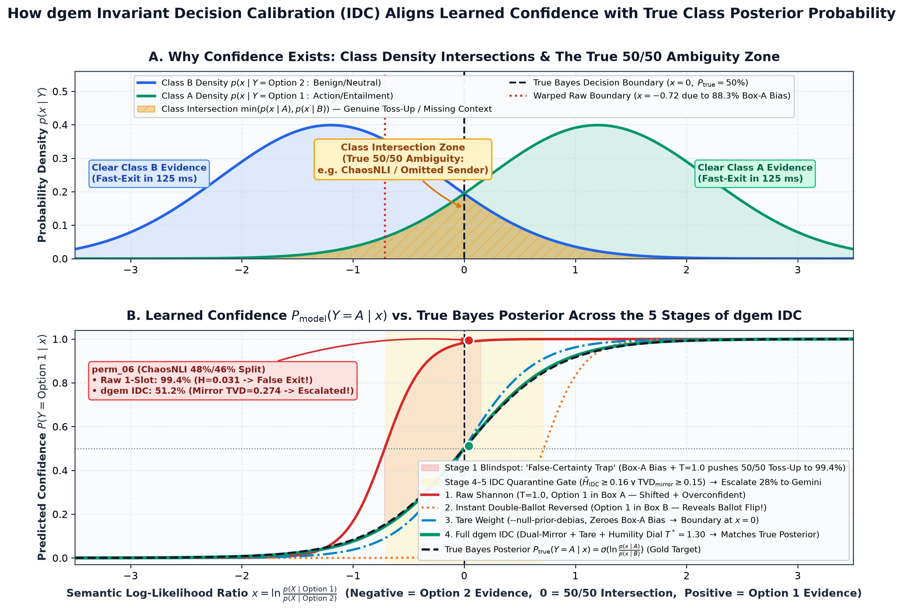

# Confidence Beyond Shannon: Invariant Decision Calibration (`IDC`)

> **In one sentence:** IDC is a small set of cheap checks and corrections that make a `dgem` confidence score reflect **the question itself, not the position where each answer happened to be listed**, and that flag decisions whose answer changes when the list order changes.

**Why "invariant"?** Reordering the answer options doesn't change the question, so it shouldn't change the decision or how confident the model is in it. A decision that stays the same under reordering is *invariant*. IDC measures how far `DiffusionGemma` is from that ideal and corrects for part of the gap.

**What this page covers:**

1. [Why `dgem` can measure confidence at all](#1-the-starting-point-dgem-can-read-a-confidence-score-in-one-pass)
2. [The problem: a ballot that favors Box A](#2-the-problem-a-ballot-that-favors-box-a)
3. [A worked example, step by step](#3-a-worked-example-one-decision-step-by-step)
4. [The IDC toolkit and what is implemented today](#4-the-idc-toolkit)
5. [What IDC does *not* fix](#5-what-idc-does-not-fix)
6. [The evidence so far, with sample sizes](#6-the-evidence-so-far-with-sample-sizes)
7. [Prior art, and what is actually new here](#7-prior-art-and-what-is-new)
8. [CLI quick reference](#8-cli-quick-reference)

---

## TL;DR

* **The problem.** Given a blank question with meaningless options, `DiffusionGemma` still picks the first option (`A`) 78–88% of the time. On a genuinely borderline question, that habit can turn a coin flip into a score like "99.9% sure". The usual uncertainty meter (Shannon entropy) then says "certain", and the case skips human or frontier-model review.
* **The IDC idea.** (1) Measure the model's built-in preference for each position and divide it out (*null-prior de-biasing*). (2) Show the model the options in forward *and* reversed order **on the same canvas, in the same single forward pass**, and check whether the two readings agree (*Dual-Mirror*). (3) If you have labeled data, soften over-sharp scores (*temperature scaling*). (4) Send disagreeing or uncertain cases onward (*the gate*).
* **What's new.** Steps 1 and 3 are known techniques from the LLM calibration literature. The part specific to `dgem` is step 2: because a diffusion model fills every answer slot at once, the reversed ballot costs **no extra forward pass**, which gives a free per-request "does order matter here?" signal.
* **How strong is the evidence?** Mixed, and now measured on more data ([EXP-14](experiments/exp-14-idc-rerun.md), same-session re-run on 50 + 231 items). Null-prior de-biasing clearly helps on the 50-item suite but **not** on the 231-item JevBench set. Dual-Mirror had a naming bug that degraded readings (now fixed), and even after the fix a second slot on the same canvas lowers the forward reading on JevBench, so it is a **research diagnostic, not a production default**. Temperature scaling fitted on held-out data cuts calibration error by about a quarter to a third on 231 items, but not on 50. The entropy-gated cascade remains the most reliable gain. [Section 6](#6-the-evidence-so-far-with-sample-sizes) has the numbers.

---

## 1. The starting point: `dgem` can read a confidence score in one pass

A chat LLM writes its answer one token at a time, so its confidence is spread across formatting tokens (`{`, `"decision":`, `"yes"`) and depends on everything it has already written. `DiffusionGemma` instead fills in a fixed set of blanks ("slots") in **one forward pass**. `dgem` gives every option a single-letter label (`A`, `B`, `C`, …) and reads the probability of each allowed letter straight from the slot.

That gives a clean probability for every option, and from it the **Shannon entropy**: a single number for how spread out the probabilities are. Dividing by the maximum possible entropy puts it on a 0-to-1 scale regardless of how many options there are:

$$\tilde{H} = \frac{-\sum_{k=1}^{K} p_k \ln p_k}{\ln K} \in [0, 1] \qquad (0 = \text{all probability on one option},\ 1 = \text{a perfect tie})$$

This already helps. In `EXP-04`, entropy was about 8× higher on items where human annotators split three ways than on items where they agreed (`0.59` vs `0.07` nats; **n = 3 items per group**, so treat this as a direction, not a precise multiplier). In `EXP-05b`, sending only items with $\tilde{H} \ge 0.16$ to `gemini-3.8-flash` raised accuracy on the 50-item calibration suite from 88% to **98% (49/50)** while escalating 34% of items (`benchmarks/results_calibration_cascade_normalized.json`). That cascade used **plain entropy only, with no IDC**, and the 0.16 threshold was tuned on the same 50 items.

**The catch:** entropy measures how sure the model is about *which letter to write in that slot, given this particular option order*. It doesn't tell you whether the model would give the same answer if the options were listed differently.

---

## 2. The problem: a ballot that favors Box A

Election researchers have long documented a *ballot-order effect*: candidates listed first get extra votes from undecided voters. Language models show the same habit. To measure it for `DiffusionGemma`, `EXP-13B` asked questions with **no content at all** (`[REDACTED / CONTENT-FREE CALIBRATION PROBE]`) and neutral options (`Option 1 … Option K`). An unbiased model would split evenly. It didn't:

| Options ($K$) | Picks slot `A` | Slot `B` | Slot `C` | Slot `D` | Even split would be |
| :--- | :---: | :---: | :---: | :---: | :---: |
| 2 | **88.3%** | 11.7% | — | — | 50% |
| 3 | **78.3%** | 8.6% | 13.1% | — | 33% |
| 4 | **49.3%** | 4.8% | 16.3% | 29.5% | 25% |

*(Source: `benchmarks/results_permutation_cloudrun.json`, `null_prior`. With 4 options there's also a secondary preference for the last slot, which is common in LLMs.)*

On clear-cut questions this barely matters, because the evidence swamps the habit. On **borderline** questions the habit can decide the outcome. Here is a real example from the ordering suite, `perm_07`: a ticket that is equally an SRE outage and a legal/contract issue, asked with three different option orders in separate passes:

| Option order (slot A / B / C) | Model's answer | Confidence |
| :--- | :--- | :---: |
| legal / **sre** / finance | `sre_identity_platform_oncall` | 61% |
| sre / finance / **legal** | `legal_and_contracts_desk` | 89% |
| finance / **legal** / sre | `legal_and_contracts_desk` | **99.6%** |

Same ticket, same options, only the order changed, yet confidence ranges from 61% to 99.6% and the answer flips. In this case the entropy of the first ordering was high enough to trigger escalation anyway. The dangerous cases are the ones where it isn't, which is what the next section walks through.

---

## 3. A worked example: one decision, step by step

**Case `perm_08`** (synthetic, from `benchmarks/permutation_suite.jsonl`): *"A documentary filmmaker includes a 14-second unaltered chorus of a #1 song playing on a car radio in the background."* Options: `requires_sync_license`, `incidental_fair_use`, `public_domain_waiver`. Reasonable lawyers could argue either of the first two. The test's expected answer is `incidental_fair_use`.

| Step | What `dgem` does | What the numbers say | What the gate would decide |
| :--- | :--- | :--- | :--- |
| **0. Raw single reading** | One slot, original order | `incidental_fair_use` **99.9%**, $\tilde{H} = 0.007$ | **Auto-answer.** Looks certain. |
| **1. Print the ballot twice** (`--dual-mirror`) | Add a second slot with the options reversed, on the **same canvas, same forward pass** | Forward slot: 71.3%. Reversed slot: 96.5%. | — |
| **2. Compare the two readings** | Mirror TVD: half the total gap between the two probability lists | TVD = **0.258** (on clear-cut items it's typically < 0.01) | — |
| **3. Gate** | Escalate if the readings disagree, or if the merged distribution is uncertain | Merged $\tilde{H} = 0.47$, TVD = 0.26 | **Escalate** to a stronger model or a human |

**What happened here:** the model's final pick was right, but its 99.9% wasn't earned. How sure it seemed depended on the layout of the page. A trustworthy system should route a case like this to review rather than auto-approve it at "99.9%".

> ⚠️ **Honest footnotes on this example**
>
> * **It did not fully reproduce on another backend.** In the Vertex AI re-run ([EXP-14](experiments/exp-14-idc-rerun.md)), `perm_08`'s single reading was already uncertain (hesitation 20%, escalated by entropy alone) and the forward/reversed gap was only 0.064. The example shows the mechanism, not a stable property of this item.
>
> * **The forward slot changed too.** Adding the reversed slot moved the forward reading from 99.9% to 71.3%. On a diffusion canvas every slot can see every other slot, so the two readings are *not independent*: the mirror is part of the scene, not a detached observer. That is probably part of why it catches disagreement, but it also means the two readings could agree simply because they can see each other. A same-canvas vs. separate-pass ablation is still needed (see [§6](#6-the-evidence-so-far-with-sample-sizes)).
> * **The mirror only tests one reordering.** On `perm_06` (a surgeon sighing after an operation: complication or just tiredness?), moving the options to a different order in a separate pass flips the answer from `neutral` to `entailment`. But the forward and *reversed* readings agree (TVD = **0.0006**), so the mirror does **not** flag it. Dual-Mirror is a smoke detector for one kind of order sensitivity, not a proof of invariance.

The measured points for both cases are plotted below, next to a reliability diagram recomputed from the 50-item calibration receipts:



---

## 4. The IDC toolkit

IDC is four independent techniques. You can switch on any combination.



| Technique | Everyday analogy | What it does | Needs labeled data? | Extra cost | Where it's available today |
| :--- | :--- | :--- | :---: | :--- | :--- |
| **Null-prior de-biasing** (`EXP-13B`) | Tare the kitchen scale before weighing | Divides each option's probability by the model's measured content-free preference for that slot: $\tilde{p}_k \propto p_k / p_0(k)^{\alpha}$. $\alpha$ sets how strongly to correct. | **No.** Only needs the blank-question probe. | ~0 ms (arithmetic) | CLI: `dgem decide`, `bench-calibration`, `bench-jev`, `bench-decision-index` via `--null-prior-debias` (`--prior-alpha`, default `0.5`). **Suite-dependent:** helped on the 50-item suite, hurt calibration on JevBench (EXP-14). Validate on your own data before enabling. |
| **Dual-Mirror canvas** (`EXP-13C`) | Print the ballot twice, once upside down, and check both votes match | Adds a reversed-order copy of each choice slot to the same canvas, then compares the two readings. | **No** | No extra forward pass. Mean wall time was 124.7 ms vs 128.8 ms for one slot (n = 16, short prompts). | CLI `--dual-mirror` (research use). **Not recommended in production** (EXP-14): until commit `2f731b0` the reversed slot was named `<id>__mirror_rev`, and the word "mirror" in a slot id degraded both readings; now `<id>__rev`. Even so, a second slot lowered forward accuracy on JevBench (189 → 163–169). Production merges 70/30 forward-priority; a 50/50 average with real option names worked better offline. Mirror TVD is recorded in benchmark receipts but not returned by `dgem decide`, `dgem serve`, MCP, or the Studio. |
| **Temperature scaling** (`EXP-11`) | A humility dial | Softens over-sharp scores: $p_k \propto p_k^{1/T}$ with $T > 1$. Never changes which option wins. | **Yes.** $T^*$ must be fitted on labeled examples. | ~0 ms | `bench-calibration` / `bench-jev --temperature-scale` / `--auto-temperature` (benchmarks only). Held-out, it helped on 231 JevBench items ($T^* \approx 1.5$), not on 50. |
| **The gate** (`EXP-05`) | A triage nurse deciding who sees the specialist | Escalates when uncertainty (or mirror disagreement) is high. | The threshold is best tuned on labeled data | Only escalated items pay for the second model | Entropy gate: `cascade_mode: "entropy"` on every surface. **Mirror-disagreement gate: only in `bench-permutation` so far** (fires on answer disagreement, merged $\tilde{H} \ge 0.16$, or normalized JSD $\ge 0.06$). |

The illustration below shows what each step does to the decision boundary. It uses synthetic curves, not measured data:



<details>
<summary><strong>The maths in one place</strong> (click to expand)</summary>

Write the score the model gives option letter $\ell_k$ under presentation order $\pi$ as

$$z(\ell_k \mid X, \pi) = \underbrace{s(o_{\pi(k)} \mid X)}_{\text{what we want: evidence for the option}} + \underbrace{b_{\text{pos}}(k)}_{\text{slot habit}} + \underbrace{\epsilon(X, \pi, k)}_{\text{order/format interaction}}$$

* **Null-prior de-biasing** estimates $b_{\text{pos}}$ from content-free inputs, $\hat b_{\text{pos}}(k) = \ln p_0(k)$, and subtracts $\alpha\,\hat b_{\text{pos}}(k)$ in logit space. It removes the average slot habit, not the input-specific interaction $\epsilon$.
* **Dual-Mirror** reads $z$ under $\pi$ and under the reversed order $\bar\pi$. Averaging the two cancels the part of $b_{\text{pos}}$ that is antisymmetric between first and last positions. The gap between the two readings, $\text{TVD} = \tfrac12\sum_k |p^{\pi}_k - p^{\bar\pi}_k|$, estimates how much $\epsilon$ and the leftover $b_{\text{pos}}$ matter *for this input*. A full cyclic ensemble over all $K$ orders (`EXP-13A`) estimates the mutual information $I(Y;\Pi \mid X)$ exactly, but costs $K$ passes.
* **Temperature scaling** fits one scalar $T$ by minimizing a calibration loss on labeled data (Guo et al., 2017).

</details>

The conceptual picture: an honest score should say 50% where the two classes genuinely overlap. A raw, position-biased, over-sharp score doesn't:



---

## 5. What IDC does *not* fix

* **Wording sensitivity.** Rephrasing an option label can shift scores. IDC only deals with *order*.
* **Missing context.** If a decisive fact is absent (for example, the sender's domain on a phishing check), the model can be confidently wrong in *both* orders. IDC only helps when the gap happens to show up as entropy or mirror disagreement.
* **Full order invariance.** Dual-Mirror checks one alternative order. `perm_06` shows another order can still flip the answer. Only the $K$-pass cyclic ensemble tests every rotation.
* **Real-world base rates.** A score can be well calibrated on a benchmark and still wrong for a deployment where one class is rare (1% fraud vs 50% fraud). There's no base-rate flag today. Target-domain calibration still needs labeled target data (see the [Glossary](glossary.md#relative-tie-detection-vs-target-domain-probability-calibration)).
* **Independence of the two readings.** The forward and reversed slots see each other on the canvas (see [§3](#3-a-worked-example-one-decision-step-by-step)).

---

## 6. The evidence so far, with sample sizes

### 6a. Ordering study (`EXP-13`, 16 synthetic items, `benchmarks/results_permutation_cloudrun.json`)

The single-slot baseline answered **all 16 items correctly**, so this suite measures *how honest the confidence is*, not error catching. There were no errors to catch.

| Finding | Result |
| :--- | :--- |
| The Box-A habit exists and is large | 88% / 78% / 49% for slot A on blank 2/3/4-option questions (table in §2) |
| Order changes answers on borderline items | Among the 4 "ambiguous" items, a cyclic reorder flipped the answer on **2** (`perm_06`, `perm_07`). No flips on the 12 clear-cut items. |
| Null-prior de-biasing ($\alpha = 0.75$) | Brier score `0.0173 → 0.0017`, mostly by making already-correct answers sharper. But the cyclic flip rate went **up** from 12.5% to 25%: removing the average habit can push borderline items across the line in other orderings. |
| Single-slot entropy gate ($\tilde{H} \ge 0.16$) | Escalates 1 of 16 (`perm_07`). Lets `perm_08` through at 99.9%. |
| Dual-Mirror gate | Escalates 5 of 16 (`perm_07`, `perm_08`, `perm_10`, `perm_12`, `perm_16`), all answered correctly, so these are "caution" escalations. Misses `perm_06` (§3). |
| Dual-Mirror calibration | Brier score **worse**: `0.0173 → 0.0410` |
| Dual-Mirror latency | 124.7 ms vs 128.8 ms mean wall time, i.e. no measurable overhead |
| "0% reversal flip rate" | True by construction: the merged output is one answer. It's a design property, not an empirical result. |

### 6b. Calibration suite (50 items across 11 public datasets, `EXP-04` / `EXP-11` / `EXP-13`)

Every row is recomputed from the stored per-item probabilities. **Caveat:** the baseline ran on 2026-09-20 against a different Cloud Run revision (`/mnt/gcs/dgemma`) from the null-prior and dual-mirror runs (2026-09-23, `diffgemma-26b-a4b-it-q4`), so some of the difference may be run-to-run variation.

| Configuration | Accuracy | Items >90% confident that were right | Brier score (↓) | 10-bin ECE (↓) | Receipt |
| :--- | :---: | :---: | :---: | :---: | :--- |
| Baseline, $T = 1$ | 88% (44/50) | 34/36 | 0.186 | 0.075 | `results_calibration_cloudrun.json` |
| Baseline + $T^* = 1.35$ | 88% | 31/32 | 0.185 | **0.033** ⚠️ | same (T* fitted **on these 50 items**) |
| **Null-prior de-biasing**, $T = 1$ | **90% (45/50)** | **34/34** | **0.149** | 0.061 | `results_calibration_null_prior.json` |
| Dual-Mirror, $T = 1$ | 90% (45/50) | 23/24 | 0.221 | 0.081 | `results_calibration_dual_mirror.json` |

**How to read this:**

* **Null-prior de-biasing is the strongest IDC component so far.** It gave the best Brier score and zero wrong answers among the high-confidence items, without any labeled data. With only 34 high-confidence items, though, "zero errors" is still consistent with a true error rate of up to about 9% (the statistical "rule of three": 3/34).
* **The large ECE improvement from temperature scaling (0.075 → 0.033) is in-sample.** $T^*$ was chosen on the same 50 items it was scored on. With most items in the top bin, 10-bin ECE on 50 items is also noisy.
* **Dual-Mirror, with the current 70/30 merge, makes the headline calibration metrics slightly worse.** Its value is the disagreement signal, which isn't yet exposed or used by the production gate.

### 6c. Same-session re-run on Vertex AI (EXP-14)

A single session against the Vertex AI endpoint, with interleaved baselines and versioned receipts ([EXP-14](experiments/exp-14-idc-rerun.md), `benchmarks/runs/20260925-vertex-idc*`):

| Question | 50-item suite | JevBench (231 items) |
| :--- | :--- | :--- |
| Noise floor (repeat baselines) | 44, 44, 44, 45 correct; Brier 0.175–0.193 | 187 and 189 correct; Brier 0.264 |
| Null-prior de-biasing | 45 correct, **Brier 0.147, ECE 0.026** (better than every baseline) | 186 correct, Brier 0.293, ECE 0.104 (**worse** than baseline) |
| Dual-Mirror, old slot name `__mirror_rev` | 45 correct, Brier 0.186 | **145** correct (collapse) |
| Dual-Mirror, fixed slot name `__rev` | 45–46 correct, Brier 0.177–0.194 (within noise) | 163–169 correct (still below baseline); best offline merge 185 |
| Temperature fitted on held-out folds | no reliable gain | ECE 0.081 → 0.054–0.061 (24–33%), $T^* \approx 1.5$ |
| Entropy cascade to Gemini (offline, hesitation ≥ 16%) | 48/50 at 34% escalated (Gemini alone 48/50) | **221/231 at 39% escalated** (Gemini on all: 225) |

**Follow-up ([EXP-15](experiments/exp-15-letter-collision.md)):** the mirror's damage is caused by **letter collision**. The server labels every choice A, B, C…, so in a reversed slot the same letter means a different option, and the model copies letters across slots. An identical copy (184) and a reversed slot labelled with digits (`--mirror-mode reversed-digits`, 182) stayed within the baseline noise band (182–189), while the lettered reversed slot fell to 154. On that run, the digit mirror's disagreement added little error detection beyond hesitation (AUROC 0.852 → 0.854).

**Follow-up ([EXP-16](experiments/exp-16-slot-names.md)):** the second slot's *name* matters too. With identical options (no letter collision), naming it `__mirror_rev` cost 19 items versus `__rev`; single-slot ids made no difference. The original dual-mirror collapse had both causes.

**Follow-up ([EXP-17](experiments/exp-17-separate-pass-mirror.md)):** reading the reversed order in a *separate* pass avoids interference. Its disagreement is statistically related to errors beyond hesitation (partial Spearman 0.13, CI [0.03, 0.24]), but two ordinary forward passes disagree in a similarly informative way, and cross-validated error detection improves by at most 0.016 AUROC, at double the cost. Hesitation alone already detects most errors (AUROC ≈ 0.85).

### 6d. What is not yet measured

1. **Same-canvas vs separate-pass mirror (`PROP-03`):** EXP-14 shows the extra slot interferes with the forward reading; a two-pass mirror is the obvious comparison.
2. **The combined pipeline with a working mirror gate:** blocked on item 1.
3. **More ambiguous items:** 4 synthetic "ChaosNLI-style" items is too few. Real `ChaosNLI` items with 100-annotator label distributions would give a much stronger test.
4. **Prior strength on more than one suite (`PROP-06`):** null-prior's opposite effects on the two suites need explaining.

The structural gains in `EXP-12` (bracket tournaments for more than 26 options, batching more than 10 slots) are about *coverage*, not calibration. They're reported separately in [EXP-12](experiments/exp-12-decision-index.md) (19-item internal panel).

---

## 7. Prior art, and what is new

IDC builds on well-established ideas. Crediting them makes the new part easier to see:

| IDC component | Closest prior work | What `dgem` adds |
| :--- | :--- | :--- |
| Null-prior de-biasing | *Contextual calibration*: Zhao et al., "Calibrate Before Use: Improving Few-Shot Performance of Language Models" (2021), which estimates bias from content-free inputs such as `"N/A"` | Measured for a discrete-diffusion slot readout, per option count $K$ |
| Order sensitivity / permutation debiasing | Pezeshkpour & Hruschka, "Large Language Models Sensitivity to the Order of Options in Multiple-Choice Questions" (2023); Zheng et al., "Large Language Models Are Not Robust Multiple Choice Selectors" (PriDe, 2023) | **Forward and reversed readings in one forward pass.** Autoregressive models need a second call for this. On a diffusion canvas it's one more slot. |
| Temperature scaling | Guo et al., "On Calibration of Modern Neural Networks" (2017) | Applied per slot to restricted-softmax readouts |
| Confidence-gated escalation | Selective prediction (Geifman & El-Yaniv, 2017); LLM cascades such as FrugalGPT (Chen, Zaharia & Zou, 2023) | Passes Stage-1 slot probabilities to Stage 2 as a hint (`EXP-05`) |

**The new part in one line:** a diffusion decision model can check *"would my answer survive a reversed ballot?"* on every request **without a second forward pass**, which turns order sensitivity from an offline audit into a per-request signal.

---

## 8. CLI quick reference

```bash
# Single decision with null-prior de-biasing (no labeled data needed):
./bin/dgem decide -t templates/support_triage.json.tmpl -v ticket="..." --null-prior-debias

# Research only: add the reversed-order mirror slot (same forward pass; see EXP-14 before using):
./bin/dgem decide -t templates/support_triage.json.tmpl -v ticket="..." --dual-mirror

# Reproduce the EXP-13 ordering study (cyclic reorders, null prior, Dual-Mirror, mirror gate):
./bin/dgem bench-permutation -u "$URL/v1" --gcp-auth -w 2

# Calibration suite with IDC components (compare against results_calibration_cloudrun.json):
./bin/dgem bench-calibration -u "$URL/v1" --gcp-auth --null-prior-debias
./bin/dgem bench-calibration -u "$URL/v1" --gcp-auth --dual-mirror

# Re-score a saved receipt with temperature scaling (in-sample unless you hold out data):
./bin/dgem bench-calibration --from-receipt benchmarks/results_calibration_cloudrun.json --auto-temperature

# Held-out temperature, cascade gates and merge rules, offline from versioned receipts (EXP-14):
python3 scripts/analyze_idc.py cv-temperature benchmarks/runs/20260925-vertex-idc/jevbench__baseline.json
python3 scripts/bench_runs.py compare --suite jevbench
```

Figures on this page are generated by `scripts/generate_idc_diagrams.py`. Figure 3 is computed directly from the receipts listed above; figures 1–2 are labeled illustrations.
