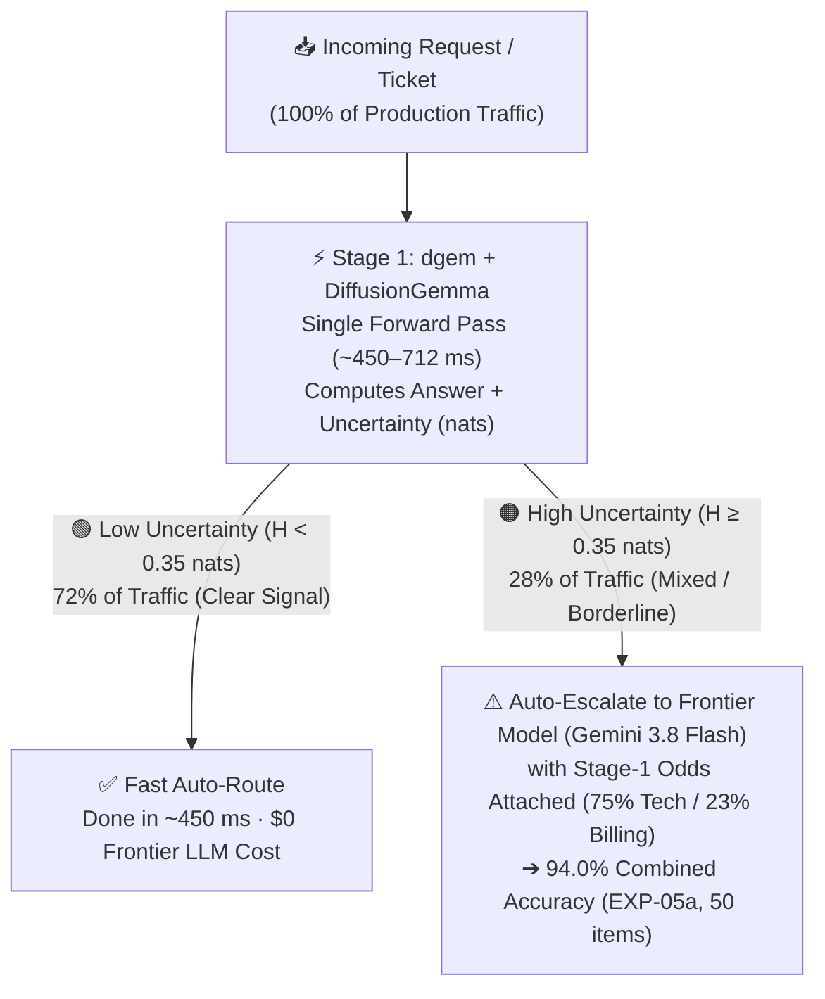

# The Journey to Decision Models

For decades, software engineers and product teams had to choose between two extremes when building classification and decision systems: **fast, rigid classical models** (like Naive Bayes, Logistic Regression, DeBERTa encoders, and Finite-State Transducers) or **slow, expensive autoregressive Large Language Models** (like GPT-4 and Gemini).

**DiffusionGemma** introduces a third paradigm: **Discrete Diffusion Decision Models**.

---

## 0. Product & Executive Overview: Why Decision Models & How the Entropy Gate Works

If you are a Product Manager, Engineering Leader, or Systems Architect, here is the core problem `dgem` solves—without the machine learning jargon:

### The Three Generations of Classification
1. **Traditional Predictive ML (`~10 ms` · Fast & Trustworthy, Slow to Build)**:
   Give a traditional model 10,000 labeled customer tickets and it will classify new ones in milliseconds with a genuine confidence score (e.g., `99% Billing` vs. `51% Billing`). **The catch:** Every time your product adds a new routing department or policy rule, your team has to collect new data and retrain the model from scratch.
2. **Autoregressive LLMs (`~2,500 ms` · Instant Setup, Slow & Overconfident at Runtime)**:
   Chat models let you define categories on the fly in plain English (*zero-shot*). **The catch:** They generate text one word at a time from left to right. Using a chat LLM just to classify a ticket into three fields is like asking a novelist to write a paragraph just to check a box—and because it outputs a plain string (`"department": "Technical"`), **it hides whether the model was 99% certain or guessing 51/49 on a coin flip**.
3. **Decision Models (`dgem` + `DiffusionGemma` · `~450 ms` · Zero-Shot Setup + Per-Field Uncertainty)**:
   Instead of generating words left to right, `DiffusionGemma` evaluates all of your decision blanks simultaneously on a fixed canvas in **one single pass (`~450 ms`)**. Because it locks directly onto your allowed options, it cannot emit invalid JSON or an off-menu label—and it returns a per-field **uncertainty score (`Shannon Entropy` in `nats`)**. That score is a strong starting signal, not a guarantee: see [how it can be fooled and how `dgem` checks it](confidence-beyond-shannon.md).

### How the Entropy Gate Works (The "Triage Nurse vs. Specialist" Pattern)
In real products, **70%+ of incoming requests are obvious** (e.g., *"Our API is returning 502 Bad Gateway"*), while **~25–30% are genuinely mixed** (e.g., *"Our API is returning 502 Bad Gateway AND we are disputing our $45,000 Q3 invoice"*).

Instead of sending 100% of your traffic to a slow, expensive frontier reasoning model—or letting a fast model guess blindly on ambiguous edge cases—`dgem` uses an **Entropy Gate**:



* **When the signal is clear (`H < 0.35 nats`)**: `DiffusionGemma` is 98%+ confident. The request takes the **Green Fast Lane** (`72%` of traffic), finishing in sub-second latency at a fraction of LLM cost.
* **When the request contains conflicting signals (`H ≥ 0.35 nats`)**: `DiffusionGemma` detects its own internal tug-of-war (`75.5% Technical` vs. `23.2% Billing`) and raises an **Amber Flag (`0.56 nats`)**. Your application automatically routes **only that ambiguous 28% slice** to a frontier model (or human reviewer)—passing along `DiffusionGemma`'s exact odds (`75% vs 23%`) as a diagnostic clue, lifting overall accuracy on the 50-item calibration suite from 88% to **94.0%**. A size-normalized variant ($\tilde{H} \ge 0.16$, threshold tuned on the same 50 items) reaches **98.0%** while escalating 34% (`EXP-05`).

---

## 1. The Three Eras of Decision Systems (Technical Deep Dive)

```
Era 1: Classical Statistical ML   --> Era 2: Classical Symbolic NLP --> Era 3: Autoregressive GenAI --> The Emerging Era: Decision Models
(Naive Bayes, SVM, XGBoost)           (N-grams, HMMs, WFSTs)            (GPT, Gemini, LLaMA)             (Discrete Block Diffusion / dgem)
Bag-of-Words / Zero Context           Local Sliding Window              Causal Sequential Next-Token     Non-Autoregressive Canvas Readout
Microsecond / Cheap CPU               Millisecond / C++ Rulebooks       Multi-Second / Heavy GPU Loops   Sub-Second / Guaranteed Schema
```

### Era 1: Classical Statistical ML & Discriminative Encoders (1960s–Present)
* **Core Algorithms**: Naive Bayes, Logistic Regression, SVMs, XGBoost, Dual-Encoders (`GTR` / `Sentence-T5`), Tabular Foundation Models (`TabPFN`), and Fine-Tuned Cross-Encoder Heads (`BERT`, `DeBERTa-v3`).
* **Strength**: Microsecond to 45 ms inference, minimal memory footprints, and fixed output schemas.
* **Fatal Flaw**: **Zero-Shot Rigidity, Late-Pooling Loss & Independent Heads**. Classical statistical ML cannot model word order or negation (*"This is NOT an outage"*). Fine-tuned encoder classifiers understand context, but every policy change (adding a 4th severity level or a new department) requires curating thousands of labeled examples, retraining weights, and redeploying model binaries. Furthermore, evaluating 3 questions requires 3 separate classification heads that cannot attend to each other's predictions.

<details class="term-aside">
<summary>💡 <strong>Concept Aside: What about pairing a <code>GTR</code> Dual-Encoder with a Zero-Shot Tabular FM (<code>TabPFN</code> / <code>TabFM</code>)?</strong> <em>(click to expand)</em></summary>

* **Why Engineers Ask**: Can we encode the input and policy labels with a `GTR` (`Sentence-T5`) dual encoder, normalize the similarity vectors into a table, and run a zero-shot tabular model (`TabPFN`) on top?
* **The Two Bottlenecks**:
  1. **Late Vector Pooling**: `GTR` compresses a 1,000-token input into a single vector $u \in \mathbb{R}^d$ *before* reading your policy rules, destroying token-to-token alignment (e.g., SQL parameter drift in `AgentDrift` or `50–75% < 100%` in `ANLI-R3`).
  2. **Support-Row Requirement**: `TabPFN` requires **labeled support rows ($N_{\text{support}} > 0$)** in its tabular context grid, whereas `dgem`'s `.json.tmpl` policies compile **zero-shot ($N=0$)** via full token-level cross-attention.
* **Deep Dive**: Read the full breakdown in [Discrete Diffusion vs. Autoregression (§5)](architecture.md#5-architectural-faq-can-dual-encoders-gtr--tabpfn-replace-a-decision-model-or-do-you-need-test-time-compute) and the [Glossary & Mental Models](glossary.md).

</details>

### Era 2: Classical Symbolic NLP & Automata (1990s–Present)
* **Core Algorithms**: Regular Grammars, Hidden Markov Models (HMMs), Weighted Finite-State Transducers (WFSTs like OpenFst, Google Sparrowhawk, NVIDIA NeMo).
* **Strength**: Extremely fast (1–8 ms in C++), deterministic, zero hallucinations, and mathematically verifiable.
* **Fatal Flaw**: **Local context horizon (1–3 token sliding window)**. WFSTs cannot build full-sentence dependency parse trees. As language complexity increases, grammar rulebooks explode into combinatorial conflicts (e.g., tuning a title rule for *"Dr. Smith"* causes street thoroughfares like *"Ocean Dr."* to expand to *"Ocean doctor"*).

### Era 3: Autoregressive Generative AI (2018–Present)
* **Core Algorithms**: Causal Transformer Decoders (GPT-4, Gemini, LLaMA, Claude).
* **Strength**: Deep semantic reasoning, world knowledge, and zero-shot instruction following.
* **Fatal Flaws for Structured Decisions**:
  1. **The Sequential Token Tax**: To output a single word like `"billing"`, the model must serially generate thought rationales, markdown tags, or JSON formatting loops, consuming **2,000–17,500 ms** per request.
  2. **Formatting & Syntax Drift**: Autoregressive models can emit invalid JSON, wrap responses in conversational filler, or succumb to prompt injections.
  3. **Strict Causal Masking**: Tokens generated early cannot attend to tokens that appear later in the sequence.

---

## 2. How Discrete Diffusion Decision Models Work

Rather than generating sequential text, DiffusionGemma treats a decision as a **discrete canvas denoising problem**:

```
[System Schema] + [User Input Data] + [Pre-Allocated Canvas: <slot_1> <slot_2> <slot_3>]
                                     │
                      ┌──────────────┴──────────────┐
                      │ Bidirectional Self-Attention │
                      │   (Prompt <---> Canvas)      │
                      └──────────────┬──────────────┘
                                     │
                  [Single-Pass Discrete Denoise / Readout]
                                     │
              ┌──────────────────────┼──────────────────────┐
              ▼                      ▼                      ▼
      Slot 1: "billing"       Slot 2: "yes"         Slot 3: "4 (frustrated)"
      (confidence: 99.1%)     (stderr: ±0.002)       (entropy: 0.04 nats)
```

### 1. The Pre-Allocated Canvas & Bidirectional Cross-Attention
Instead of starting an open-ended token generation loop, `dgem` sets aside a fixed-width discrete canvas (32 to 256 tokens). While autoregressive LLMs apply a causal mask, DiffusionGemma applies **bidirectional self-attention** across the entire prompt and canvas:
* The slot tokens attend to all prompt tokens simultaneously.
* Crucially, **the slot tokens attend to each other (`slot_1 <-> slot_2`)**. The model's classification of `team = engineering` directly informs its confidence on `urgent = yes` during the exact same forward pass.

### 2. Dual-Mode Uncertainty Telemetry & Epistemic Calibration (`ChaosNLI`)
Evaluated on [`ChaosNLI`](benchmarks-report.md) (100 human annotators per item), DiffusionGemma's single-pass restricted-softmax Shannon entropy $H = -\sum p_k \ln p_k$ correlates monotonically with human disagreement:

| Human Annotator Consensus Tier | Accuracy | Mean Confidence $P(y)$ | Mean Shannon Entropy $H$ | Entropy Multiplier |
| :--- | :---: | :---: | :---: | :---: |
| **`low-entropy` (`ChaosNLI` Consensus)** | **100.0% (3/3)** | `0.986` | **`0.0744 nats`** | **1.0× (Baseline)** |
| **`easy` (In-Domain Guardrail & Triage)** | **100.0% (17/17)** | `0.983` | **`0.0892 nats`** | **1.2×** |
| **`ambiguous` (Borderline Rater Splits)** | **77.8% (7/9)** | `0.861` | **`0.4061 nats`** | **5.5× higher $H$** |
| **`high-entropy` (`ChaosNLI` 3-Way Crowd Split)** | **33.3% (1/3)** | `0.759` | **`0.5932 nats`** | **8.0× higher $H$** ⭐ |

When human annotators agree, DiffusionGemma resolves the slot with **100% accuracy** and near-zero entropy (`0.0744 nats`). When the human crowd splits evenly, internal entropy spikes **8.0× higher (`0.5932 nats`)**, giving engineers a deterministic threshold ($H > 0.30\text{ nats}$) to trigger abstention or escalate to a Tier-3 reasoning model.

> **But raw entropy can be fooled.** The table above uses one fixed option order, and only 3 items sit in each ChaosNLI tier, so treat the 8× figure as a direction rather than a constant. `DiffusionGemma` has a strong habit of picking whichever option is listed first ("Box A"). On a borderline question that habit can make a coin flip *look* like 99.9% certainty, and the entropy gate then waves it through. **[Confidence Beyond Shannon: Invariant Decision Calibration (IDC)](confidence-beyond-shannon.md)** explains the problem with a worked example, describes the checks `dgem` adds (removing the Box-A habit, reading a reversed ballot in the same pass, temperature scaling), and reports what the evidence does and doesn't show so far.

### 3. Templates as Executable Decision Policies (`Policy-as-Code`)
In `dgem`, a declarative `.json.tmpl` file **is** the classifier head:
* **Zero-Shot Policy Compilation**: Evaluating 50 items across 11 public benchmarks (`dgem bench-calibration`) without a single fine-tuned weight achieved **100% accuracy** on `AgentDrift` trajectory hijacks (`7/7`), `deepset/prompt-injections` (`4/4`), `LLM-AggreFact` RAG grounding (`2/2`), and `MS MARCO` passage relevance (`2/2`) in **664–793 ms**.
* **Joint Multi-Slot Conditioning**: A single `.json.tmpl` policy evaluates boolean gates, `[A-Z]` categorical choices, and ordinal scores simultaneously in one forward pass (**458.9 ms** on Cloud Run L4).

---

## 3. Summary

| Question | Classical ML / Encoders | Autoregressive LLMs | Discrete Diffusion Decision Models (`dgem`) |
| :--- | :--- | :--- | :--- |
| **How does it decide?** | Feature weights / static linear heads | Token-by-token sequential prediction | **Bidirectional canvas slot denoising** |
| **How are policies updated?** | Relabel dataset & retrain weights | Prompt engineering + output parser | **Declarative `.json.tmpl` (`Policy-as-Code`)** |
| **How fast is it?** | Microseconds – 20 ms | 2 – 17.5 seconds | **458.9 – 712 ms (1 forward pass)** |
| **Can slots attend to each other?** | No (independent heads) | Unidirectional (`left -> right` only) | **Yes (`slot_1 <-> slot_2` bidirectionally)** |
| **Does it know when it's unsure?** | Overconfident out-of-domain | Uncalibrated sequence logprobs | **Often: entropy rises with human disagreement, but option order can hide it ([IDC](confidence-beyond-shannon.md))** |
| **Can it handle vision?** | Separate vision classifiers | Yes (multimodal autoregression) | **Yes (native SigLIP vision canvas)** |
