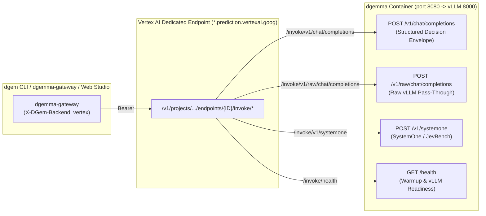

# Vertex AI Dedicated Endpoints (`/invoke/*`) vs. Cloud Run GPU

`dgem` supports **four execution infrastructures** using the exact same `.json.tmpl` decision policies, OpenTelemetry instrumentation, and `dgemma` container (`us-central1-docker.pkg.dev/genai-blackbelt-fishfooding/dgem/dgemma:latest`):

1. **Local Apple Silicon Metal (`diffgemma`)** — Developer laptop prototyping & offline eval.
2. **GCE VM (`g2-standard-8` L4 / `a2-highgpu-2g` A100)** — Raw VM benchmarking & custom kernel profiling.
3. **Serverless Cloud Run GPU (`dgemma`)** — Scale-to-zero failover and batch backend (`--min-instances=0`, `$0/hr` idle, NVIDIA RTX PRO 6000 or L4).
4. **Vertex AI Dedicated Endpoints (`invokeRoutePrefix: "/*"`)** — **Default production backend** (`vertex_first`): `dgemma-dedicated-g4` (`4423577720856772608`, RTX PRO 6000) with the L4 `dgemma-dedicated` (`4217256562927861760`) as a legacy fallback.

---

## 0. Current Recommendation (September 2026): Crawl → Walk → Run

| Tier | Platform | Use it for | Measured (single decision, 3 questions) |
| :--- | :--- | :--- | :--- |
| **Crawl** | Apple Silicon Metal (`diffgemma`, q4) | Offline development and template authoring | ~0.9 s; different engine from production, so numbers don't transfer |
| **Walk → run** | Cloud Run GPU (`dgemma`, 1× RTX PRO 6000) | Batch evaluation, research, scale-to-zero failover | 65 ms denoise / 144 ms wall (p50); 90–120 s cold start |
| **Run (default)** | Vertex AI Dedicated Endpoint **`4423577720856772608`** (`g4-standard-48` + 1× RTX PRO 6000) | Production: always warm, IAM, replica autoscaling (1–2), multimodal | **57.5 ms denoise / 143 ms wall (p50)**; images 66.5 ms |
| Legacy | Vertex AI `4217256562927861760` (`g2-standard-16` + 1× L4) | Cheapest always-warm fallback; text only | 188 ms / 271 ms; **crashes under load** (see below) |

Measurements: [`benchmarks/runs/20260925-serving-speed`](../benchmarks/runs/20260925-serving-speed/README.md)
(50 requests per cell, same session). Why G4 rather than A100/H100: the checkpoint is NVFP4 (4-bit), which
Blackwell GPUs (RTX PRO 6000) execute natively; L4 and A100 do not.

**Operational notes**

- **Samples.** Schemas without `"samples"` now default to **1** (one read, fastest). Templates opt in to
  `4` (one parallel batch, ~40 ms more on G4) when they want agreement/stderr; override per call with
  `-v samples=N`. Avoid `"auto"` for latency: it runs a second sequential batch on most requests
  (150.6 ms vs 97.9 ms for a fixed 4 on G4).
- **Concurrency.** The G4 image caps decisions in flight at `MAX_INFLIGHT=8` and queues the rest, so a
  32-client burst completed with 0 errors (≈60 decisions/s at 1 sample, ≈36/s at 4 samples on one replica).
  The L4 endpoint has no limiter: 4 samples × 8 concurrent clients crashed vLLM's engine and the replica
  restarted for ~2 minutes. The gateway's `vertex_first` routing fails over to Cloud Run during such events.
- **Dual-mirror** adds ~4 ms at 1 sample on G4, but see [EXP-14](experiments/exp-14-idc-rerun.md) for why it
  is not recommended in production.
- **Deploying G4:** `VERTEX_PROFILE=g4-rtxpro6000 IMAGE_URI=<pinned tag> ./scripts/deploy_vertex_endpoint.sh`
  (~10 minutes from deploy call to serving; the container self-warms before its first request).

---

## 1. Why We Use Vertex AI Arbitrary Custom Routes (`invokeRoutePrefix: "/*"`)

Standard Vertex AI Online Prediction (`:predict` and `:rawPredict`) binds a container deployment to a **single fixed HTTP path** (`AIP_PREDICT_ROUTE`). However, the `dgemma` container (`structured_server.py` on port `8080` fronting `vLLM EngineCore` on port `8000`) exposes **four distinct HTTP routes**:

- `POST /v1/chat/completions` — Structured 128-token diffusion decision envelope (`answers` + `diagnostics`).
- `POST /v1/raw/chat/completions` — Direct pass-through to `vLLM`'s raw `/v1/chat/completions`.
- `POST /v1/systemone` — Multipart image + JSON decision route (`JevBench` / `SystemOne`).
- `GET /health` — Live container warmup phase, staged GiB telemetry, and `vllm_ready` flag.

By uploading the model with **[`invokeRoutePrefix: "/*"`](https://docs.cloud.google.com/gemini-enterprise-agent-platform/machine-learning/predictions/use-arbitrary-custom-routes)** and deploying it to a **Vertex AI Dedicated Endpoint** (`dedicatedEndpointEnabled: true`), Vertex AI forwards any non-root path under `/invoke/<path>` **verbatim** as `/<path>` to `structured_server.py`:



---

## 2. Side-by-Side Comparison: Cloud Run GPU vs. Vertex AI Dedicated Endpoints

| Dimension | Serverless Cloud Run GPU (`dgemma`) | Vertex AI Dedicated Endpoint (`dgemma-dedicated`) |
| :--- | :--- | :--- |
| **Scale-to-Zero (`min=0`)** | **Yes (`--min-instances=0`)** — Automatically scales down after 15 min idle (`$0.00/hr` when idle). | **No (`minReplicaCount >= 1`)** — Bills continuously (`~$0.95/hr` for 1× L4 or `~$2.30/hr` for 2× L4) until undeployed (`make vertex-teardown`). |
| **Cold-Start / Provisioning** | **~89s** from `0 → 1` (64-stream GCS HTTPS Range API into `/tmp/dgemma` overlapped with `vLLM` + `SigLIP` init). | **~12–18 min** initial VM + container provisioning; once `Deployed`, replicas stay permanently warm (`0s` wakeup). |
| **Supported GPU Shapes** | `1× NVIDIA L4` (`24GB VRAM`, `32Gi RAM`) or `1× NVIDIA RTX Pro 6000 Blackwell` (`48GB VRAM`, `80Gi RAM`). | `1..8× NVIDIA L4` (`g2-standard-8` to `g2-standard-96`), `1..8× NVIDIA A100` (`a2-highgpu-*`), `8× NVIDIA H100` (`a3-highgpu-8g`). |
| **Multimodal (`bfloat16` + `SigLIP`)** | Single-GPU `RTX Pro 6000` (`48GB VRAM`, `80Gi RAM`) runs full `bfloat16` + `SigLIP` with zero tensor parallelism. | Requires `g2-standard-24` (`2× NVIDIA L4 = 48GB VRAM`, `--tensor-parallel-size 2`) or `a2-highgpu-1g` (`A100 40GB`). |
| **Routing Protocol** | Direct HTTPS to `https://dgemma-*.a.run.app/v1/chat/completions` | Arbitrary Custom Routes (`invokeRoutePrefix: "/*"`) via `https://<id>.<region>-<proj_num>.prediction.vertexai.goog/v1/projects/.../endpoints/<id>/invoke/v1/chat/completions` |
| **Authentication Token** | **OIDC Identity Token** (`gcloud auth print-identity-token`, audience = Cloud Run URL) | **OAuth2 Access Token** (`gcloud auth print-access-token`, scope = `cloud-platform`) |
| **Payload Size Limit** | **`32 MiB`** (HTTP/1.1) / Unlimited streaming (HTTP/2) | **`10–32 MiB`** on Dedicated Endpoints (`*.prediction.vertexai.goog`); bypasses the `1.5 MiB` shared `:predict` limit |
| **Health Probe Behavior** | Polls `GET /health` (`200 OK` immediately so gateway can read live staging telemetry during scale-from-zero). | Polls `GET /vertex-health` (`503` while `vLLM` loads weights, `200 OK` once `vllm_ready: true`). |
| **Enterprise MLOps Features** | Revision traffic splitting, Direct Cloud Run IAP, Cloud Logging & Monitoring. | Model Registry versioning, Private Service Connect (PSC) endpoints, traffic-split canary rollouts (`deployedModels/{id}/invoke/*`), DCGM GPU AutoMetrics. |

---

## 2.1 Empirical 30-Case Benchmark Comparison (`dgem bench`, historical: L4 endpoint)

We evaluated the exact same 30-case multi-domain decision suite ([`benchmarks/eval_dataset.jsonl`](https://github.com/ghchinoy/dgem/blob/main/benchmarks/eval_dataset.jsonl) across `support`, `code_review`, and `security`) on our live **Vertex AI Dedicated Endpoint (`4217256562927861760`, `g2-standard-16` · `1× NVIDIA L4` · `/invoke/v1`)** and **Serverless Cloud Run GPU (`dgemma`)**:

| Backend Target | Hardware Profile | Cold-Start / Wakeup | Single-Pass (`N=1`) Denoise | 4-Sample (`N=4`) Avg GPU Denoise | Avg End-to-End Wall Time (`30 cases`) | Proxy / Network Overhead | Multi-Domain Slot Accuracy | Receipt |
| :--- | :--- | :--- | :--- | :--- | :--- | :--- | :--- | :--- |
| **Vertex AI Dedicated Endpoint (`/invoke/v1`)** | `g2-standard-16` (`1× NVIDIA L4` 24GB VRAM, `64GB` RAM) | **`0.0 s`** (`minReplicaCount=1`, always warm) | **`195 ms`** (`245 ms` wall) | **`490.0 ms`** (`~122.5 ms/read`) | **`536.0 ms`** | **`46.0 ms`** | **`76.7%`** (`23/30`) | `benchmarks/results_vertex_l4_invoke.json` |
| **Serverless Cloud Run GPU (`dgemma`)** | `1× NVIDIA RTX Pro 6000` (`48GB VRAM`, `80Gi` RAM) | **`~121.8 s`** (`0 → 1` scale-from-zero, `$0.00/hr` idle) | **`171 ms`** (`199 ms` wall) | **`427.3 ms`** (`~106.8 ms/read`) | **`459.0 ms`** | **`31.7 ms`** | **`80.0%`** (`24/30`) | `benchmarks/results_cloudrun.json` |
| **GCE VM (Raw vLLM without `structured_server.py`)** | `g2-standard-8` (`1× NVIDIA L4` 24GB VRAM, `32GB` RAM) | **`0.0 s`** (dedicated VM) | — | — | **`1,968.7 ms`** (`3.67×` slower) | — | **`73.3%`** (`22/30`) | `benchmarks/results_gce_l4.json` |
| **Local Apple Silicon Metal (`diffgemma`)** | Apple M-Series (`q4` unified memory) | **`0.0 s`** (local daemon) | **`210 ms`** | **`892.0 ms`** | **`898.5 ms`** | **`6.5 ms`** | **`80.0%`** (`24/30`) | `benchmarks/results_local_metal_slot.json` |

### Key Engineering Takeaways from Live Deployment
1. **Why `g2-standard-16` (`64 GB` RAM) is Required for `1× NVIDIA L4` on Vertex AI**:
   - `g2-standard-8` (`1× NVIDIA L4`) provides only **`32 GB` of host RAM**. Staging the `17.53 GiB` `dgemma` safetensors into `/tmp/dgemma` (`tmpfs` in RAM) while `vLLM`/PyTorch allocates a `17.53 GiB` CPU load buffer requires **`~35.1 GiB` of RAM**, causing a container OOM kill on `g2-standard-8`.
   - **`g2-standard-16`** attaches the **exact same single `1× NVIDIA L4` GPU** (`24 GB` VRAM) with **`64 GB` of host RAM** and `16 vCPUs`, eliminating the `32 GB` RAM bottleneck for negligible incremental CPU cost.
2. **2-Second `/health` Startup for Vertex AI Health Probes**:
   - Vertex AI Dedicated Endpoints fail `deploy-model` if port `:8080/health` does not respond during container initialization. [`deploy/cloudrun/entrypoint.sh`](https://github.com/ghchinoy/dgem/blob/main/deploy/cloudrun/entrypoint.sh) stages only the `<20 MB` tokenizer + `4 MB` safetensors headers synchronously (`<2 seconds`), launches `structured_server.py` on `:8080` immediately so `/health` returns `200 OK`, and streams the `17.53 GiB` tensor bodies in the background across 64 HTTPS Range streams while `_wait_for_upstream()` holds early inference requests until `vLLM` on `:8000` is ready.

---

## 3. Choosing Between Endpoints Across Web Studio, HTTP API, `/v1/systemone`, and MCP

`dgemma-gateway` defaults to **`vertex_first` (Vertex AI Dedicated Endpoint Primary + Cloud Run Serverless GPU Auto-Failover)** and supports three routing modes across every interface:

| Mode (`backend` / `X-DGem-Backend`) | Routing Behavior | Recommended Use Case |
| :--- | :--- | :--- |
| **`vertex_first` (Default)** | Routes to **Vertex AI Dedicated Endpoint (`4423577720856772608`, G4)** whenever `deployed` (`0s` cold start). Automatically fails over to **Cloud Run GPU (`dgemma`)** if Vertex AI is `deploying` or `quiesced`. | **Internal Teams & Production Agents** (Guaranteed `0s` cold start when Vertex is up; zero downtime during maintenance). |
| **`vertex` (Strict Pin)** | Routes strictly to **Vertex AI (`/invoke/*`)**. Never falls back to Cloud Run. | **Pure Vertex AI Benchmarking** (`dgem bench`). |
| **`cloudrun` (Strict Pin)** | Routes strictly to **Serverless Cloud Run GPU (`dgemma`)**. | **Pure Cloud Run Benchmarking** & scale-to-zero testing. |

### A. In the Web Studio UI (`https://<your-dgem-gateway>`)
1. Click the **`Vertex First (Auto)` / `Cloud Run GPU` / `Vertex AI (/invoke/*)`** selector in the top header bar to open the solid opaque Backend Target panel.
2. Choose **Vertex First · Cloud Run Failover (Recommended)**, **Cloud Run GPU (Strict)**, or **Vertex AI Strict (`/invoke/*`)**.
3. The panel also displays the live replica status of **Vertex AI Dedicated Endpoint (`dgemma-dedicated-g4` · `4423577720856772608`)** with 1-click **Provision Vertex GPU (1× L4)** and **Teardown Replica ($0/hr)** buttons.

### B. Via HTTP API (`/api/decide`, `/v1/systemone`, `/v1/chat/completions`, `/v1/raw/chat/completions`)
Pass `X-DGem-Backend: vertex_first | vertex | cloudrun` (or query parameter `?backend=vertex` or JSON body field `"backend": "vertex"`) on any gateway route. Every response includes `X-DGem-Backend-Used: vertex | cloudrun`:

```bash
# 1. Policy-as-Template Decision (/api/decide)
curl -sS "https://<your-dgem-gateway>/api/decide/support_triage" \
  -H "Authorization: Bearer $(gcloud auth print-identity-token)" \
  -H "Content-Type: application/json" \
  -H "X-DGem-Backend: vertex_first" \
  -d '{
    "variables": {
      "ticket": "I was charged twice for my Pro subscription and need an immediate refund."
    }
  }' | jq .

# 2. Direct SystemOne Ad-Hoc Schema Evaluation (/v1/systemone)
curl -sS "https://<your-dgem-gateway>/v1/systemone?backend=vertex" \
  -H "Authorization: Bearer $(gcloud auth print-identity-token)" \
  -H "Content-Type: application/json" \
  -d '{
    "state": "Production database CPU is at 100% and enterprise checkout is failing.",
    "questions": {
      "urgent": {"type": "boolean", "question": "Is this an urgent outage?"},
      "team": {"type": "choice", "question": "Which team owns this?", "criteria": {"engineering": "Infra/DB", "billing": "Invoices"}}
    }
  }' | jq .
```

### C. Via MCP Server (`https://<your-dgem-gateway>/mcp`)
All three MCP inference tools (**`decide_policy`**, **`decide_custom_questions`** — the MCP equivalent of `/v1/systemone`, and **`locate_bounding_boxes`**) accept an optional `backend` parameter (`"vertex_first"` | `"vertex"` | `"cloudrun"`):

```json
{
  "name": "decide_custom_questions",
  "arguments": {
    "backend": "vertex_first",
    "context": "Production database CPU is at 100% and enterprise checkout is failing.",
    "questions": [
      { "id": "urgent", "type": "boolean", "question": "Is this an urgent outage?" },
      { "id": "team", "type": "choice", "question": "Which team owns this?", "options": ["engineering", "billing", "support"] }
    ]
  }
}
```

### D. Via `dgem` CLI (`--vertex-url`)
Pass `--vertex-url 4423577720856772608` (the default; use `4217256562927861760` for the legacy L4) on any `dgem` CLI command (`decide`, `bench`, `bench-calibration`, `bench-rerank`, `bench-jev`):

```bash
# Single decision against the default Vertex AI Dedicated Endpoint (G4, 4423577720856772608):
./bin/dgem decide --vertex-url 4423577720856772608 --gcp-auth \
  -t templates/support_triage.json.tmpl \
  -v ticket="I was charged twice for my Pro subscription." -s

# Full 30-case benchmark suite against Vertex AI Dedicated Endpoint:
./bin/dgem bench --vertex-url 4423577720856772608 --gcp-auth \
  -d benchmarks/eval_dataset.jsonl \
  -o benchmarks/results_vertex_l4_invoke.json
```

---

## 4. Deploying & Tearing Down a Vertex AI Dedicated Endpoint

```bash
# 1. Upload dgemma with invokeRoutePrefix="/*" and deploy to a Dedicated Endpoint
#    (VERTEX_PROFILE=g4-rtxpro6000 for G4 + RTX PRO 6000; default profile l4 = g2-standard-16 + 1x L4)
make vertex-deploy

# 2. Undeploy replicas when zero-idle-cost ($0.00/hr) is desired
make vertex-teardown
```

---

## 5. 4-Phase Head-to-Head Benchmark Matrix (`scripts/compare_vertex_vs_cloudrun.sh`)

All empirical receipts are stored in [`benchmarks/results_head_to_head_vertex_vs_cloudrun.json`](file:///Users/ghchinoy/projects/dgem/benchmarks/results_head_to_head_vertex_vs_cloudrun.json), [`benchmarks/results_calibration_vertex_l4.json`](file:///Users/ghchinoy/projects/dgem/benchmarks/results_calibration_vertex_l4.json), and [`benchmarks/results_rerank_vertex_l4.json`](file:///Users/ghchinoy/projects/dgem/benchmarks/results_rerank_vertex_l4.json).

### Phase 1: Concurrency & Tail-Latency Scaling (`dgem bench` 30-Case Multi-Slot Suite)

| Concurrency (`-w`) | Active vLLM Sequences (`w × 4`) | Accuracy | GPU Denoise `p50` | GPU Denoise `p90` | GPU Denoise `p99` | Client Wall `p50` | Sustained Throughput | Operational Note |
| :--- | :--- | :--- | :--- | :--- | :--- | :--- | :--- | :--- |
| **`w=1` (Sequential)** | `4` sequences | **`80.0%` (`24/30`)** | **`499.4 ms`** | **`517.1 ms`** | **`576.0 ms`** | **`534.0 ms`** | `1.87 dec/sec` | Lowest per-request latency (`188 ms` when `N=1`) |
| **`w=4` (4 Workers)** | `16` sequences (`= MAX_NUM_SEQS`) | **`76.7%` (`23/30`)** | **`717.4 ms`** | **`769.8 ms`** | **`827.6 ms`** | **`786.0 ms`** | **`5.44 dec/sec`** (`30` cases in `5.51s`) | **Sweet-spot concurrency** for 1× NVIDIA L4 (`24 GB` VRAM) |
| **`w=8` (8 Workers)** | `32` sequences | **`76.7%` (`23/30`)** | **`1009.4 ms`** | **`1025.7 ms`** | **`1054.5 ms`** | **`1047.0 ms`** | **`7.49 dec/sec`** (`30` cases in `4.01s`) | **Peak throughput** on a single L4 GPU replica (`100%` HTTP 200) |
| **`w=16` (16 Workers)** | `64` sequences | — | — | — | — | — | — | Exceeds single-L4 `24 GB` KV-cache (`MAX_NUM_SEQS=16`); scale `max-replica-count >= 2` or cap `w <= 8` per L4 |

### Phase 2: 50-Case Public Dataset Calibration & Guardrail Suite (`dgem bench-calibration`, `EXP-04`)

| Metric | **Vertex AI Dedicated Endpoint (`4217256562927861760`)** | **Serverless Cloud Run GPU (`dgemma`)** |
| :--- | :--- | :--- |
| **Overall Suite Accuracy (`50` cases)** | **`88.0%` (`44/50`)** | **`82.0%` (`41/50`)** |
| **Chance-Corrected Accuracy (`JevBench`)** | **`83.05%`** | **`74.57%`** |
| **10-Bin Expected Calibration Error (`ECE`)** | **`0.0470` (`4.70%`)** | **`0.0684` (`6.84%`)** |
| **Multi-Class Brier Score** | **`0.1944`** | **`0.2412`** |
| **Composite `JevBench v1.3.1` Score (GeoMean)** | **`73.37`** (`Intelligence: 84.10`, `Calibration: 84.85`) | **`71.18`** |
| **Median Latency (`p50`)** | **`790.0 ms`** | **`712.0 ms`** |

### Phase 3: 30-Query (300-Passage) 12-Slot Listwise Diffusion Reranking (`dgem bench-rerank`, `EXP-10`)

| Metric | **Vertex AI Dedicated Endpoint (`4217256562927861760`)** | **Serverless Cloud Run GPU (`dgemma`)** |
| :--- | :--- | :--- |
| **Simultaneous Slots per Forward Pass** | `12` slots (`10` passage grades + `poisoned_passage` + `answer_present`) | `12` slots (`10` passage grades + `poisoned_passage` + `answer_present`) |
| **Mean Wall Latency (`12` Slots / ~2,000 tokens)** | **`1,631.9 ms`** (`~136 ms/slot`) | **`1,454.3 ms` – `2,336.4 ms`** |
| **Continuous Expectation `nDCG@10`** | **`0.8502`** | **`0.9265`** |
| **FollowIR Policy-Flip `p-MRR`** | **`+0.8350`** | **`+0.7533`** |
| **Exact Tie Rate** | **`0.0%`** | **`0.0%`** |
| **RAG Prompt-Injection Poison Quarantine** | **`100.0%`** | **`100.0%`** |

